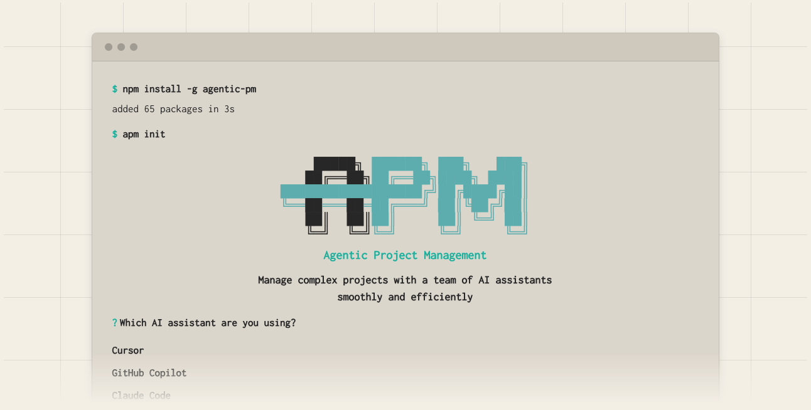

# Agentic Project Management (APM)

[](https://opensource.org/licenses/MPL-2.0) [](https://github.com/sdi2200262/agentic-project-management/releases/tag/v0.5.0)

*Manage complex projects with a team of AI assistants, smoothly and efficiently.*

## What is APM?

**Agentic Project Management (APM)** is a AI workflow framework that brings real-world project management principles into your AI-assisted workflows. It addresses a fundamental challenge of LLMs: **context window limitations**. 

APM uses various context retention techniques, coordinating a team of specialized AI agents in a structured way so that you can maintain productive AI-assisted work for longer periods before facing model hallucinations and needing to start over. When context window does fill up, APM ensures a smooth transition to a "fresh" chat session without important context loss.

Think of it like having a project manager, developers, ad-hoc specialists, and a setup/configuration expert all powered by AI and working together under your guidance.

<p align="center">
  
</p>

## Installation

Install APM CLI globally via NPM:

```bash
npm install -g agentic-pm
```

Or install locally in your project:

```bash
npm install agentic-pm
```

<details>
<summary><strong>Supported AI Assistants</strong></summary>

APM supports the following AI assistants and IDEs:

| Assistant           | Type                    | Format   | Command Directory      |
|---------------------|-------------------------|----------|------------------------|
| Cursor              | IDE & CLI               | Markdown | `.cursor/commands`     |
| Claude Code         | IDE & CLI               | Markdown | `.claude/commands`     |
| GitHub Copilot      | IDE                     | Markdown | `.github/prompts`      |
| Windsurf            | IDE                     | Markdown | `.windsurf/workflows`  |
| Roo Code            | IDE                     | Markdown | `.roo/commands`        |
| Kilo Code           | IDE                     | Markdown | `.kilocode/workflows`  |
| Qwen Code           | CLI                     | TOML     | `.qwen/commands`       |
| opencode            | CLI                     | Markdown | `.opencode/command`    |
| Gemini CLI          | CLI                     | TOML     | `.gemini/commands`     |
| Auggie CLI          | CLI                     | Markdown | `.augment/commands`    |

When you run `apm init`, simply select your AI assistant from the list, and APM will automatically configure the appropriate command structure for your environment.

</details>

## Getting Started

Follow these simple steps to start using APM in your project:

1. **Navigate to your project directory** in your terminal.

2. **Run the APM initialization command:**
   ```bash
   apm init
   ```
   
   By default, `apm init` automatically finds and installs the latest template version compatible with your current CLI version. To install a specific template version (e.g., for rollbacks or testing), you can use the `--tag` option:
   ```bash
   apm init --tag v0.5.0+templates.1
   ```

3. **Select your AI assistant** when prompted (e.g., Cursor, Copilot, Claude Code, etc.).

4. **APM automatically installs:**
   - `.apm/` directory with APM guides and initial assets
   - APM slash commands in your AI assistant's command directory
   - Necessary installation meta-data

5. **Open your AI assistant chat** and enter the slash command:
   ```
   /apm-1-initiate-setup
   ```

6. **Follow the established APM workflow:** <br/>
Setup Phase (Project Discovery & Planning) → Task Loop Phase (Plan Execution)

For step-by-step guidance, see the **[Getting Started Guide](docs/Getting_Started.md)**. For detailed CLI behavior and policies, see the **[CLI Guide](docs/CLI.md)**.

## Documentation

APM v0.5 includes comprehensive documentation covering all aspects of the framework:

| Document | Description |
|----------|-------------|
| **[Introduction](docs/Introduction.md)** | Overview of APM concepts, goals, and core framework |
| **[Getting Started](docs/Getting_Started.md)** | Step-by-step setup and first session guide |
| **[Agent Types](docs/Agent_Types.md)** | Different agent roles and specializations |
| **[Workflow Overview](docs/Workflow_Overview.md)** | Complete workflow walkthrough with process diagrams |
| **[Token Consumption Tips](docs/Token_Consumption_Tips.md)** | Cost optimization strategies and model recommendations |
| **[Modifying APM](docs/Modifying_APM.md)** | Customization of APM assets and advanced features |
| **[Troubleshooting Guide](docs/Troubleshooting_Guide.md)** | Troubleshooting for common issues |
| **[Context & Memory Management](docs/Context_and_Memory_Management.md)** (advanced) | How APM handles context and manages memory across agent instances  |
| **[Context & Prompt Engineering](docs/Context_and_Prompt_Engineering.md)** (advanced) | Prompt and context engineering techniques used throughout the framework |
| **[CLI Guide](docs/CLI.md)** | Detailed CLI usage, behaviors, policies |

For a complete documentation index with recommended reading order, see the **[Documentation Hub](docs/README.md)**.

## Contributing

APM is an open-source project, and your contributions are welcome! Whether it's improving prompts, enhancing documentation, suggesting new features, or reporting bugs, please feel free to open an issue or submit a pull request.

**Ways to contribute:**
- **Report bugs or workflow issues**
- **Suggest features or improvements**
- **Improve documentation**
- **Share customizations/adaptations** for specific domains or use-cases
- **Extend support** for new AI assistants

**Areas particularly seeking contributions:**

- **Assistant Support:** Help expand APM support for additional AI assistants beyond the ones currently supported.
- **Ad-Hoc Delegation Guides:** The framework includes Debug and Research delegation guides, but there's opportunity to create specialized guides for other context-intensive tasks such as testing automation, security analysis, data extraction and more.
- **Workflow Optimizations:** Share improvements to agent protocols or memory system enhancements.

Please read [CONTRIBUTING.md](CONTRIBUTING.md) for details on the code of conduct and contribution process.

## Versioning Strategy

APM uses a dual versioning system to separate updates to the core CLI tool from updates to the agent prompts and guides (templates). The CLI follows Semantic Versioning on NPM, while template updates are released via GitHub Releases using build metadata. This allows for frequent template improvements without unnecessary CLI version bumps.

For a detailed explanation of the versioning, tagging, and release process, please see the [VERSIONING.md](VERSIONING.md) file.

## License

This project is licensed under the **Mozilla Public License 2.0** - see the [LICENSE](LICENSE) file for full details.

### License Update: MIT → MPL-2.0

As APM has matured from an experimental framework into a comprehensive multi-agent coordination system with growing commercial interest, its license has been upgraded from MIT to **Mozilla Public License 2.0 (MPL-2.0)**. This change helps protect the Open Source Software community while maintaining full commercial compatibility.

**What this means:** APM remains completely free and Open Source for all uses (personal, commercial, enterprise). You can build proprietary products using APM, integrate it into commercial IDEs, and create paid services around it. The only requirements are that improvements to core APM files must be shared back with the community, and that you attribute the creators and the APM project as required by the MPL 2.0 license. Make sure to read the [LICENSE](LICENSE) file for full details.

<p align="center">
  <a href="https://github.com/sdi2200262" target="_blank">
    
  </a>
</p>