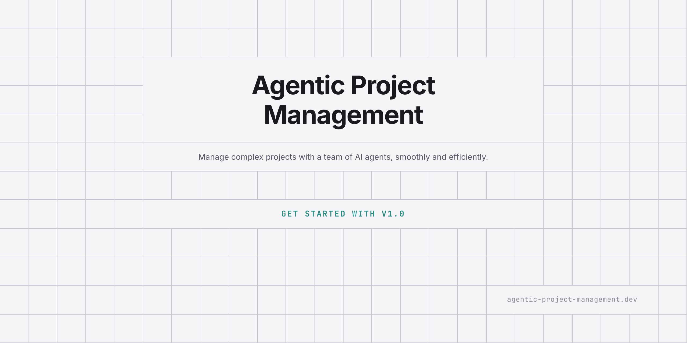

# Agentic Project Management (APM)

[](https://opensource.org/licenses/MPL-2.0) [](https://www.npmjs.com/package/agentic-pm) [](https://github.com/sdi2200262/agentic-project-management/releases)

> **Note:** APM v1 is currently in testing preview. The content below reflects the stable v1 release. For testing updates, see [Issue #79](https://github.com/sdi2200262/agentic-project-management/issues/79).

*Manage complex projects with a team of AI agents, smoothly and efficiently.*

## What is APM?

APM is an open-source framework for managing ambitious software projects with AI assistants. Instead of working in a single, increasingly chaotic chat, APM structures your work into a coordinated system where different AI agents handle planning, coordination, and execution as a team.

As conversations grow, AI context degrades. The assistant loses track of requirements, produces bad code, and hallucinates details. For substantial projects, this makes sustained progress nearly impossible.

APM coordinates three specialized agent types, each operating in its own context with only the information it needs:

- **Planner** - Conducts structured project discovery and decomposes requirements into three planning documents: a Spec (what to build), a Plan (how work is organized), and Rules (how work is performed).
- **Manager** - Coordinates execution by assigning Tasks to Workers, reviewing completed work, and maintaining project state. Operates on execution summaries rather than raw code.
- **Workers** - Execute specific Tasks with tightly scoped context. Each Worker receives a self-contained Task Prompt with everything it needs, executes, validates, and reports back.

Project state lives in structured files outside any agent's context. When a conversation ends or an agent reaches its limits, a Handoff transfers working knowledge to a fresh instance. Completed sessions can be archived and carried forward to new ones.

You mediate every exchange between agents, keeping the workflow platform-agnostic and every interaction visible. Each agent guides you through the workflow at every step, telling you exactly which command to run, in which conversation, and what to do next.

<p align="center">
  
</p>

## Supported Assistants

| Assistant | Type | Format |
|-----------|------|--------|
| Claude Code | CLI | Markdown |
| Cursor | IDE | Markdown |
| GitHub Copilot | IDE | Markdown |
| Gemini CLI | CLI | TOML |
| OpenCode | CLI | Markdown |

## Quick Start

Install the CLI globally:

```bash
npm install -g agentic-pm
```

Navigate to your project directory and initialize:

```bash
apm init
```

Select your AI assistant when prompted. APM installs commands, guides, skills, and project artifact templates into your workspace.

Open your AI assistant (start Claude Code in a terminal, open a new Cursor Agent chat, etc.) and run:

```
/apm-1-initiate-planner I want you to build Claude Opus 5. Make no mistakes.
```

The Planner guides you through project discovery and creates planning documents. Once approved, it tells you to open a new conversation and run `/apm-2-initiate-manager` to begin coordinated execution. From there, each agent directs you through the workflow step by step.

For the full walkthrough, see the [Getting Started](https://agentic-project-management.dev/docs/getting-started) guide.

## Documentation

Full documentation is available at [agentic-project-management.dev](https://agentic-project-management.dev):

- **[Introduction](https://agentic-project-management.dev/docs/introduction)** - What APM is and how it works
- **[Getting Started](https://agentic-project-management.dev/docs/getting-started)** - Installation through first task cycle
- **[Agent Types](https://agentic-project-management.dev/docs/agent-types)** - How Planner, Manager, and Worker roles work
- **[Agent Orchestration](https://agentic-project-management.dev/docs/agent-orchestration)** - Communication, Memory, dispatch, and Handoff mechanics
- **[Workflow Overview](https://agentic-project-management.dev/docs/workflow-overview)** - Every procedure in detail
The site also covers advanced topics like how APM's prompt and context engineering works under the hood, design principles behind the multi-agent coordination, tips and tricks for model selection and cost optimization, troubleshooting, and customization.

## CLI Commands

See the [CLI Guide](https://agentic-project-management.dev/docs/cli) for full details.

| Command | Description |
|---------|-------------|
| `apm init` | Initialize with official releases |
| `apm custom` | Install from custom repositories |
| `apm update` | Update to latest compatible version |
| `apm archive` | Archive current session or manage archives |
| `apm add` | Add assistant(s) to existing installation |
| `apm remove` | Remove assistant(s) from installation |
| `apm status` | Show installation state |

## Customization

APM supports custom repositories for teams that want to modify the workflow. Fork the repo or use it as a template, adjust templates, build, release, and install with `apm custom -r owner/repo`. A [customization skill](skills/apm-customization/) is included in the repo to guide AI agents through the process.

See the [Customization Guide](https://agentic-project-management.dev/docs/customization-guide) for details.

## Migrating from v0.5.x

A standalone [migration skill](skills/apm-migration/) guides an AI agent through migrating from older APM versions. It archives your existing artifacts, cleans up old files, and leaves the project ready for `apm init`. The new Planner detects archived sessions during Context Gathering and carries context forward.

See the [standalone skills README](skills/) for per-platform installation instructions.

## Contributing

Contributions are welcome. See [CONTRIBUTING.md](CONTRIBUTING.md) for guidelines. Report bugs or suggest features via [GitHub Issues](https://github.com/sdi2200262/agentic-project-management/issues). Reach out on Discord: `cobuter_man`.

## Versioning

CLI and template releases version independently but share major version for compatibility. See [VERSIONING.md](VERSIONING.md) for details.

## License

Licensed under the **Mozilla Public License 2.0 (MPL-2.0)**. APM is free for all uses including commercial. Improvements to core APM files must be shared back with the community. See [LICENSE](LICENSE) for full details.

Versions prior to v0.4.0 were released under the MIT license. The license was updated to MPL-2.0 starting with v0.4.0.

<p align="center">
  <a href="https://github.com/sdi2200262" target="_blank">
    
  </a>
</p>
