# agentic-project-management (APM)

*Manage your projects with a team of AI Agents like in real life... without using a million requests!*

## Overview

**agentic-project-management (APM)** is a framework designed to structure and automate complex projects undertaken with the assistance of multiple AI agents. Inspired by real-world agile project management, APM adapts proven principles to AI-assisted development, particularly with tools like Cursor. 

It addresses the common challenges of managing large tasks with AI, such as maintaining context, handling the limitations of Large Language Model (LLM), avoiding model hallucinations and more. This is a more streamlined and user-defined approach to utilizing AI tools without burning through countless API requests and rising costs exponentially.

APM is for developers, students, researchers, and anyone leveraging AI coding assistants for their projects.

## APM Workflow

```mermaid
graph LR
    User["👤 User"]
    MA["🤖 Manager Agent(s)"]
    SA_I["🛠️ Implementation Agent(s)"]
    SA_D["🐞 Debugger Agent(s)"]
    SA_T["🧑‍🏫 Tutor Agent(s)"]
    MB["📚 Memory Bank(s)"]

    User <--> MA
    MA --> SA_I
    MA --> SA_D
    MA --> SA_T

    MA <--> MB
    SA_I <--> MB
    SA_D <--> MB
    SA_T <--> MB

    %% Styling
    classDef user fill:#E3F2FD,stroke:#1E88E5,stroke-width:2px,color:#0D47A1;
    classDef manager fill:#EDE7F6,stroke:#5E35B1,stroke-width:2px,color:#311B92;
    classDef specializedAgent fill:#FCE4EC,stroke:#AD1457,stroke-width:2px,color:#880E4F; 
    classDef memoryBank fill:#E8F5E9,stroke:#388E3C,stroke-width:2px,color:#1B5E20;

    class User user;
    class MA manager;
    class SA_I,SA_D,SA_T specializedAgent;
    class MB memoryBank;
```

## The Core Idea

APM revolves around a few key components and roles, mirroring an efficient real-life project team:

*   **Manager Agent(s):** Acts as the project lead. It's responsible for understanding the overall project goals, creating a detailed step-by-step implementation plan, assigning tasks to Implementation Agents (by generating specific prompts) and reviewing completed work. They are also responsible for completing handover and onboarding procedures for Specialized Agents.
*   **Implementation Agents:** Each is assigned specific, granular tasks by the Manager Agent according to the Implementation Plan and is responsible for executing the task and logging its work comprehensively on the current Memory Bank.
*   **Memory Bank(s):** One or more markdown files that serve as the project's living logbook. Every significant action, decision, and piece of work completed by an Implementation Agent is recorded here in a standardized format. This provides a complete audit trail and shared context. Makes handover and onboarding procedures seamless.
*   **Handover Protocol:** A structured process for transferring project leadership from one Manager Agent to a new one or transferring important context from one Specialized Agent to another. This involves creating a `Handover_File.md` summarizing progress and context, and a `Handover_Prompt.md` to onboard the new Agent, ensuring continuity for long or complex projects that might exceed a single LLM's context window.

The entire workflow emphasizes clear communication, meticulous record-keeping, and user oversight on important steps, bringing robust project management methodologies into your AI development process.

## Key Features

*   **Structured Multi-Agent Workflow:** Clearly defined roles and responsibilities for different AI agents.
*   **Centralized Task Planning & Oversight:** Manager Agent ensures a coherent approach to project execution.
*   **Comprehensive Progress Logging:** Memory Bank(s) provide a detailed, transparent, and chronological record of all work.
*   **Robust Context Management:** Handover Protocol designed to mitigate LLM context limitations for extended projects.
*   **Standardized Prompts & Formats:** Ensures consistency in communication and logging.
*   **Designed for Seamless Integration:** Optimized for AI assistants like Cursor, with guidance for using `.cursor/rules`.

## Quick Start

1.  **Use this Template:** Click the "Use this template" button on GitHub to create your own repository based on APM for your project.
2.  **Initial Prompt:** Navigate to the `prompts/00_Initial_Manager_Setup/01_Initiation_Prompt.md` file in your new repository. Copy its content and paste it as the first prompt to your primary AI assistant (which will become your first Manager Agent).
3.  **Follow the Guidance:** The Manager Agent, guided by the initiation prompt, will then ask you questions to understand your project and begin setting up the implementation plan and Memory Bank.

For a full walkthrough and more details, please see our [Getting Started Guide](docs/02_Getting_Started.md).

*Alternatively, you may copy-paste prompts directly from the original GitHub repository:*
 https://github.com/sdi2200262/agentic-project-management
## Explore the Documentation

Dive deeper into APM's concepts, customization options, and advanced usage in the full documentation:

*   [**Full Documentation**](docs/)
*   [**Cursor Integration Guide**](docs/05_Cursor_Integration_Guide.md) - Learn how to best leverage APM with Cursor, including setting up `.cursor/rules`.

## Contributing

Contributions are welcome! Whether it's improving prompts, enhancing documentation, suggesting new features, or reporting bugs, please feel free to open an issue or submit a pull request.

Please read [CONTRIBUTING.md](CONTRIBUTING.md) for details on our code of conduct and the process for submitting pull requests.

## License

This project is licensed under the MIT License - see the [LICENSE](LICENSE) file for details.
