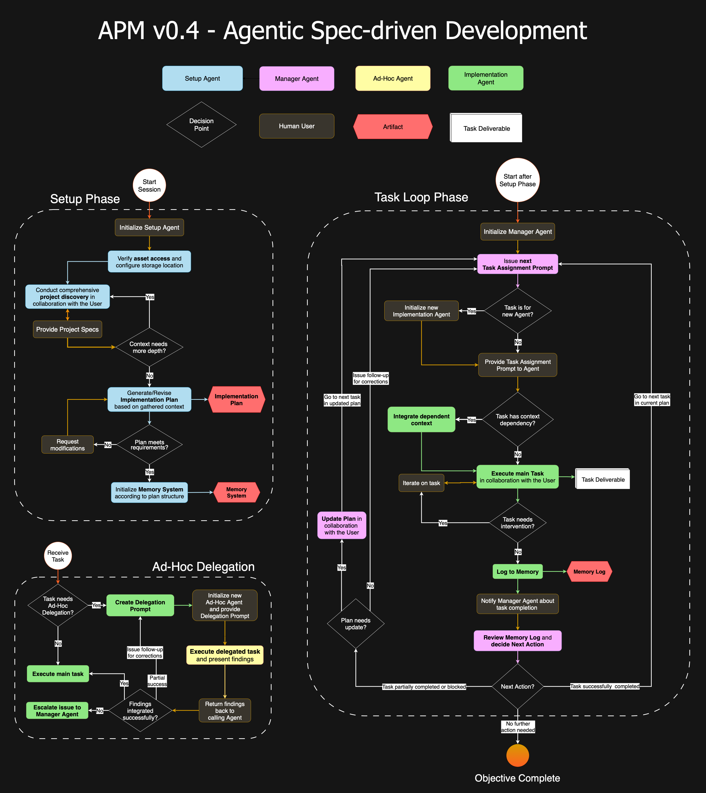

# APM v0.5 - Agentic Project Management Framework

**A Structured, Multi-Agent Workflow System for Complex Project Execution with AI Assistants**

## Table of Contents

- [What is APM?](#what-is-apm)
- [The Problem APM Solves](#the-problem-apm-solves)
- [APM's Approach](#apms-approach)
- [Multi-Agent Coordination](#multi-agent-coordination)
- [The APM Workflow](#the-apm-workflow)
- [Core Framework and Customization](#core-framework-and-customization)
- [Documentation Overview](#documentation-overview)
- [Visual Workflow Overview](#visual-workflow-overview)

## What is APM?

Agentic Project Management (APM) is a structured multi-agent workflow framework for managing complex projects within AI IDE environments. It applies real-world project management principles to AI-driven workflows, including task breakdown, role assignment, progress tracking, and seamless handoffs between team members. 

APM offers an Agentic Spec-driven Development experience that prioritizes explicit context management and ensures continuity throughout sessions.

APM utilizes chat sessions in your AI IDE as separate agent instances, each with its own context scope and memory. By distributing the project's workload among these agents, APM enables more focused interactions, reduces cognitive load, and minimizes the risk of context loss or hallucinations, resulting in more reliable and consistent outcomes.

## The Problem APM Solves

Managing large projects with AI assistants presents systematic challenges. Extended conversations frequently lead to context degradation where the AI loses track of original requirements, produces contradictory suggestions, or generates inaccurate details. These issues arise from fundamental limitations of LLMs: **Context Window Limits**

This constraint feels "heavier" within AI IDEs, when often times Context Windows are shrunk even further to maintain profitable interactions with the model's provider. As conversations grow, the AI struggles to keep track of everything, leading to confusion, errors, and wasted time.

APM addresses these issues by emphasizing structured interaction, explicit context management and integration, and efficient, targeted cross-agent communication through meta-prompting.

## APM's Approach

The framework uses multiple AI agent instances, each with a specific role and clear responsibilities, coordinated through structured protocols and persistent memory/context management.

The result is a workflow that feels more like working with a well organized team than wrestling with a single overloaded AI assistant.

> Think of APM like running a software development team. You have a project manager who understands the big picture, developers who focus on specific tasks, and clear documentation that keeps everyone aligned. Developers document each task execution, and the manager reviews the logs for coordination. The difference is that your "team members" are AI assistants in separate chat sessions.

---

## Multi-Agent Coordination

APM v0.5 employs a sophisticated multi-agent system built around four specialized agent types:

*   **1. Setup Agent:** Initiates the project session, creating the needed APM assets. The Setup Agent conducts comprehensive project discovery, transforms requirements into a detailed Implementation Plan, and initializes the Memory System that enables effective coordination. Once session is initialized it passes control to the Manager Agent.

*   **2. Manager Agent:** Coordinates the project session and makes all the important decisions. The Manager Agent maintains the big picture, creates targeted task assignments for Implementation Agents, reviews completed work, and orchestrates the overall project flow while preserving context continuity between agent instances.

*   **3. Implementation Agents:** Execute focused task assignments by the Manager. Task domains vary: coding, design, analysis, writing, research etc. while Implementation Agent instances are assigned groups of same-domain tasks. They always log their work to preserve context and ensure project continuation.

*   **4. Ad-Hoc Agents:** Temporary agents for isolated tasks (e.g., debugging, research, analysis) outside the main workflow as workflow "branches". They run in separate chat sessions with minimal scoped context, are assigned by Implementation Agents, and return findings for integration. Ad-Hoc Agents don’t make project decisions, just solve a specific problem, report back, and close, preventing context overload in core agents.

> In APM, agent types are **not artificial "personas"**. Instead, their specialization arises organically from clearly defined responsibilities and tightly scoped context for each agent instance. By supplying each agent with only the information relevant to their specific role and tasks, APM ensures reliable responses, without wasting tokens on unnecessary persona descriptions.

### Context Management
APM preserves context with a carefully designed adaptation of the traditional Memory Bank and a context Handover Procedure. For tasks that require isolated, context-intensive work (such as research or debugging), Ad-Hoc Agent instances handle these activities separately, preventing unnecessary strain on the core agents' context.

*   **Dynamic Memory Bank**: An adaptation of the traditional single-file Memory Bank that maps Memory Log files to the tasks of an Implementation Plan. Memory Logs are stored in a directory structure with folders mapped to the Implementation Plan's phases.

*   **Ad-Hoc Agent Delegation**: Workflow branches for handling debugging, research, or analysis tasks through temporary agent instances that work in isolated context scopes.

*   **Handover Protocol**: A context transfer mechanism using structured handover files and prompts to seamlessly transition between agent instances when context limits are reached.

## The APM Workflow

APM v0.5 operates through two workflow phases:

1. **Setup Phase**: Comprehensive project discovery and planning through the Setup Agent & initialization of session assets
2. **Task Loop Phase**: Coordinated task assignment & execution via Manager and Implementation Agents

Plus **Handover Procedure**: as distinct events for seamless context transfer when agents approach memory limits

---

## Core Framework and Customization

In APM v0.5, the core framework is installed and managed via the `apm init` CLI tool. Instead of a `/prompts` directory, the CLI automatically installs the necessary files into your project's workspace:

* **Guides:** All workflow guides are placed in the `.apm/guides/` directory for agent reference and user customization.
* **Commands:** Agent slash commands (initiation prompts, handover guides, ad-hoc delegations) are installed directly into your selected AI assistant's command directory (e.g., `.cursor/commands`, `.github/prompts`, `.claude/commands`).

This automated setup ensures all assets are correctly placed and version-managed. Customization is done by editing the files in these directories after running `init`.

## Documentation Overview

APM's documentation is organized to support both quick starts and deep dives:

- **Core Framework Documentation**: Available in the `/docs` directory
- **Visual Guides**: PDF guides in `/docs/guides` that complement the mainn documentation suite

For a complete documentation index, see the [Documentation Hub](README.md).

## Visual Workflow Overview

Below is a visual overview of the APM workflow, illustrating the full process from the Setup Phase through the Task Loop Phase, including workflow branches of Ad-Hoc Delegations.
> **Note:** This overview omits some intermediate steps and sub-processes in both the Setup Phase and Task Loop Phase for brevity. For a complete, detailed workflow breakdown, see the [Workflow Overview](Workflow_Overview.md) document.

  

---

APM is an Open Source project, and contributions to both the framework and its documentation are encouraged. You can contribute by posting an Issue for bugs, feature requests, or questions, or by submitting a Pull Request (PR) with improvements, fixes, or documentation enhancements/refinements. For details on contributions and guidelines, please see the [CONTRIBUTING.md](../CONTRIBUTING.md) file.