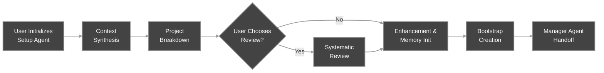
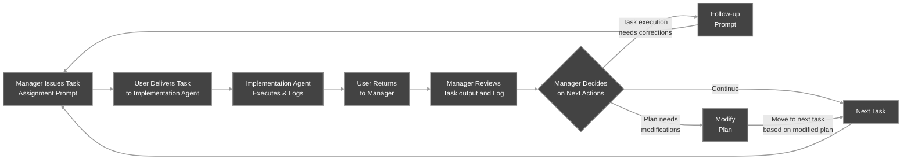
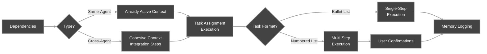
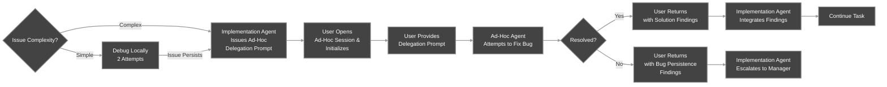
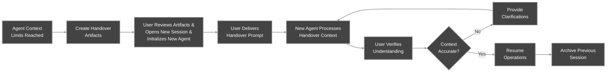

# Workflow Overview - APM v0.5

APM establishes an **Agentic Spec-Driven Development** workflow that operates through two main phases:
1. **Setup Phase** with the *Setup Agent*
2. **Task Loop** with the *Manager, Implementation and Ad-Hoc Agents,* supported by **Handover Procedures** for context management.

> **Note on AI IDEs:** For specific behaviors and settings regarding IDEs like GitHub Copilot (e.g., context summarization issues), please refer to the [Getting Started](Getting_Started.md#notes-for-specific-ai-ides) guide.

---

## Setup Phase

The Setup Phase is a mandatory linear sequence. It functions as the project's architectural stage, ensuring a solid plan exists before any code is written.

### 1. Context Synthesis & Discovery

The Setup Agent initiates a structured, interactive interview process to build a complete "contextual foundation." This stage is critical for preventing downstream issues and ensuring the plan matches your specific constraints.

The Agent leads the User through three distinct discovery phases:
  1.  **Existing Materials & Vision:** Focuses on high-level scope, PRDs, existing codebases, and project documentation.
  2.  **Technical Requirements:** Drills down into specific stack choices, architectural constraints, dependencies, and other technical matters.
  3.  **Process Requirements:** Aligns on workflow preferences, coding standards, testing protocols, and review gates.

The Agent enforces **mandatory follow-up cycles** for each phase. It analyzes your responses and requests clarifications or missing details before advancing to the next topic, ensuring no critical requirements are overlooked. Early delivery of foundational documents (like PRDs) allows the Agent to tailor its technical questions in subsequent phases.

### 2. Project Breakdown (Chat-to-File Methodology)
Once context is established, the Setup Agent initiates the Project Breakdown. It uses a carefully designed "Chat-to-File" procedure designed to overcome common LLM limitations (like lazy planning or pattern matching) by forcing the model to articulate its reasoning in the chat before writing to the file. This process is often called "forced chain-of-thought" as it forces non-CoT models to use much higher quality reasoning while still utilizing their advanced agentic capabilities.

The Agent executes a systematic 4-step progression to transform requirements into a concrete plan:
  1.  **Domain Analysis:** Identifies distinct work areas (e.g., Frontend, Backend, DevOps) and assigns them to specialized Implementation Agents to ensure separation of concerns.
  2.  **Phase Definition:** Establishes the logical sequence of development (e.g., "Phase 1: Foundation" → "Phase 2: Core Features").
  3.  **Phase Cycles & Task Breakdown:** The Agent analyzes tasks phase-by-phase. It  assesses dependencies, applies **anti-packing guardrails** and other quality checks, *in the chat* before committing them to the plan.
  4.  **Final Review & Generation:** The Agent balances agent workloads, marks cross-agent dependencies, and finalizes the `Implementation_Plan.md` file.

The Agent will produce the plan incrementally, explaining its reasoning logic as it generates the file content. The User can review the finalized plan to request modifications and verify the Agent's rationale as presented in the chat.

### 3. Implementation Plan AI Review (Optional)
Before finalizing the plan, you can opt for a systematic, agent-driven quality assurance pass. This step is designed to catch specific AI planning pitfalls—such as "task packing" (squeezing too much work into one task) or pattern matching, that might cause issues during execution.

This is not a generic re-read. The Setup Agent applies an analytical testing framework to specific sections of the plan you select. It challenges its own previous planning decisions to identify risks, ambiguity, or missing context. The Agent will present a critique of the selected sections. You must review these findings and approve or reject the proposed modifications.

> **Crucial:** This AI review focuses on structural and logical integrity. It does not replace your manual review for requirements or domain constraints.

### 4. Implementation Plan Enhancement & Finalization
Once the structure is approved, the Setup Agent performs the final transformation of the draft plan into the detailed APM Artifact. This step bridges the gap between a detailed plan and actionable instructions for Implementation Agents.

The Agent takes the detailed task list generated during the Project Breakdown phase and expands it following a specific format. It generates comprehensive specifications for every task, including detailed acceptance criteria, technical boundaries, and specific file paths. This rewrite, replaces the draft structure with verbose task specifications required for the [Task Loop Phase](#task-loop-phase).

### 5. Manager Bootstrap

Finaly, the Agent generates a **Bootstrap Prompt**. This prompt acts as the "seed" for the Manager Agent, containing the user intent, project context, and initialization instructions.

---

## Task Loop Phase

The Manager Agent coordinates the project, while Implementation Agents execute the work. This cycle repeats until the project is complete.

### 1. Manager Initialization
The Manager parses a specialized prompt (either a **Bootstrap Prompt** from the Setup Phase or a **Handover Prompt** from a previous session) to understand the current project state. It then reads the required guides, the `Implementation_Plan.md` and the `Memory_Root.md` to build its mental model.
  
After completing these steps, the Manager summarizes its understanding and requests user authorization to proceed. To continue, the User reviews the Agent's summary and explicitly **authorizes** the Manager to proceed before any tasks are assigned. This is to make clarifications or corrections if the Manager's understanding seems incorrect, before proceeding to project execution.

### 2. Task Assignment Prompt Creation
The Manager analyzes the next task in the `Implementation_Plan.md` to determine its requirements, and it constructs a detailed [**Meta-Prompt**](Context_and_Prompt_Engineering.md#apm-prompt-asset-architecture) designed to ensure the Implementation Agent has exactly the context needed to execute it successfully. This **Task Assignment Prompt** is presented in a Markdown code block in-chat, for the User to copy-paste to the corresponding Implementation Agent's chat session.

When fetching the next task, the Manager Agent scans for context dependencies. It distinguishes between **Same-Agent Dependencies** (which rely on the same agent's active context) and **Cross-Agent Dependencies** (which require explicit file reading and integration steps). If the task relies on a different agent's work, the Task Assignment includes a specific `## Context from Dependencies` section with instructions to read relevant output files.

### 3. Task Execution (Implementation Agents)

After receiving a Task Assignment Prompt, an Implementation Agent executes the work based on the task type:

  * **Single-Step:** For atomic tasks, the Agent completes the work and logs to Memory, in one response.
  * **Multi-Step:** For complex tasks, the Agent executes the work step-by-step, requiring User confirmation at each checkpoint. This allows for course correction between steps.

If Cross-Agent Dependencies exist, the Agent explicitly reads files/outputs from previous task executions by other Agents before starting their own.

Implementation Agents operate in a focused context scope, only being aware of what is in their task assignments, preventing "context pollution" from unrelated project work.

The User is the active "Human-in-the-Loop" overseeing and guiding task execution. Additionally,  you can combine steps to save tokens (e.g., `"Step 1 looks good. Combine steps 2 and 3 in your next response."`) or request strict explanations when needed.

### 4. Memory Logging & Review

Upon completion or if facing a serious blocker, the Implementation Agent creates a **Memory Log** summarizing the output, decisions, and file changes. The Memory Log serves as a *"context abstraction layer"* between the Manager's big-picture and the Implementation Agent's execution details.

The User returns to the Manager Agent and reports the task completion (e.g., `"Task 1.2 is complete. Review the log at .apm/Memory/Phase_01/Task_1_2_Auth.md and proceed accordingly."`).

The Manager reviews the log and decides to **Continue** to the next task, **Request Corrections** by issuing a follow-up pronpt, or **Update the Plan** if the task revealed a need to do so.

### 5. Error Handling (Ad-Hoc Delegation)

APM tries to prevent Implementation Agents from spiraling into long debugging loops that waste tokens and corrupt context. If an Implementation Agent cannot solve an issue after **2 attempts**, it triggers the **Ad-Hoc Delegation Protocol**.

The issue is handed to a temporary **Ad-Hoc Agent**. The blocked Implementation Agent creates a **Delegation Prompt** describing the bug and how to reproduce it.

The User copies and pastes the delegation prompt into an Ad-Hoc Agent chat session, collaborates with the temporary agent to resolve the bug, and after a solution is found, returns to the original Implementation Agent with the fix. If the problem remains unresolved, it may be escalated back to the Manager for further guidance.

---

## Handover Procedures

When an Agent's context window approaches its limits, a Handover is required to maintain performance and project continuity. This is a standard procedure, not a failure state.

### The Handover Process
A Handover Procedure transfers the outgoing agent's working memory, insights, user preferences, and not-logged context, to a fresh instance to ensure seamless continuity.

#### 1. Trigger & Eligibility
Handovers must be proactive. Waiting until the context window is full may cause hallucinated or corrupted handovers. The procedure must be performed *between* tasks (after a Memory Log is completed), never during active execution.

Watch for context usage (~80-90% capacity) or signs of context degradation (repetitive questions, forgetting constraints) and when needed command the "full" agent to begin the handover protocol once the current task cycle is fully resolved.

#### 2. Artifact Creation (The Two-Artifact System)
The agent distills its "mental state" into two distinct components:
  * **Handover File:** A Markdown file capturing undocumented insights, effective workflow patterns, and specific user preferences that are not recorded in formal Memory Logs.
  * **Handover Prompt:** A structured meta-prompt containing onboarding instructions and reading protocols for the new agent. It is presented in a Markdown code block for copy-paste to the new Agent instance.

#### 3. Initialization & Verification
The new agent is initialized and given the Handover Prompt, which instructs it to read the Handover File and the relevant Memory Logs to reconstruct the required context.

The new agent will summarize its understanding. The User **must** carefully review the summary to make sure no hallucinations or broken context has been transferred to the new Agent instance. Once verified, the User authorizes the new agent to continue from where the previous left off.

> **Note:** For recovery from failed handovers, see the relevant section in the [Troubleshooting Guide](Troubleshooting_Guide.md#troubleshooting-guide---apm-v05)