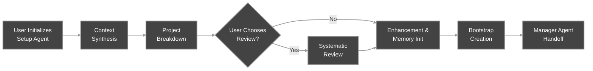
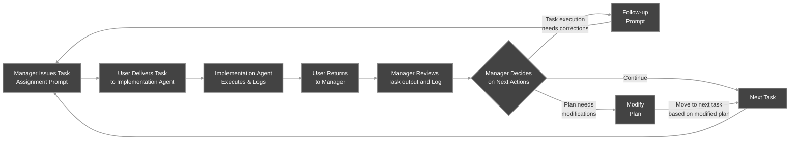
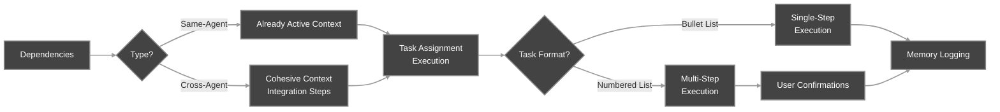
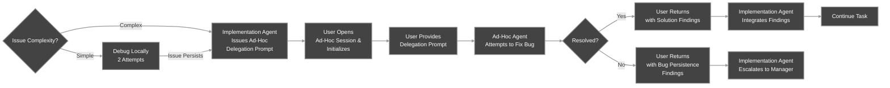
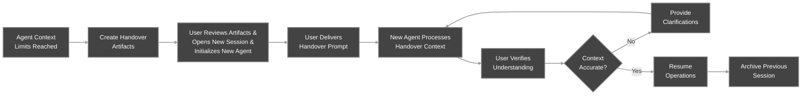

# Workflow Overview - APM v0.5

APM operates through two workflow phases:
1. **Setup Phase**: Comprehensive project discovery and planning
2. **Task Loop Phase**: Coordinated task assignment & execution

Plus **Handover Procedures** as distinct events when agents approach memory limits.

## Table of Contents

- [Notes for specific AI IDEs](#notes-for-specific-ai-ides)
- [Setup Phase](#setup-phase)
  - [Setup Agent Initialization](#setup-agent-initialization)
  - [1. Context Synthesis & Project Discovery](#1-context-synthesis--project-discovery)
  - [2. Project Breakdown & Implementation Plan Creation](#2-project-breakdown--implementation-plan-creation)
  - [3. Implementation Plan Review (Optional)](#3-implementation-plan-review-optional)
  - [4. Implementation Plan Enhancement & Finalization](#4-implementation-plan-enhancement--finalization)
  - [5. Manager Bootstrap Creation](#5-manager-bootstrap-creation)
- [Task Loop Phase](#task-loop-phase)
  - [Manager Agent Initialization](#manager-agent-initialization)
  - [Task Assignment Prompt Creation](#task-assignment-prompt-creation)
  - [Implementation Agent Task Execution](#implementation-agent-task-execution)
  - [Error Handling & Ad-Hoc Debugger Delegation](#error-handling--ad-hoc-debugger-delegation)
  - [Memory Logging & Review](#memory-logging--review)
- [Handover Procedures](#handover-procedures)
  - [When to Consider Handovers](#when-to-consider-handovers)
  - [Handover Eligibility Requirements](#handover-eligibility-requirements)

---

## Notes for specific AI IDEs

> **As of August 2025, GitHub Copilot does not provide a context window consumption visualization.** Instead, it uses an internal "summarizing conversation history" mechanism that is known to be buggy and can break cached context, disrupting APM workflows.
>   - **Setup Phase**: If the summarization mechanism triggers, the agent may lose track of guides and procedures. **Stop the response immediately**, then re-provide the required prompts and guides (e.g., Setup Agent initiation prompt, planning guides) before continuing.
>   - **Task Loop Phase**: The cycle is more resilient, but the same issue can occur. If summarization mechanism triggers, and you noticed degrading response quality **stop the response**, re-provide the necessary prompts/guides or task context, and verify the agent has re-established understanding before proceeding.
>
> **Tip:** Consider disabling the summarization mechanism by setting `github.copilot.chat.summarizeAgentConversationHistory.enabled` to `false` in your Copilot settings.
>
> > Additional notes for specific IDEs will be added here as new releases occur and user feedback is collected.

---
## Setup Phase

The Setup Agent conducts comprehensive project initialization through systematic progression gates. Each step must complete before advancing to the next. **Use powerful frontier models with agentic capabilities for the Setup Agent, like Claude Sonnet 4.** 

### Setup Agent Initialization

The Setup Phase begins when the User initiates the Setup Agent, which then starts a comprehensive 5-step sequence defined below.

### 1. Context Synthesis & Project Discovery
The Setup Agent proceeds to Context Synthesis for project discovery:

**User Actions:**
- Respond to a structured discovery questionnaire across three phases
- Provide detailed project information, requirements, and constraints
- Validate the Setup Agent's understanding or expand

**Setup Agent Actions:**
- Conduct systematic discovery through a three-phase methodology:
  - **Phase 1**: Existing materials, PRDs, project vision, and scope assessment
  - **Phase 2**: Targeted inquiry across technical requirements, dependencies, constraints
  - **Phase 3**: Process requirements, workflow preferences, quality standards  
- Use mandatory follow-up cycles for each discovery phase until understanding is complete
- Retain insights for the systematic breakdown phase

### 2. Project Breakdown & Implementation Plan Creation
After complete contextual understanding has been achieved in Context Synthesis, the Setup Agent proceeds to Project Breakdown using a systematic chat-to-file procedure:

**User Actions:**
- Review domain analysis, agent assignments, and phase cycles in chat
- Review the final holistic review and refinement in chat
- Review the structured Implementation Plan file as it develops through phase cycles
- Provide feedback for immediate modifications, tweaks, or gaps.
    > **Tip:** Spend ample time carefully reviewing and refining the Implementation Plan in collaboration with the Setup Agent. When working with AI, it's crucial to be thorough and proactive. Meticulously combing through the plan at this early stage helps prevent roadblocks and issues later. Always plan ahead and ensure the Implementation Plan fully matches your project needs before moving forward.
- Once the Implementation Plan meets the User's project requirements and preferences, the User may choose whether to proceed with a systematic, agent-driven review or skip to enhancement.

**Setup Agent Actions:**
Execute systematic progression through the mandatory gates:
  1. **Domain Analysis** (in chat): Identify work domains → Create initial Implementation Agent assignments
  2. **Phase Definition** (in chat): Define phase sequence → Establish project progression logic  
  3. **Phase Cycles** (in chat + file): 
     - Task identification with anti-packing guardrails (in chat)
     - Complete individual analysis for each task (in chat)
     - Initial task dependency assessment (in chat)
     - File appendix in simple format (in file)
  4. **Final Review** (in chat + file): Agent workload balancing + cross-agent dependency marking
  5. **Plan Approval**: Present the complete file and chat reasoning for User review

**Immediate Review Checkpoint:** Immediately after the Project Breakdown completes (before optional systematic review or enhancement), perform a full end-to-end review of the Implementation Plan. Fix mismatches and structural issues now to prevent costly downstream changes and token spend. Match the Plan to your project's needs and your workflow preferences.

**The Setup Agent employs a systematic chat-to-file procedure carefully designed to address core LLM limitations such as pattern matching, artificial dependencies, and hallucinations.** This approach ensures that the entire Implementation Plan's reasoning and decision-making process is transparently provided in a single, comprehensive response. By ‘forcing’ chain-of-thought (CoT) reasoning, this method unlocks deep reasoning capabilities in powerful ‘non-thinking’ models commonly available across most AI IDEs and subscription tiers.

**Important:** Some AI IDE system prompts or even certain "thinking" models may not follow this chat-to-file procedure as intended. For example, they might split the process into multiple responses, or their two-pane (thinking/response) architecture may disrupt the intended flow. If this occurs, please ensure the entire sequence is completed as described.

**This approach is intentionally crafted for robust, agentic non-thinking models, which are the default in most AI IDEs.** 

> **Note:** If you encounter any issues during this process, please refer to the relevant section of the [Troubleshooting Guide](./docs/Troubleshooting_Guide.pdf) for detailed assistance.

### 3. Implementation Plan Review (Optional)
If the User opts for a systematic review, the Setup Agent highlights plan sections needing extra attention. For the areas the User selects, the Setup Agent reviews for AI-specific planning issues—like task-packing, misclassified tasks, or other LLM-related errors, rather than rechecking the entire project context. Major context gaps may still be flagged if found. This agent-driven review is optional and is intended to optimize workflow clarity, smoothness, and AI-oriented planning practices, rather than to ensure the Implementation Plan fully and accurately reflects the project's actual requirements. **The User should always conduct their own comprehensive review of the Implementation Plan before relying on the Agent's review.**

**User Actions:**
- Select specific phases/tasks for detailed analysis if reviewing
- Review Setup Agent's analytical findings and approve plan modifications

**Setup Agent Actions:**
- Propose high-value review areas based on plan complexity analysis
- Apply analytical testing/review framework to user-selected areas only
- Challenge previous planning decisions through structured questioning
- Apply improvements identified through the review process

### 4. Implementation Plan Enhancement & Finalization
In this exchange, the Setup Agent transforms the Implementation Plan into a detailed APM artifact.

**User Actions:**
- Review the enhanced Implementation Plan with detailed task specifications
- Request modifications to any artifacts, if needed

**Setup Agent Actions:**
- Transform the simple plan into a detailed APM artifact with comprehensive task specifications

> **Note:** If you encounter any issues during this process, please refer to the relevant section of the [Troubleshooting Guide](./docs/Troubleshooting_Guide.pdf) for detailed assistance.

### 5. Manager Bootstrap Creation
The final step of the Setup Agent workflow is to generate a comprehensive Bootstrap Prompt for initializing the first Manager Agent chat session.

**User Actions:**
- Review the Bootstrap Prompt for completeness and accuracy
- Copy the Bootstrap Prompt to the first (already initialized) Manager Agent chat session
- Close the Setup Agent session upon successful Manager initialization

**Setup Agent Actions:**
- Generate a comprehensive Bootstrap Prompt containing:
  - YAML frontmatter 
  - User intent and requirements summary  
  - Implementation Plan overview and execution guidance
  - Memory system initialization instructions
  - Next action specifications for Manager Agent
- Complete context transfer preparation and end Setup Agent session

---

## Task Loop Phase

Manager and Implementation Agents coordinate through structured task assignment and review cycles until project completion. **While powerful models can enhance performance for these agent instances, APM v0.5 also works effectively with more economical alternatives such as Cursor's Auto model mixture or Copilot's GPT-4.1 base model, providing a viable cost-effective option.**

### Manager Agent Initialization
Upon initialization, the Manager Agent expects either the Bootstrap Prompt (if it is the first manager of the session) or a Handover Prompt (if it is a subsequent manager in the session). This ensures the Manager Agent receives all necessary context and resources to begin or resume managing the project.

**User Actions:**
- Provide either the Bootstrap Prompt or a Handover Prompt to the new Manager Agent session
- Confirm the Manager Agent's understanding of project scope and responsibilities; provide clarification if issues exist
- Authorize the Manager Agent to begin coordination duties and task execution following established protocols

**Manager Agent Actions:**
- Parse YAML front matter for asset locations and format specifications from the received prompt (Bootstrap or Handover)
- Read all required guides and ensure understanding of session responsibilities, procedures, and protocols
- Confirm understanding of project context and requirements, and request User authorization before proceeding with coordination duties

### Task Assignment Prompt Creation
Task Assignment Prompts are carefully structured meta-prompts created by the Manager Agent that guide Implementation Agents in executing specific tasks according to the project plan.

**User Actions:**
- Deliver Task Assignment Prompts to appropriate Implementation Agent chat sessions
- Coordinate between Manager and Implementation Agents as the communication bridge

**Manager Agent Actions:**
- Examine task contents in the Implementation Plan for dependency declarations and context requirements
- Determine dependency handling approach:
  - **Same-Agent Dependencies**: Simple contextual reference approach
  - **Cross-Agent Dependencies**: Comprehensive integration context approach
- Create a structured Task Assignment Prompt containing:
  - YAML front matter with execution type and dependency flags
  - Task reference from the Implementation Plan
  - Context from dependencies (adjusted approach)
  - Detailed instructions based on Implementation Plan specifications
  - Expected outputs and success criteria
  - Memory Logging path and instructions

### Implementation Agent Task Execution
The Implementation Agent executes assigned tasks according to Task Assignment Prompts and the project plan, following clear execution and logging protocols. Tasks contain dependency context integration instructions and can be single-step or multi-step depending on execution requirements:

**Dependency Integration**:
- **Cross-Agent**: Complete all integration steps + Step 1 of the main task (or full task if single-step)
- **Same-Agent**: Minimal context reference, direct task execution

**Single-Step Tasks:**
- Complete all subtasks in one response
- Direct execution → immediate Memory Logging

**Multi-Step Tasks:**
- Execute Step 1 → User confirmation → Step 2 → confirmation → continue
- User iteration/feedback/guidance opportunities at each step
- **Step combination available**: Adjacent steps can be combined when requested by the User or pre-specified in the Task Assignment Prompt for efficiency
- Final step completion → Memory Logging

**Explanation Protocol**:
- **User Requests**: Users can request explanations for complex tasks at Manager level or during task execution
- **Timing**: Brief introduction before execution, detailed explanation after completion
- **Scope**: Technical approach, decision rationale, architectural impact, integration considerations

### Error Handling & Ad-Hoc Debugger Delegation

**Error Escalation Protocol**:
- **Minor Issues** (≤2 debugging exchanges): Debug locally (up to two attempts)
- **Major Issues** (>2 exchanges OR complex/systemic): **Mandatory Ad-Hoc Debugger delegation**

**Ad-Hoc Delegation Workflow**:

1. **Implementation Agent**: Stop debugging, create a delegation prompt using the appropriate Debug Delegation guide
2. **User**: Open a new Ad-Hoc agent session, paste the delegation prompt  
3. **Ad-Hoc Agent**: Execute a three-step workflow (Bug Assessment/Reproduction → Execution → Delivery)
4. **User**: Return findings to the Implementation Agent session
5. **Implementation Agent**: Integrate the solution or escalate to the Manager

### Memory Logging & Review
After every Task Assignment, a Memory Log must be created to capture all key information about task execution: outcomes, issues, next steps, etc., following a standardized format. This ensures the Manager Agent has a complete, structured record of what occurred.

**User Actions:**
- If prompted, confirm task completion quality before authorizing Memory Logging
- Report completed tasks and Memory Log completion to Manager Agent session
- Facilitate communication between Implementation and Manager Agents

**Implementation Agent Actions:**
- Complete standardized Memory Log format with:
  - Status, outputs, issues, and next steps documentation
  - Detailed work summary and decision rationale
- Report completion status to the User for Manager review coordination

**Manager Agent Actions:**
- Analyze Memory Logs for completion status, quality, and outputs
- Make next action decisions:
  - **Continue Forward**: Issue next Task Assignment Prompt
  - **Request Corrections**: Create follow-up prompt for same agent
    - **Assign Debugging**: Engage Ad-Hoc agents for complex issues
  - **Update Plan**: Modify Implementation Plan based on execution findings
- Create phase summaries when phases complete
- Maintain memory system organization per selected strategy

---

## Handover Procedures

Context transfer protocols when agents approach memory limits, maintaining project continuity across agent instances. **Handover procedures can be used with any model tier, as they primarily involve structured context transfer rather than complex reasoning. However, more capable models will provide better context synthesis and verification.**

### When to Consider Handovers

**Proactive handover timing is critical for maintaining project quality.** Don't wait until an agent completely fails or starts hallucinating. By then, the context transfer may already be compromised.

- **Context Window Awareness:**
  - **Visual Indicators**: Most AI IDEs have some kind of context usage visualization; initiate handover at 80-90% capacity
- **General Rule of Thumb:**
    - **Implementation Agents**: Consider handover after 5-10 task cycles, depending on task complexity
    - **Manager Agents**: Consider handover after 10-15 task cycles for first Manager (context gathering burden), 15-20 for replacement Managers

**Performance Warning Signs:**
- Repetitive questions about information provided earlier
- Contradicting previous decisions or advice
- Generic responses lacking project-specific context
- Forgotten project details or requirements
- Misremembering task assignments or project structure

### Handover Eligibility Requirements

**Critical:** Handovers can only occur during specific workflow states. Requests during active work are denied with completion requirements.

**Implementation Agent Handover Eligibility:**
- Complete task execution cycle finished
- Task work completed OR blocked with clear identification  
- Ad-Hoc delegation completed and findings integrated (if any)
- Memory Log thoroughly completed following standard format
- User reporting of task status completed

**Manager Agent Handover Eligibility:**
- Complete task loop cycle finished
- Task Assignment issued AND Implementation Agent execution complete
- Memory Log received back from User with task results
- Memory Log reviewed and next action decision made

**Important:** Some AI IDE system prompts or models may not respect handover timing restrictions. If an agent agrees to handover during ineligible periods, complete the current critical step first, then manually verify eligibility before proceeding.

### Handover Artifact Creation

**The two-artifact handover system ensures comprehensive context transfer while maintaining structured initialization for replacement agents.**

**User Actions:**
- Review handover artifacts for completeness and accuracy
- Verify that the Handover File & Prompt captures current project state and working context before new session initialization
    - **Tip:** Take time to review the Handover File & Prompt content; if the current agent missed important context, the replacement agent will inherit those gaps.

**Current Agent Actions:**
- Create comprehensive two-artifact system when approaching context limits:
  - **Handover File** (`<Agent>_Handover_File_<X>.md`): Current project status, recent work completed, key decisions and rationale, known issues/blockers, User preferences and effective approaches, working insights not captured in Memory Logs
  - **Handover Prompt** (presented in chat as markdown code block): APM framework onboarding instructions for replacement agent, Handover File reading and context integration protocols, current session state and immediate next actions, user verification requirements before proceeding

**The Handover File serves as active memory context that formal Memory Logs don't capture:** User preferences, working insights, effective approaches, and project intuition developed during the session. By combining a context dump in the Handover File for non-workflow context retained in collaboration with the accurate history from Memory Logs, we achieve a complete context transfer to the next agent instance.

### Handover Execution Process

**Context transfer requires careful verification to ensure replacement agents understand both the technical project state and the working relationship established with the user.**

**User Actions:**
- Validate the current agent's handover artifacts for completeness and project accuracy
- Open a new replacement agent session (same agent type, clear naming) & initialize
- Paste the Handover Prompt as the very first message to the new agent
- **Carefully verify** the new agent's context understanding by examining their understanding summary and/or asking clarification questions before authorizing operations
    - **Important:** Be thorough in verification; replacement agents may confidently misunderstand context while appearing knowledgeable
- Archive/close the previous agent session only after successful handover verification

**Current Agent Actions:**
- Prepare comprehensive handover artifacts following established guide protocols
- Ensure complete context transfer preparation, including working insights and User interaction patterns

**New Agent Actions:**
- Process Handover File thoroughly for complete context integration
- Demonstrate understanding of project state, recent progress, immediate priorities, and working relationship with the User
- Ask specific clarification questions about any ambiguous context points
    - **Never** proceed with operations until receiving explicit User authorization

### Common Handover Issues

**Common Handover Issues:**
- **Overconfident Replacement**: New agents may claim understanding without thoroughly processing context; address during verification
- **Context Gaps**: If the outgoing agent missed important information, the replacement inherits those gaps; address during verification
- **Model Variations**: Different models may interpret handover context differently; be prepared to provide clarifications
- **Working Relationship**: Replacement agents need to rebuild understanding of your communication style and preferences

> **Note:** For guidance on how to recover from common Handover issues, refer to the relevant paragraph of the `Troubleshooting` section of the [APM User Guide](../guides/APM_User_Guide.pdf).

---

**APM workflow ensures systematic project progression through structured agent coordination, comprehensive context management, and seamless continuity during context transfers.**