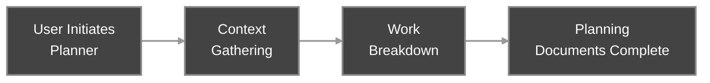
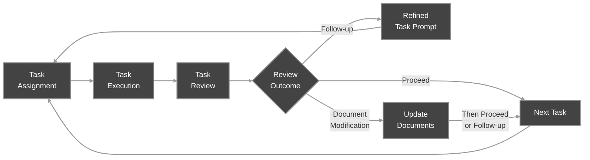
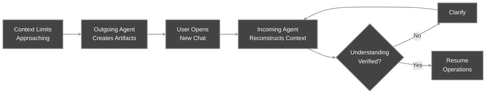

# Workflow Overview

APM operates through two distinct phases: the Planning Phase establishes project structure through planning documents, and the Implementation Phase executes the plan through repeating assignment-execution-review cycles. Each phase has specific procedures, agents, and outcomes that build toward project completion.

---

## Planning Phase

The Planning Phase transforms User requirements into planning documents that guide all subsequent work. The Planner operates once at project start, conducting structured discovery and decomposing gathered context into actionable documents.


```mermaid
graph LR
    A[User Initiates<br/>Planner] --> B[Context<br/>Gathering]
    B --> C[Work<br/>Breakdown]
    C --> D[Planning<br/>Documents Complete]

    classDef default fill:#434343,stroke:#888888,stroke-width:2px,color:#ffffff
    linkStyle default stroke:#9A9A9A,stroke-width:2px
```

### Context Gathering

The Planner conducts structured discovery through three Question Rounds, each focused on progressive refinement. Before starting question rounds, the Planner checks for archived sessions in `.apm/archives/`.

**Archive Detection**

If archived APM sessions exist, the Planner presents them to the User and asks about relevance. When indicated archives are relevant, the Planner spawns the `apm-archive-explorer` custom subagent to examine them, then verifies findings against the current codebase before integrating into question rounds. This enables iterative development where each session builds on prior work.

**Question Round 1: Existing Materials and Vision**

- Project type, problem statement, and scope
- Existing documentation, PRDs, or codebase
- High-level goals and success criteria

**Question Round 2: Technical Requirements**

- Work structure and dependencies
- Technical requirements and constraints
- Validation criteria for each requirement
- Design decisions and constraints

**Question Round 3: Implementation Approach and Quality**

- Technical constraints and preferences
- Workflow patterns and quality standards
- Domain organization and coordination needs
- Finalizing the Spec and Rules

After each round, the Planner iterates on gaps and unclear areas before advancing. When User responses reference codebase elements or documentation, the Planner explores proactively to gather concrete information. Research Subagents may be spawned to avoid consuming the Planner's context during exploration.

After all rounds complete, the Planner presents an Understanding Summary for User review. Modifications loop back through targeted follow-ups until User approval triggers transition to Work Breakdown.

### Work Breakdown

The Planner decomposes gathered context into three planning documents through visible reasoning - reasoning is presented in chat before file output.

**Spec Creation**

- Surfaces design decisions from gathered context: explicit choices, implicit constraints, and alternatives not taken
- Writes the Spec with project-specific design decisions; structure follows the decisions identified
- Presents for User review, iterates on feedback until approval

**Plan Creation**

- Identifies logical work domains and defines Workers
- Identifies all Stages with objectives
- For each Stage, completes detailed Task breakdown with objectives, outputs, validation criteria, guidance, dependencies, and steps
- Assesses workload distribution across agents
- Generates Dependency Graph visualizing Task dependencies and agent assignments
- Presents for User review, iterates on feedback until approval

**Rules Creation**
- Extracts universal execution patterns from three sources: Spec decisions with execution implications, recurring patterns across Plan Tasks, and workflow conventions from Context Gathering
- Writes APM standards block in the platform's agents file
- Presents for User review, iterates on feedback until approval

After all three planning documents receive User approval, the Planner initializes the bus system for all agents defined in the Plan and the Planning Phase concludes. The User initializes the Manager to begin the Implementation Phase.

---

## Implementation Phase

The Implementation Phase executes the Plan through repeating assignment-execution-review cycles. The Manager assigns tasks to Workers, reviews completed work, and maintains project state. Each task executes through its own cycle.


```mermaid
graph LR
    A[Task<br/>Assignment] --> B[Task<br/>Execution]
    B --> C[Task<br/>Review]
    C --> D{Review<br/>Outcome}
    D -->|Proceed| E[Next Task]
    D -->|Follow-up| F[Refined<br/>Task Prompt]
    D -->|Document<br/>Modification| G[Update<br/>Documents]
    E --> A
    F --> A
    G -->|Then Proceed<br/>or Follow-up| E

    classDef default fill:#434343,stroke:#888888,stroke-width:2px,color:#ffffff
    linkStyle default stroke:#9A9A9A,stroke-width:2px
```

### Manager Initialization

After the Planning Phase, the User creates a new chat for the Manager and runs the initialization command. The Manager:

- Reads all planning documents
- Populates the Tracker and initializes the Index
- Initializes version control if a git repository exists
- Presents understanding summary for User review

After User authorization, the Manager begins coordinating task execution through assignment-execution-review cycles.

### Assignment-Execution-Review Cycle

Each task executes through its own assignment-execution-review cycle containing three parts: Task Assignment, Task Execution, and Task Review. When multiple tasks are dispatched (batch or parallel), each task still has its own cycle - they may run sequentially or concurrently, but the per-task structure remains the same.

#### Task Assignment

The Manager assesses which tasks are ready based on dependency completion and the Tracker. For each ready task:

1. **Dependency Context Analysis** - Classifies dependencies as same-agent (light context with recall anchors) or cross-agent (comprehensive context with file reading instructions). After Worker Handoff, previous-Stage same-agent dependencies are reclassified as cross-agent.

2. **Spec Extraction** - Extracts relevant design decisions from the Spec for contextual integration into the Task Prompt. Workers do not reference the Spec directly - all necessary context is embedded by the Manager.

3. **Task Prompt Construction** - Assembles a self-contained prompt with task reference, context from dependencies, objective, detailed instructions, expected output, validation criteria, memory logging instructions, and reporting instructions.

4. **Delivery via Task Bus** - Writes the Task Prompt to the Worker's Task Bus file. Directs the User to run `/apm-4-check-tasks` in the Worker's chat.

**Dispatch Modes:**

- **Single Dispatch** - One task to one Worker
- **Batch Dispatch** - Multiple sequential tasks to the same Worker in a single Task Bus message
- **Parallel Dispatch** - Tasks to multiple Workers simultaneously when no cross-Worker dependencies exist among them

For parallel dispatch, the Manager initializes version control (feature branches and worktrees) for workspace isolation.

#### Task Execution

The Worker receives the Task Prompt and executes through this loop:

1. **Registration** - On first Task Prompt, the Worker binds to the agent identity specified in the prompt. This identity persists across the Implementation Phase for that Worker instance.

2. **Context Integration** - If cross-agent dependencies exist, the Worker reads specified files to integrate context from prior tasks by other Workers.

3. **Execution** - Works through task instructions step by step according to the Task Prompt.

4. **Validation** - Validates results per specified criteria in order: Programmatic tests, then Artifact checks, then User review. User validation requires pausing for review before proceeding.

5. **Correction Loop** - If validation fails, attempts to correct and re-validates. This loop repeats until success or a stop condition.

6. **Task Logging** - Creates Task Log at specified path documenting outcome, validation results, deliverables, technical decisions, and flags.

7. **Task Reporting** - Clears the Task Bus, writes Task Report to Report Bus summarizing completion status and key findings.

The Worker directs the User to run `/apm-5-check-reports` in the Manager's chat.

**Batch Execution:** When receiving a batch, the Worker executes each task sequentially and writes a Task Log immediately after each. If any task results in Blocked or Failed status, the Worker stops execution (fail-fast) and reports partial completion with unstarted tasks listed as "Not started (batch stopped)."

**Subagent Spawning:** Workers may spawn platform-native subagents (Debug Subagent, Research Subagent) for isolated context-heavy work that would pollute the main context. Findings are integrated into the Worker's context after completion.

#### Task Review

The Manager receives the Task Report via Report Bus and reviews the outcome:

1. **Report Processing** - Reads the Task Report from Report Bus (triggered by `/apm-5-check-reports`), clears per Clear-on-Return protocol. If Batch Report, processes each task's outcome individually.

2. **Log Review** - Reads the Task Log referenced in the Report. Interprets task status (Success, Partial, Failed, Blocked), flags (important_findings, compatibility_issues), and log content.

3. **Review Outcome** - Determines next action based on review:
   - **Proceed** - Task successful, no issues detected. Update Tracker, check Stage completion, dispatch next task(s).
   - **Follow-up** - Task needs retry with refined approach. Create follow-up Task Prompt with different content (refined objective, updated instructions, follow-up context section explaining what went wrong). Same Task Log path - Worker overwrites previous log.
   - **Document Modification** - Execution revealed issues with planning documents (Spec, Plan, or Rules). Determine authority scope (bounded Manager authority vs User collaboration for significant changes). Modify documents, verify consistency, update Dependency Graph if Plan Task relationships change. Then proceed to next task or issue follow-up as needed.

4. **Tracker Update** - Every outcome path ends with updating the Tracker: completed tasks, readiness changes, merge state.

5. **Stage Summary** - After all tasks in a Stage complete, the Manager reviews all Task Logs for that Stage and appends a stage summary to the Index capturing Stage-level outcomes and cross-cutting observations.

**Parallel Report Handling:** During parallel dispatch, Reports arrive asynchronously. The Manager processes each as it arrives, determines the review outcome, merges the completed task's branch, reassesses readiness, and dispatches newly ready tasks if any. When no ready tasks exist but Workers are still active, the Manager communicates what is pending and waits.

### Memory

Memory resides in `.apm/` and tracks project state and execution history:

- **Tracker** (`tracker.md`) - Live project state containing task tracking (statuses per Stage: Waiting, Ready, Active, Done), agent tracking (instance numbers, notes), version control state, and working notes. Updated by the Manager throughout the Implementation Phase.

- **Index** (`memory/index.md`) - Durable project memory containing memory notes (persistent observations and patterns) and stage summaries (appended after each Stage completion).

- **Task Logs** (`memory/stage-<NN>/task-<NN>-<MM>.log.md`) - Structured logs created by Workers after each task completion. Serve as context abstraction layer between Manager's coordination view and Worker's execution details.

- **Handoff Logs** (`memory/handoffs/<agent>/handoff-<NN>.log.md`) - Logs created during Handoff containing working context not captured elsewhere.

- **Archives** (`.apm/archives/`) - Archived session artifacts preserved for future reference. Each archive is a directory named `session-YYYY-MM-DD-NNN` containing the session's planning documents, Tracker, and Memory. An optional `session-summary.md` provides a pre-built overview. Archives accumulate across sessions and are accessible to future Planners during Context Gathering.

### Bus System

The bus system in `.apm/bus/` enables file-based communication between Agents. The Planner initializes it at the end of the Planning Phase. Each Worker has a bus directory containing three bus files:

- **Task Bus** (`task.md`) - Manager-to-Worker communication containing Task Prompts
- **Report Bus** (`report.md`) - Worker-to-Manager communication containing Task Reports
- **Handoff Bus** (`handoff.md`) - Outgoing-to-incoming Agent communication containing handoff prompts

The User triggers bus checks using commands (`/apm-4-check-tasks`, `/apm-5-check-reports`) — there is no direct Manager-Worker communication. Before writing to an outgoing bus file, an Agent clears its incoming bus file, preventing stale messages.

---

## Handoff

When an Agent's context window approaches limits (70-80% capacity), a Handoff transfers context to a fresh instance of the same Agent. Handoff applies to Manager and Workers only - the Planner operates in a single instance.


```mermaid
graph LR
    A[Context Limits<br/>Approaching] --> B[Outgoing Agent<br/>Creates Artifacts]
    B --> C[User Opens<br/>New Chat]
    C --> D[Incoming Agent<br/>Reconstructs Context]
    D --> E{Understanding<br/>Verified?}
    E -->|No| F[Clarify]
    F --> D
    E -->|Yes| G[Resume<br/>Operations]

    classDef default fill:#434343,stroke:#888888,stroke-width:2px,color:#ffffff
    linkStyle default stroke:#9A9A9A,stroke-width:2px
```

### Handoff Process

**Eligibility**

- Manager may Handoff at any point as long as the Handoff Prompt captures comprehensive current state
- Workers may Handoff between tasks or mid-task; must include current execution context in detail in their Handoff Log

**Outgoing Agent**

1. Creates Handoff Log capturing working context not recorded elsewhere (effective patterns, User preferences, undocumented insights, current execution context if mid-task, version control state if applicable)
2. Writes handoff prompt to Handoff Bus instructing the incoming Agent on context reconstruction
3. Directs User to start a new chat and run the initialization command — the incoming Agent auto-detects the handoff prompt

**Incoming Agent**

1. User creates a new chat for the same agent role (e.g., "Manager 2" or "Frontend Agent 2")
2. User runs initialization command (`/apm-2-initiate-manager` or `/apm-3-initiate-worker`)
3. Agent auto-detects handoff prompt from Handoff Bus, follows instructions to read Handoff Log and relevant Task Logs
4. Agent reconstructs working context and presents understanding summary
5. User verifies accuracy and authorizes Agent to resume from where Outgoing Agent left off

**Context Reconstruction Scope**

- Incoming Manager reads the Handoff Log, Tracker, Index (stage summaries and memory notes), and relevant recent Task Logs
- Incoming Worker reads the Handoff Log and current-Stage Task Logs for their agent. Previous-Stage logs are not loaded for efficiency - the Manager accounts for this when constructing future Task Prompts by treating previous-Stage same-agent dependencies as cross-agent dependencies.

---

## Session Continuation

After a session completes, Session Continuation archives the current session's artifacts and restores fresh templates for a new session while preserving access to previous work.

### Archive Structure

Archived sessions reside in `.apm/archives/`. Each archive is a directory named `session-YYYY-MM-DD-NNN` (zero-padded daily counter) containing the session's planning documents, Tracker, and Memory. The bus directory is not archived — bus state is ephemeral and session-specific.

```text
.apm/archives/
├── index.md
├── session-2026-03-04-001/
│   ├── metadata.json
│   ├── plan.md
│   ├── spec.md
│   ├── tracker.md
│   ├── session-summary.md     # optional
│   └── memory/
└── session-2026-03-05-001/
    └── ...
```

### Workflow

1. **Summarize** - After project completion, run `/apm-8-summarize-session` in a new chat. The summarization agent reads `.apm/` artifacts, produces a session summary, and offers to archive.

2. **Archive** - Archival moves current `.apm/` artifacts to `.apm/archives/session-YYYY-MM-DD-NNN/`, restores fresh templates, and updates `.apm/archives/index.md`. Can also be triggered directly via `apm archive` CLI command.

3. **Continue** - When a new Planner starts, Context Gathering detects existing archives and offers to explore them using the `apm-archive-explorer` custom subagent, integrating relevant findings into question rounds.

Archives can optionally reference a previous archive via a `continues` key in `metadata.json`, establishing session lineage for multi-session projects.

---

**Next Steps:**

- See the complete workflow mechanics in [Getting Started](Getting_Started.md)
- Understand Agent responsibilities in [Agent Types](Agent_Types.md)
- Learn about Agent communication and memory in [Agent Orchestration](Agent_Orchestration.md)
