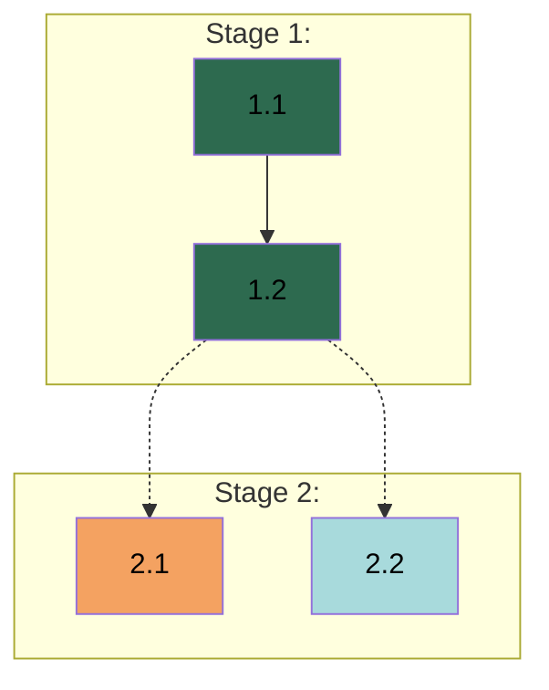

# APM {VERSION} - Work Breakdown Guide

## 1. Overview

**Reading Agent:** Planner

This guide defines the process for Work Breakdown, which transforms gathered context into planning documents (Spec, Plan, and Rules) through visible reasoning - thinking visibly in chat before committing to files.

### 1.1 Outputs

- *Spec:* Design decisions and constraints that define what is being built. Free-form structure determined by project needs.
- *Plan:* Stage and Task breakdown with Worker assignments, validation criteria, dependency chains, and Dependency Graph.
- *`{RULES_FILE}`:* Universal execution-level Rules applied during Task execution.

**Artifact consumers:**
- *Spec and Plan:* Manager reads directly. Workers do not reference these files - the Manager extracts relevant content into Task Prompts.
- *`{RULES_FILE}`:* Workers access directly during Task execution. Standards must be self-contained without Spec or Plan context.

**Completeness.** All context gathered during Context Gathering must be captured across these three artifacts: design decisions in the Spec, work structure and dependencies in Plan Task fields, domain-specific implementation details in Plan Task Guidance, and universal execution patterns in Rules. Version control conventions are the Manager's concern - any VC patterns you observed during Context Gathering are recorded as factual observations in the Spec below the Workspace section for the Manager to read. If you choose to omit gathered context from all three artifacts, justify why it is not needed for execution - the Manager and Workers operate from these documents alone and will not have access to anything left out.

During the Implementation Phase, the Manager coordinates multiple Workers, each focused on a specific domain. Workers may receive multiple Tasks over time, building accumulated working context as they progress. The Manager constructs self-contained Task assignments from the Spec and Plan, handles all coordination (dispatch decisions, branch creation, worktree management, merging), and reviews completed work. The Manager creates a feature branch for every dispatch - Workers always operate on their assigned branch, never directly on the base branch. Workers commit following conventions from Rules; the Manager handles everything else. Your planning documents define work organization and content; coordination decisions happen at runtime and are not your concern.

Decomposition granularity adapts to project size and complexity - smaller projects warrant lighter breakdown, larger projects may need more detail.

---

## 2. Operational Standards

### 2.1 Decomposition Principles

These principles apply across all decomposition levels. Adapt granularity to project size and complexity.

**Domains:** Identify logical work domains from Context Gathering. Split when domains involve different expertise or mental models. Combine when domains share tight context and dependencies. When balanced, prefer separation. Integrate User preferences.

**Stages:** Sequential milestone groupings - Stage N+1 begins after Stage N completes. Each Stage delivers coherent value. Split when work streams are unrelated or intermediate deliverables block subsequent work. Combine when separation is artificial. When balanced, prefer fewer Stages with clear milestones. When domains can work in parallel, structure that as parallel Tasks within a single Stage rather than parallel Stages.

**Tasks:** Derive from Stage objectives. Each Task produces a meaningful deliverable, scoped to one Worker's domain, with specified validation criteria. Split when a Task spans domains or bundles unrelated deliverables. Combine when micro-tasks create overhead without value. Include subagent steps for investigation or research.

**Steps:** Organize work within a Task for failure tracing. Ordered, discrete, sharing the Task's validation. If a step needs independent validation, split the Task.

**Scope boundaries:** Worker-assignable work is completable within the development environment and verifiable autonomously. User coordination involves external platforms, credentials, or validation requiring human judgment - include explicit coordination steps and note where User involvement is needed.

**Validation criteria.** Each Task specifies concrete pass/fail criteria tied to its deliverables - what to check and how. Criteria the Worker can verify autonomously (tests pass, outputs exist with correct structure, behavior matches requirements) allow autonomous iteration. Criteria requiring User involvement - judgment (design approval, content quality) or action (running external checks, confirming platform behavior) - require the Worker to pause. Most Tasks combine multiple criteria. Validation criteria are Worker-scoped - no references to other Stages, Tasks, or coordination-level gates. Workers validate their own deliverables; Stage coordination is the Manager's concern.

### 2.2 Spec Standards

The Spec defines what is being built - design decisions, constraints, and requirements that shape the deliverable. It forms the foundation the Plan builds on: every design decision captured here has corresponding Tasks in the Plan that implement it.

The test for each candidate: would changing this decision reshape the project's design, or only affect a single scope of work? Project-shaping decisions - choices where alternatives existed, affecting what is being built across the project - belong here. Single-scope details and universal execution patterns do not. Within a design topic, capture the decision - not its implementation mechanics. If changing a detail does not change the decision, the detail belongs in Task Guidance. When User documents already authoritatively define requirements, reference them - the Spec captures design decisions layered on existing requirements, not restate them. When the workspace contains multiple repositories or codebases, capture workspace structure in the Spec - which repositories are working targets, which are read-only references, and where Workers operate. Different repositories may have different version control conventions; the Spec captures the workspace layout and Rules capture per-repository conventions when they differ. Structure the Spec so design decisions can be extracted per-Task - the Manager distills relevant content into individual Task Prompts.

### 2.3 Plan Standards

The Plan defines how work is organized - Stages, Tasks, Worker assignments, dependencies, and validation criteria. The Manager uses it for dispatch decisions, dependency analysis, coordination, and progress tracking.

**What belongs.** Task-level coordination - objectives, deliverables, Worker assignments, validation criteria, dependencies, step-by-step guidance. **What does not:** Design decisions across Tasks (Spec), universal execution patterns (Rules).

**Task self-sufficiency:** Each Task must contain enough context for a Worker to execute from a Task Prompt alone per §1.1 Outputs.

Guidance may reference authoritative sources by path - the Manager reads those sources and integrates relevant content into the Task Prompt. Steps describe the Worker's sequential operations - the Manager transforms them into actionable instructions enriched with Spec content and Guidance.

**Dispatch-aware structuring.** When assignments and Task ordering could go multiple ways, prefer arrangements that maximize dispatch opportunities. Three dispatch modes exist:
- *Batch:* same-agent Task groups dispatchable together (sequential chains or independent groups).
- *Parallel:* independent dispatch units for different agents, dispatchable simultaneously.
- *Single:* a lone Ready Task with no batch or parallel partners.

All three patterns are valid. Structure the Plan to create natural opportunities across all of them rather than forcing one pattern.

### 2.4 `{RULES_FILE}` Standards

`{RULES_FILE}` defines how work is performed - universal execution patterns across all Tasks. Workers access it directly during Task execution.

The test for each candidate - does it describe how work is performed, or what is being built? Output formats, response strings, data schemas, and interface contracts define what is being built - they belong in the Spec even when multiple Workers need them. For candidates that pass as execution patterns: does the pattern apply to every Worker regardless of domain? All Workers read the same file - if the pattern only applies to one domain, it does not belong here.

When uncertain whether something qualifies, prefer placing it in Task guidance - easier to promote later than to demote.

**Self-containedness:** Workers' working context is intentionally scoped to their Task Prompt and `{RULES_FILE}` - the Spec, Plan, and external design artifacts are omitted by design. Standards referencing those documents undermine that scoping. Embed content directly.

---

## 3. Work Breakdown Procedure

Three sequential activities, each with its own analysis, file write, and User approval gate:
1. Spec Analysis - analyze design decisions, write the Spec, pause for User review.
2. Plan Analysis - analyze work structure, write the Plan, pause for User review.
3. Rules Analysis - analyze execution patterns, write Rules, pause for User review.

Complete each phase before starting the next. Present reasoning visibly in chat as natural analytical thinking per `{SKILL_PATH:apm-communication}` §2.2 Visible Reasoning. At each approval gate, describe what was written, what comes next if approved, and ask for review.

### 3.1 Spec Analysis

Present reasoning under the header **Spec Analysis:** addressing the aspects below. Perform the following actions per §2.2 Spec Standards.

**Spec Header:**
1. Set `title` in `.apm/spec.md` YAML frontmatter to the project name.
2. Set `modified` field: "Spec creation by the Planner."
3. Fill the `## Overview` section: 3-5 sentences (project type, core problem, essential scope, success criteria).

**Spec Content:**
1. Analyze design decisions from gathered context:
   - *Design decisions.* Each explicit choice and implicit constraint embedded in requirements: what was decided, what alternatives existed, why this direction. Surface assumptions stated as facts that represent actual decisions.
   - *Source documents:* which requirements already have authoritative definitions in User documents; reference rather than duplicate.
   - *Boundary calls.* For each candidate, determine its primary location: Spec (project-level design decisions), Task guidance (Task-scoped details, single-domain constraints), or Rules (universal execution patterns). Each item belongs in one primary location.
   - *Decision relationships:* decisions that cascade, constrain, or cluster naturally together.
   - *Structure rationale:* how to organize decisions so the Manager can extract relevant content per Task.
   - *Workspace.* From the workspace assessment during Context Gathering, document the project environment: directory structure, working repositories, reference repositories, authoritative document locations, existing `{RULES_FILE}` content that was found. When version control signals were observed during Context Gathering, append a note below the Workspace section describing what was observed factually - commit patterns with specific commit references, branch usage patterns, User preferences if stated. These are observations for the Manager, not conventions to adopt.
2. Add specification content per §4.1 Spec Format. Let structure follow the decisions identified. Include the workspace section in the Spec.
3. Pause for User review:
   - State the Spec is complete and the artifact is created.
   - Ask User to review for accuracy.
   - If modifications needed → Apply and repeat step 3.
   - If approved → Proceed to §3.2 Plan Analysis.

### 3.2 Plan Analysis

Present reasoning under the header **Plan Analysis:** with sub-headers **Domain Analysis:**, **Stage Analysis:**, **Stage N Task Analysis:** for each Stage, and **Dependency Analysis:** for the analytical phases. After writing the Plan, review under **Plan Review:**. Perform the following actions per §2.3 Plan Standards.

**Plan Header:**
1. Set `title` in `.apm/plan.md` YAML frontmatter to the project name (same as Spec).
2. Set `modified` field: "Plan creation by the Planner."

**Plan Content:**
1. Analyze work structure from gathered context and the approved Spec per §2.1 Decomposition Principles:
   - *Domain Analysis.* Grounded in the Spec approved above:
     - Logical work domains and their scope.
     - Why domains are separated or combined.
     - How domains map to Workers with proposed names and responsibilities.
     Update Plan header Workers field.
   - *Stage Analysis:*
     - What each Stage delivers and its boundary rationale.
     - Why this ordering, what each Stage builds on and what it enables.
     - For each Stage, what distinct deliverables are needed, which Workers produce each, which can be produced independently vs which depend on others. When a deliverable spans domains, split into per-domain Tasks with cross-agent dependencies. When a deliverable is large, split into sequential Tasks that build toward it. Each Task produces a single meaningful deliverable scoped to one Worker's domain.
     Update Plan header Stages field.
   - *Stage N Task Analysis.* For each Stage in order, state context (User requirements and constraints influencing this Stage), then for each Task:
     - *Worker assignment:* which Worker and why.
     - *Task scope:* what is the Task's scope? Is the User involved in any steps?
     - *Task guidance:* implementation context the Worker needs, including domain-specific patterns (how to structure code, existing patterns to follow), constraints (performance, security, dependencies), technical decisions (library choices, API contracts), single-domain details (validation approach, testing strategy, error handling specifics). Include context classified as Task-scoped per §3.1 Spec Analysis.
     - *Task validation:* concrete criteria that verify the Task's deliverables - what to check and how. Note where User involvement is needed. Validation criteria co-define the Task with Guidance.
     - *Dependencies:* same-agent as `Task N.M`, cross-agent as **`Task N.M by <Agent>`** (bolded), specifying the deliverable at the boundary.
     - *Steps:* ordered operations building toward Task completion.
     Every aspect above must be addressed for every Task - none may be skipped. Depth of reasoning varies with complexity, but coverage does not: even a concise Task analysis names the Worker, states scope, provides guidance, specifies validation criteria, lists dependencies, and defines steps. After each Stage, assess whether each Task represents independently validatable work per §2.1 Decomposition Principles.
   - *Dependency Analysis.* After all Tasks are analyzed, verify all cross-agent dependencies are correctly identified and bolded. Cross-check agent assignments - if a dependency's producer differs from the consumer's agent, it must be bolded. Reason through the dependency audit (list, classify, flag misclassified) and cross-agent chains (provider, consumer, agents, required deliverable). Fix any misclassified dependencies. Generate a mermaid Dependency Graph per §4.2 Plan Format. Verify edge types: same-agent dependencies use `-->`, cross-agent dependencies use `-.->`. When presenting the dependency audit to the User, describe dependencies by their relationship rather than by graph notation.
2. Write the full Plan per §4.2 Plan Format. Enrich Task details from reasoning. Ensure every cross-agent dependency is bolded at write time. Include the Dependency Graph in the Plan header.
3. After writing the Plan, review it and correct any issues found:
   - *Structural check:* Confirm every Task has all required fields (Objective, Output, Validation, Guidance, Dependencies, Steps). Confirm every cross-agent dependency is bolded in both the Task's Dependencies field and the Dependency Graph.
   - *Workload check:* Count Tasks per Worker. Flag disproportionate workloads for subdivision review. If a Worker is clearly overloaded, subdivide autonomously (reason through domain boundaries and Worker coherence, update assignments and dependencies). If the imbalance is borderline or involves judgment calls, present the assessment to the User and ask before modifying.
   - *Consistency check:* Verify that Dependency Graph edge types match dependency classifications (`-->` same-agent, `-.->` cross-agent). Confirm Worker names in the Graph match the Workers table.
4. Pause for User review:
   - State the Plan is complete and the artifact is created.
   - Ask User to review the Plan.
   - If modifications needed → Apply and repeat step 4.
   - If approved → Proceed to §3.3 Rules Analysis.

### 3.3 Rules Analysis

Present reasoning under the header **Rules Analysis:** addressing the aspects below.

Perform the following actions per §2.4 `{RULES_FILE}` Standards:
1. Analyze for universal execution patterns across all planning sources:
   - **From the Spec:** execution patterns implied by design decisions, not the design content itself. Specific outputs, formats, values, and schemas defined by design decisions remain in the Spec - they reach Workers through Task Prompts.
   - **From the Plan:** patterns recurring across multiple Task guidance fields.
   - **From gathered context:** workflow preferences, conventions, or quality requirements from Context Gathering not yet captured in the Spec or the Plan. Version control conventions are excluded - the Manager handles those and appends content to Rules during the start of the Implementation Phase.
   - **Classification.** Which candidates are truly universal vs Task-specific; whether each is self-contained for Workers with no access to the Spec or the Plan. Universal means applicable to every Worker regardless of domain - test each: does it apply to all Workers, or only specific domains? Most projects produce few genuinely universal rules. Project-specific constraints and output specifications belong in the Spec or Task guidance even when they apply to multiple Workers.
   - **Existing standards:** what `{RULES_FILE}` already contains; reference rather than duplicate.
2. Write APM_RULES block to `{RULES_FILE}` per §4.3 APM_RULES Block:
   - If file exists: preserve existing content outside block, append APM_RULES block.
   - If creating new: create file with APM_RULES block only.
3. Pause for User review:
   - State Rules are complete.
   - Ask User to review `{RULES_FILE}` for accuracy.
   - If modifications needed → Apply and repeat step 3.
   - If approved → State Work Breakdown is complete and all planning documents are created. Proceed to `{COMMAND_PATH:apm-1-initiate-planner}` §4 Planning Phase Completion.

---

## 4. Structural Specifications

### 4.1 Spec Format

**Location:** `.apm/spec.md`

**YAML Frontmatter Schema:**
```yaml
---
title: <project name>
modified: <last modification note>
---
```

Below the frontmatter, the document starts with `# APM Spec` followed by two header sections: `## Overview` (3-5 sentences covering project type, core problem, essential scope, and success criteria) and `## Workspace` (project environment from the workspace assessment: directory structure, working repositories, reference repositories, and authoritative document locations). A single horizontal rule separates the header from the design decision content below. No horizontal rules within the content sections - `##` headings provide sufficient visual separation.

**Content structure.** Free-form below the header. Organize into sections that reflect the project's natural structure - its domains, components, boundaries, or technical concerns. Related design decisions share a section; cross-cutting choices get their own. The Spec should read as a coherent description of what is being built and why, shaped by the project's unique requirements.

**Content rules:** Use markdown headings (`##`) to organize decision groups. Each specification must be concrete and actionable. Structure for extraction - the Manager distills relevant content into individual Task Prompts, so decisions should be locatable and separable. Reference existing User documents rather than duplicating - include file paths and specific sections so the Manager can locate source material during Task Assignment. Use tables for enumerated values, mermaid diagrams for relationships, code blocks for schemas, prose for rationale.

### 4.2 Plan Format

**Location:** `.apm/plan.md`

**YAML Frontmatter Schema:**
```yaml
---
title: <project name>
modified: <last modification note>
---
```

Below the frontmatter, the document starts with `# APM Plan` followed by the Plan header: `## Workers` (table with `| Worker | Domain | Description |`), `## Stages` (table with `| Stage | Name | Tasks | Agents |`), and `## Dependency Graph` (mermaid diagram per **Dependency Graph Format** below). A single horizontal rule separates the header from Stage sections below. No horizontal rules within Stage sections.

**Stage Format.** Each Stage in the Plan:
- *Header:* `## Stage N: [Name]`
- *Naming:* Stage names reflect domain(s), objectives, and main deliverables.
- *Contents:* Tasks per **Task Format**, each containing steps per **Step Format**.

**Task Format.** Each Task in the Plan:

*Header:* `### Task <N>.<M>: <Title> - <Domain> Agent`

*Contents:*
```markdown
* **Objective:** [Single-sentence Task goal.]
* **Output:** [Concrete deliverables - files, components, artifacts produced.]
* **Validation:** [Concrete pass/fail criteria. Note where User involvement is needed.]
* **Guidance:** [Technical constraints, approach specifications, references to existing patterns, User collaboration patterns.]
* **Dependencies:** [Prior Task outputs required. Format: `Task N.M by <Domain> Agent, ...` Bold cross-agent dependencies. Use "None" when no dependencies exist.]

1. [Step description]
2. [Step description]
```

**Step Format:** Each step is a numbered instruction describing a discrete operation. Include clear, specific instructions that a Worker can execute directly. Reference patterns, files, or prior work when relevant. When investigation, exploration, or research is needed, include a subagent step describing purpose and scope (e.g., "Spawn a debug subagent to isolate the rendering issue" or "Spawn a research subagent to verify the current API authentication patterns").

**Dependency Graph Format:** The Dependency Graph is a mermaid diagram in the Plan header that visualizes Task dependencies, agent assignments, and execution flow. It enables the Manager to identify batch candidates, parallel dispatch opportunities, critical path bottlenecks, and coordination points.

*Graph structure:*


The graph makes dispatch patterns visible to the Manager: same-agent chains indicate batch candidates, independent cross-agent nodes indicate parallel candidates, and dotted edges mark cross-agent coordination points where one Worker's output feeds another's input.

*Node format:* `T<Stage>_<Task>["<Task ID> <Title><br/><i><Agent Name></i>"]`

*Edge rules.* Same-agent dependencies use `-->` (solid). Cross-agent dependencies use `-.->` (dotted). Only direct dependencies - do not draw transitive closure.

*Styling:* Assign each agent a consistent fill color across all its Task nodes. Apply colors via `style T<S>_<T> fill:<color>` statements after all subgraphs, ordered by Worker appearance in the Plan Workers field. Use text color #000 and select fill colors with sufficient contrast for readability.

### 4.3 APM_RULES Block

The namespace block structure for `{RULES_FILE}`:

```text
APM_RULES {

[Project-specific standards below]

} //APM_RULES
```

**Content rules:** No content outside the APM_RULES block unless explicitly requested. Use markdown headings (`##`) for categories. Each standard must be concrete and actionable. Only universal execution-level patterns - not architecture decisions, Task-specific guidance, or coordination decisions. Reference existing standards outside the block rather than duplicating.

---

## 5. Content Guidelines

### 5.1 Quality Standards

**Spec:** Design decisions are concrete and traceable to Context Gathering findings. Reference existing User documents rather than duplicating.

**Plan:** Each Task is understandable without external reference. Use specific language - not "implement properly" but the specific pattern to follow. All fields populated. Consistent naming and terminology.

**`{RULES_FILE}`.** Only genuinely universal patterns. Concrete and actionable - each standard specific enough that violation is detectable. If `{RULES_FILE}` already exists, preserve its content and append the APM_RULES block rather than duplicating existing standards. Format selection: tables for pattern comparisons, code blocks for syntax examples, bulleted lists for rules, numbered lists for sequential steps, prose for context.

### 5.2 Common Mistakes
- *Over-specification:* Implementation details in the Spec that belong in Task guidance - if it only affects one Task, it is Task guidance.
- *Under-specification:* Design decisions left implicit - if it could reasonably go multiple ways, document the chosen direction.
- *Task packing:* Multiple unrelated deliverables in one Task - split them.
- *Over-decomposition:* Excessive small Tasks - combine when they share context and validation.
- *Vague validation:* "Works correctly" is not a criterion - specify what "correctly" means concretely.
- *Missing dependencies:* Tasks requiring prior work not marked - trace prerequisites.
- *Misclassified dependencies:* Cross-agent dependencies not bolded, same-agent dependencies incorrectly bolded, or wrong edge types in the Dependency Graph (`-->` vs `-.->`) - classify at write time by checking whether producer and consumer share the same agent. Verify during Plan review.
- *Duplicating source documents:* Restating requirements from User documents (PRD, specifications) instead of referencing the source. The Spec captures design decisions layered on existing requirements.
- *Non-universal standards:* Task-specific patterns elevated to `{RULES_FILE}` - if it only applies to some Tasks, it is Task guidance.
- *Output specifications as standards:* Elevating response formats, error strings, or interface contracts to `{RULES_FILE}`. These define what is being built and belong in the Spec - universality across Workers does not make them execution patterns.
- *Standards referencing external documents:* The Spec, Plan, and design artifacts are intentionally omitted from Workers' context - referencing them from `{RULES_FILE}` undermines that scoping. See §2.4 `{RULES_FILE}` Standards.

---

**End of Guide**
