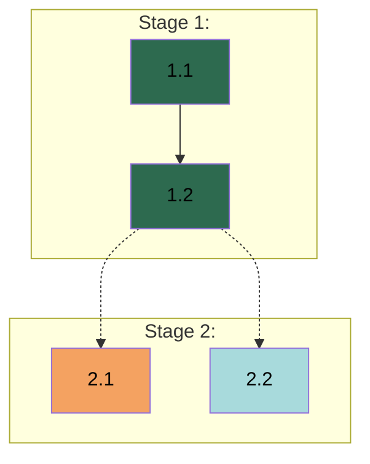

# APM {VERSION} - Work Breakdown Guide

## 1. Overview

**Reading Agent:** Planner

This guide defines the process for Work Breakdown, which transforms gathered context into planning documents (Specifications, Implementation Plan, and Execution Standards) through visible reasoning (chain-of-thought) - thinking visibly in chat before committing to files.

### 1.1 How to Use This Guide

See §3 Work Breakdown Procedure - execute sequentially. See §2 Operational Standards for decomposition decisions, specification reasoning, plan assessment, and standards extraction. Communication with the User and visible reasoning follow `{SKILL_PATH:apm-communication}` §2 Agent-to-User Communication.

### 1.2 Objectives

- Translate gathered context into actionable project structure
- Define Workers based on domain organization
- Create Tasks with clear objectives, outputs, validation criteria, and dependencies
- Establish Execution Standards for consistent execution

### 1.3 Outputs

- *`Specifications.md`:* Design decisions and constraints that define what is being built. Free-form structure determined by project needs.
- *`Implementation_Plan.md`:* Stage and Task breakdown with agent assignments, validation criteria, dependency chains, and Dependency Graph.
- *`{AGENTS_FILE}`:* Universal execution-level Execution Standards applied during Task execution.

**Artifact visibility - design for the consumer:**
- *Specifications and Implementation Plan:* Manager reads directly. Workers do not reference these files - the Manager extracts relevant content into Task Prompts, making them self-contained, and uses the plan for dispatch and progress tracking. Write for coordination needs - organization, cross-referencing, and extraction efficiency.
- *`{AGENTS_FILE}`:* Workers access directly during Task execution. Write standards so they are self-contained and actionable without Specifications or Implementation Plan context.

**Completeness:** All context gathered during Context Gathering must be captured across these three artifacts. Design decisions that shape the project go to Specifications. Implementation details, constraints, domain-specific patterns, and validation specifics go to Task guidance fields in the Implementation Plan. Universal execution patterns go to Execution Standards. If gathered context would be lost between artifacts, it is missing from Task guidance.

### 1.4 Scope Adaptation

Decomposition granularity adapts to project size and complexity. Stages, Tasks, and steps are relative concepts - smaller projects warrant lighter breakdown, larger projects may need more detail. Let the actual scope and requirements guide how work units are identified and organized.

---

## 2. Operational Standards

### 2.1 Decomposition Principles

These principles apply across all decomposition levels. Apply with judgment adapted to project scope per §1.4 Scope Adaptation.

**Domains:** Identify logical work domains from Context Gathering. Split when domains involve different expertise or mental models. Combine when domains share tight context and dependencies. When balanced, prefer separation. Integrate User preferences.

**Stages:** Identify milestone groupings. Each Stage delivers coherent value. Split when work streams are unrelated or intermediate deliverables block subsequent work. Combine when separation is artificial. When balanced, prefer fewer Stages with clear milestones.

**Tasks:** Derive from Stage objectives. Each Task produces a meaningful deliverable, scoped to one agent's domain, with specified validation criteria. Split when a Task spans domains or bundles unrelated deliverables. Combine when micro-tasks create overhead without value. Include subagent steps for investigation or research.

**Steps:** Organize work within a Task for failure tracing. Ordered, discrete, sharing the Task's validation. If a step needs independent validation, split the Task.

**Scope boundaries:** Agent-assignable work is completable within the development environment with autonomous or artifact-based validation. User coordination involves external platforms, credentials, or validation outside the environment - include explicit coordination steps and mark user validation.

**Validation criteria:** Each Task specifies validation: programmatic (automated checks), artifact (output existence and structure), or user (human judgment). Programmatic and artifact allow autonomous iteration; user validation requires pausing. Most Tasks combine multiple approaches. Validation criteria are Worker-scoped - no references to other Stages, Tasks, or coordination-level gates. Workers validate their own deliverables; Stage coordination is the Manager's concern.

### 2.2 Specifications Standards

Specifications define what is being built - design decisions, constraints, and requirements that shape the deliverable. They form the foundation the Implementation Plan builds on: every design decision captured here has corresponding Tasks in the Plan that implement it.

The test for each candidate: would changing this decision reshape the project's design, or only affect a single scope of work? Project-shaping decisions - choices where alternatives existed, affecting what is being built across the project - belong here. Single-scope details and universal execution patterns do not. Within a design topic, capture the decision - not its implementation mechanics. If changing a detail does not change the decision, the detail belongs in Task Guidance. When User documents already authoritatively define requirements, reference them - Specifications capture design decisions layered on existing requirements, not restate them. When the workspace contains multiple repositories or codebases, capture workspace structure in Specifications - which repository is the working target, which are read-only references, and where Workers operate. Structure Specifications so design decisions can be extracted per-Task - the Manager distills relevant content into individual Task Prompts.

### 2.3 Implementation Plan Standards

The Implementation Plan defines how work is organized - Stages, Tasks, agent assignments, dependencies, and validation criteria. The Manager uses it for dispatch decisions, dependency analysis, coordination, and progress tracking.

**What belongs:** Task-level coordination - objectives, deliverables, agent assignments, validation criteria, dependencies, step-by-step guidance. **What does not:** Design decisions across Tasks (Specifications), universal execution patterns (Execution Standards).

**Task self-sufficiency:** Each Task must contain enough context for a Worker to execute from a Task Prompt alone. Workers do not reference the full Implementation Plan or Specifications directly - the Manager extracts relevant content during Task Assignment.

Guidance may reference authoritative sources by path - the Manager reads those sources and integrates relevant content into the Task Prompt. Steps describe the Worker's sequential operations - the Manager transforms them into actionable instructions enriched with Specification content and Guidance.

**Dispatch-aware structuring** → When assignments and Task ordering could go multiple ways, prefer arrangements that maximize dispatch opportunities. Three dispatch modes exist per `{GUIDE_PATH:task-assignment}` §2.4 Dispatch Standards:

- *Batch candidates:* same-agent Task groups dispatchable together (sequential chains or independent groups).
- *Parallel candidates:* independent dispatch units for different agents, dispatchable simultaneously.
- *Single dispatch:* a lone Ready Task with no batch or parallel partners.

All three patterns are valid. Structure the plan to create natural opportunities across all of them rather than forcing one pattern.

### 2.4 `{AGENTS_FILE}` Standards

`{AGENTS_FILE}` defines how work is performed - universal execution patterns across all Tasks. Workers access it directly during Task execution.

The test for each candidate: does it describe how work is performed, or what is being built? Output formats, response strings, data schemas, and interface contracts define what is being built - they belong in Specifications even when multiple Workers need them. For candidates that pass as execution patterns: does the pattern apply to every Worker regardless of domain? All Workers read the same file - if the pattern only applies to one domain, it does not belong here.

When uncertain whether something qualifies, prefer placing it in Task guidance - easier to promote later than to demote.

**Self-containedness:** Workers' working context is intentionally scoped to their Task Prompt and `{AGENTS_FILE}` - Specifications, Implementation Plan, and external design artifacts are omitted by design. Standards referencing those documents undermine that scoping. Embed content directly.

---

## 3. Work Breakdown Procedure

Complete each section before proceeding to the next. Present reasoning in chat before writing files - explain your thinking about domain boundaries, Task decomposition, dependency rationale, and specification decisions so the User can follow your logic and redirect before artifacts are written. Cover these aspects when they apply: what you are analyzing and why, key decisions and reasoning, how Context Gathering findings inform each decision, dependencies or risks worth noting. Chat reasoning transforms into structured file entries per §4 Structural Specifications.

**Procedure:**
1. Analyze requirements and write Specifications → set header, write Specifications, pause for User approval.
2. Organize work into the Implementation Plan → set header, domain analysis, stage analysis, per-stage Task breakdown, plan review, pause for User approval.
3. Define Execution Standards → write Execution Standards, pause for User approval, procedure completion.

### 3.1 Specifications Analysis

Perform the following actions per §2.2 Specifications Standards.

**Specifications Header:**
1. Replace `<Project Name>` in `.apm/Specifications.md` with appropriate project name.
2. Fill **Last Modification** field: "Specifications creation by the Planner."
3. Fill **Project Overview** field: 3-5 sentences (project type, core problem, essential scope, success criteria).

**Specifications Content:**
1. Analyze design decisions from gathered context. Present reasoning in chat:
   - *Design decisions:* each explicit choice and implicit constraint embedded in requirements: what was decided, what alternatives existed, why this direction. Surface assumptions stated as facts that represent actual decisions.
   - *Source documents:* which requirements already have authoritative definitions in User documents; reference rather than duplicate.
   - *Boundary calls:* for each candidate, determine its primary location: Specifications (project-level design decisions), Task guidance (task-scoped details, validation approach, single-domain constraints), or Execution Standards (universal execution patterns). Each item belongs in one primary location. Items are placed during the Implementation Plan and Execution Standards Analysis phases.
   - *Decision relationships:* decisions that cascade, constrain, or cluster naturally together.
   - *Structure rationale:* how to organize decisions so the Manager can extract relevant content per Task.
2. Add specification content per §4.1 Specifications Format. Let structure follow the decisions identified.
3. Pause for User review:
   - State Specifications are complete and the artifact is created.
   - Ask User to review for accuracy.
   - If modifications needed → Apply and repeat step 3.
   - If approved → Proceed to §3.2 Implementation Plan Analysis.

### 3.2 Implementation Plan Analysis

Perform the following actions per §2.3 Implementation Plan Standards.

**Implementation Plan Header:**
1. Replace `<Project Name>` in `.apm/Implementation_Plan.md` with appropriate project name (same as Specifications).
2. Fill **Last Modification** field: "Plan creation by the Planner."

**Domain Analysis** → Perform the following actions per §2.1 Decomposition Principles:
1. Present domain organization reasoning in chat, grounded in the Specifications approved above:
   - *Domains identified:* logical work domains and their scope.
   - *Separation rationale:* why domains are separated or combined.
   - *Agent mapping:* how domains map to Workers with proposed names and responsibilities.
2. Update Implementation Plan header Agents field.

**Stage Analysis** → Identify all Stages and their Tasks upfront per §2.1 Decomposition Principles - see **Stage Cycles** for detailed Task breakdown:
1. Present stage structure reasoning in chat:
   - *Stage objectives:* what each Stage delivers and its boundary rationale.
   - *Task overview:* identified Tasks per Stage with brief descriptions.
2. Update Implementation Plan header Stages field.

**Stage Cycles** → For each Stage per **Stage Analysis**, complete detailed Task breakdown. Execute in Stage order per §2.1 Decomposition Principles:
1. State context for the current Stage: User requirements and constraints influencing it.
2. For each Task, present reasoning in chat:
   - *Agent assignment:* which agent and why.
   - *Task Scope:* what is the Task's scope?
   - *Task Guidance:* what implementation context does this Worker need? Domain-specific patterns (how to structure code, existing patterns to follow), constraints (performance, security, dependencies), technical decisions (library choices, API contracts), single-domain details (validation approach, testing strategy, error handling specifics). Include context classified as task-scoped per §3.1 Specifications Analysis.
   - *Task Validation:* approaches selected from programmatic, artifact, and user (per §4.2 Implementation Plan Format), with rationale for inclusion or exclusion. Validation criteria co-define the Task with Guidance.
   - *Dependencies:* enumerate every dependency. Same-agent: `Task N.M` format. Cross-agent: **`Task N.M by <Agent>`** (bolded), specifying the deliverable at the boundary.
   - *Steps:* ordered operations with purpose.
   Use more detail for complex Tasks and less for straightforward ones. Include all required dimensions. After reasoning through all Tasks in the Stage, assess whether each Task represents independently validatable work per §2.1 Decomposition Principles - combined scopes that need separate validation indicate further decomposition.
3. Append the Stage to the Implementation Plan per §4.2 Implementation Plan Format. Enrich Task details based on chat reasoning. Ensure every cross-agent dependency is bolded at write time - do not defer to **Plan Review**. After reasoning through all Tasks in a Stage, write the Stage to the Implementation Plan before proceeding to the next Stage. Do not batch reasoning or writing across Stages.

**Plan Review** → After completing all Stage Cycles, review the plan per §2.3 Implementation Plan Standards:
1. *Workload assessment:* Count Tasks per agent. Flag agents with disproportionately large workloads relative to other agents for subdivision review. If subdividing, present reasoning:
   - Sub-domain boundaries - where to split and why.
   - Agent coherence - how sub-agents maintain clear, focused domains.
   Update Implementation Plan assignments and emergent Task dependencies.
2. *Cross-agent dependency review:* Verify all cross-agent dependencies are correctly identified and bolded. Cross-check agent assignments - if a dependency's producer differs from the consumer's agent, it must be bolded. Present reasoning:
   - Dependency audit - list every dependency, classify each, flag misclassified entries.
   - Cross-agent chains - provider, consumer, agents, required deliverable.
   - Risk assessment - bottlenecks or coordination complexity.
   Fix any misclassified dependencies.
3. *Dependency Graph generation:* Generate a mermaid graph per §4.2 Implementation Plan Format using finalized Tasks, agent assignments, and dependencies. For each edge, verify the type matches: `-->` for same-agent, `-.->` for cross-agent. Write to Implementation Plan header.
4. *Plan summary:* Present in chat: agent count, Stage count with names and Task counts, total Tasks, cross-agent dependency count.
5. Pause for User review:
   - State Implementation Plan is complete.
   - Ask User to review the plan.
   - If modifications needed → Apply and repeat step 5.
   - If approved → Proceed to §3.3 Execution Standards Analysis.

### 3.3 Execution Standards Analysis

Perform the following actions per §2.4 `{AGENTS_FILE}` Standards:
1. Analyze for universal execution patterns across all planning sources. Present reasoning:
   - **From Specifications:** execution patterns implied by design decisions, not the design content itself. Specific outputs, formats, values, and schemas defined by design decisions remain in Specifications - they reach Workers through Task Prompts.
   - **From the Plan:** patterns recurring across multiple Task guidance fields.
   - **From gathered context:** workflow preferences, conventions, or quality requirements from Context Gathering not yet captured in Specifications or the Plan.
   - **Classification:** which candidates are truly universal vs task-specific; whether each is self-contained for Workers with no access to Specifications or the Plan. Universal means applicable to every Worker regardless of domain - test each: does it apply to all Workers, or only specific domains?
   - **Existing standards:** what `{AGENTS_FILE}` already contains; reference rather than duplicate.
2. Write APM_STANDARDS block to `{AGENTS_FILE}` per §4.3 APM_STANDARDS Block:
   - If file exists: preserve existing content outside block, append APM_STANDARDS block.
   - If creating new: create file with APM_STANDARDS block only.
3. Pause for User review:
   - State Execution Standards are complete.
   - Ask User to review `{AGENTS_FILE}` for accuracy.
   - If modifications needed → Apply and repeat step 3.
   - If approved → State Work Breakdown is complete and all planning documents are created. Proceed to `{COMMAND_PATH:apm-1-initiate-planner}` §4 Planning Phase Completion. 
---

## 4. Structural Specifications

### 4.1 Specifications Format

Specification content follows the header fields in `.apm/Specifications.md`. Structure is free-form - organize around the decisions themselves, not predefined categories or conventional headings. Let the project's actual design landscape shape the document: decisions that cluster naturally share a section, decisions that stand alone get their own. Different projects produce differently structured Specifications. Do not pattern-match to common templates (e.g., "Architecture," "Data Model," "API Design") when the project's decisions do not naturally group that way.

**Content rules:** Use markdown headings (`##`) to organize decision groups. Each specification must be concrete and actionable. Structure for extraction - the Manager distills relevant content into individual Task Prompts, so decisions should be locatable and separable. Reference existing User documents rather than duplicating - include file paths and specific sections so the Manager can locate source material during Task Assignment. Use tables for enumerated values, mermaid diagrams for relationships, code blocks for schemas, prose for rationale.

### 4.2 Implementation Plan Format

**Stage Format** → Each Stage in the Implementation Plan:
- *Header:* `## Stage N: [Name]`
- *Naming:* Stage names reflect domain(s), objectives, and main deliverables.
- *Contents:* Tasks per **Task Format**, each containing steps per **Step Format**.

**Task Format** → Each Task in the Implementation Plan:

*Header:* `### Task <N.M>: <Title> - <Domain> Agent`

*Contents:*
```markdown
* **Objective:** [Single-sentence task goal.]
* **Output:** [Concrete deliverables - files, components, artifacts produced.]
* **Validation:** [Binary pass/fail criteria with approach(es): Programmatic, Artifact, and/or User.]
* **Guidance:** [Technical constraints, approach specifications, references to existing patterns, User collaboration patterns.]
* **Dependencies:** [Prior task outputs required. Format: `Task N.M by <Domain> Agent, ...` Bold cross-agent dependencies. Use "None" when no dependencies exist.]

1. [Step description]
2. [Step description]
```

**Step Format:** Each step is a numbered instruction describing a discrete operation. Include clear, specific instructions that an agent can execute directly. Reference patterns, files, or prior work when relevant. When investigation, exploration, or research is needed, include a subagent step describing purpose and scope (e.g., "Spawn a debug subagent to isolate the rendering issue" or "Spawn a research subagent to verify the current API authentication patterns").

**Dependency Graph Format:** The Dependency Graph is a mermaid diagram in the Implementation Plan header that visualizes Task dependencies, agent assignments, and execution flow. It enables the Manager to identify batch candidates, parallel dispatch opportunities, critical path bottlenecks, and coordination points.

*Graph structure:*


Dispatch patterns visible from the graph per §2.3 Implementation Plan Standards:
- *Batch candidates:* same-agent Task groups (e.g., T1_1 → T1_2 → T1_3, all same agent).
- *Parallel candidates:* independent Tasks assigned to different agents (e.g., T2_1 and T2_2 above), dispatchable simultaneously.
- *Cross-agent coordination points:* dotted arrows (e.g., T1_2 -.-> T2_1) indicate where one agent's output feeds another agent's input.
- *Single dispatch:* a lone Ready Task with no batch or parallel partners.

*Node format:* `T<Stage>_<Task>["<Task ID> <Title><br/><i><Agent Name></i>"]`

*Edge rules:* Same-agent dependency: `-->` (solid). Cross-agent dependency: `-.->` (dotted). Only direct dependencies - do not draw transitive closure.

*Styling:* Assign each agent a consistent fill color across all its Task nodes. Apply colors via `style T<S>_<T> fill:<color>` statements after all subgraphs, ordered by agent appearance in the Implementation Plan Agents field. Use text color #000 and select fill colors with sufficient contrast for readability.

### 4.3 APM_STANDARDS Block

The namespace block structure for `{AGENTS_FILE}`:

```text
APM_STANDARDS {

[APM-managed standards content]

} //APM_STANDARDS
```

**Content rules:** No content outside the APM_STANDARDS block unless explicitly requested. Use markdown headings (`##`) for categories. Each standard must be concrete and actionable. Only universal execution-level patterns - not architecture decisions, task-specific guidance, or coordination decisions. Reference existing standards outside the block rather than duplicating.

**Format selection:** Tables for pattern comparisons, code blocks for syntax examples, bulleted lists for rules, numbered lists for sequential steps, prose for context.

---

## 5. Content Guidelines

### 5.1 Quality Standards

**Specifications:** Design decisions are concrete and traceable to Context Gathering findings. Reference existing User documents rather than duplicating.

**Implementation Plan:** Each Task is understandable without external reference. Use specific language - not "implement properly" but the specific pattern to follow. All fields populated. Consistent naming and terminology.

**`{AGENTS_FILE}`:** Only genuinely universal patterns. Concrete and actionable - each standard specific enough that violation is detectable. If `{AGENTS_FILE}` already exists, preserve its content and append the APM_STANDARDS block rather than duplicating existing standards.

### 5.2 Common Mistakes

- *Over-specification:* Implementation details in Specifications that belong in Task guidance - if it only affects one Task, it's Task guidance.
- *Under-specification:* Design decisions left implicit - if it could reasonably go multiple ways, document the chosen direction.
- *Task packing:* Multiple unrelated deliverables in one Task - split them.
- *Over-decomposition:* Excessive small Tasks - combine when they share context and validation.
- *Vague validation:* "Works correctly" - specify what "correctly" means concretely.
- *Missing dependencies:* Tasks requiring prior work not marked - trace prerequisites.
- *Misclassified dependencies:* Cross-agent dependencies not bolded, same-agent dependencies incorrectly bolded, or wrong edge types in the Dependency Graph (`-->` vs `-.->`) - classify at write time by checking whether producer and consumer share the same agent per §3.2 Implementation Plan Analysis. Verify during plan review.
- *Duplicating source documents:* Restating requirements from User documents (PRD, specifications) instead of referencing the source. Specifications capture design decisions layered on existing requirements.
- *Non-universal standards:* Task-specific patterns elevated to `{AGENTS_FILE}` - if it only applies to some Tasks, it's Task guidance.
- *Output specifications as standards:* Elevating response formats, error strings, or interface contracts to `{AGENTS_FILE}`. These define what is being built and belong in Specifications - universality across Workers does not make them execution patterns.
- *Standards referencing external documents:* Specifications, planning documents, and design artifacts are intentionally omitted from Workers' context - referencing them from `{AGENTS_FILE}` undermines that scoping. See §2.4 `{AGENTS_FILE}` Standards.

---

**End of Guide**
