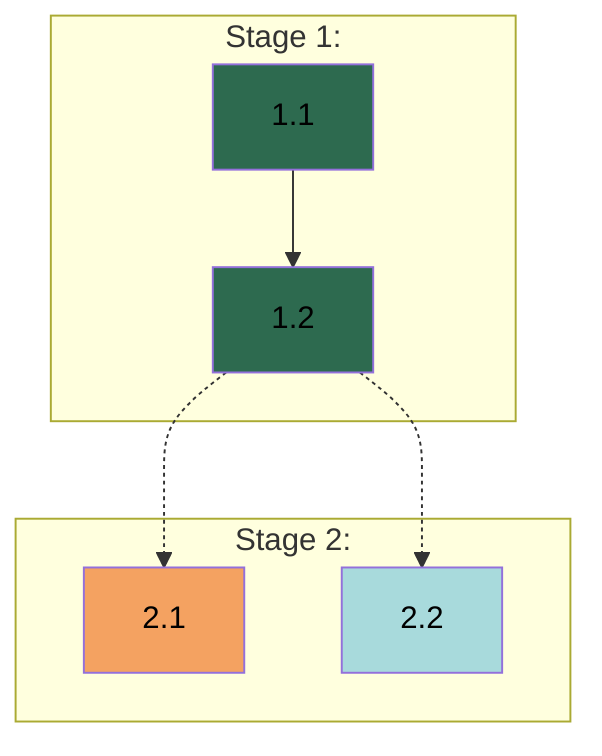

# APM {VERSION} - Work Breakdown Guide

## 1. Overview

**Reading Agent:** Planner

This guide defines the process for Work Breakdown, which transforms gathered context into Coordination Artifacts through Chain-of-Thought reasoning — thinking visibly in chat before committing to files.

### 1.1 How to Use This Guide

**Execute the Procedure** in §3 Work Breakdown Procedure sequentially. **Use Operational Standards** in §2 Operational Standards for decomposition decisions, specification reasoning, plan assessment, and standards extraction. **Present reasoning in chat** before file output — the User sees your thinking and can redirect before artifacts are written. Section references (§N.M) throughout this guide are for your procedural navigation — communicate with the User in natural language, not internal labels.

### 1.2 Objectives

- Translate gathered context into actionable project structure
- Define Workers based on domain organization
- Create Tasks with clear objectives, outputs, validation criteria, and dependencies
- Establish project Standards for consistent execution

### 1.3 Outputs

- **`Specifications.md`** — Design decisions and constraints that define what is being built. Free-form structure determined by project needs.
- **`Implementation_Plan.md`** — Stage and Task breakdown with Agent assignments, validation criteria, dependency chains, and Dependency Graph.
- **`{AGENTS_FILE}`** — Universal execution-level Standards applied during task execution.

**Artifact visibility rules — design for the consumer:**
- **Specifications and Implementation Plan → Manager only.** Workers never see or interact with these files. The Manager reads them for coordination, extracts relevant Specification content into Task Prompts, and uses the Plan for dispatch and progress tracking. Write these artifacts for the Manager's coordination needs — organization, cross-referencing, and extraction efficiency matter more than standalone readability for executors.
- **`{AGENTS_FILE}` → Workers directly.** This is the only artifact Workers access during task execution. Workers can read and reference it at any time. Write Standards so they are self-contained and actionable without Specifications or Implementation Plan context.

### 1.4 Scope Adaptation

Decomposition granularity adapts to project size and complexity. Stages, Tasks, and Steps are relative concepts — smaller projects warrant lighter breakdown, larger projects may need more detail. Let the actual scope and requirements guide how work units are identified and organized.

---

## 2. Operational Standards

### 2.1 Chain-of-Thought Reasoning

Work Breakdown uses Chain-of-Thought reasoning: present your thinking in chat before writing to files. This makes decomposition decisions visible and auditable, and gives the User opportunity to redirect.

**Chat reasoning** is free-form. Explain your thinking about domain boundaries, task decomposition, dependency rationale, and specification decisions. Use whatever structure communicates your reasoning clearly — prose, lists, tables, diagrams. The goal is that the User can follow your logic and agree or disagree before you write files.

**Reasoning frame.** While the format is flexible, cover these aspects when they apply:
- What you're analyzing and why
- Key decisions and the reasoning behind them
- How Context Gathering findings inform each decision
- Dependencies, risks, or complexity worth noting

**File output** uses the structural templates defined in §4 Structural Specifications. Chat reasoning transforms into structured file entries — the reasoning in chat is the thinking, the file entry is the result.

### 2.2 Decomposition Principles

These principles apply across all decomposition levels (domains, stages, tasks, steps). Apply them with judgment adapted to project scope per §1.4 Scope Adaptation:
- **Domain decomposition.** Identify logical work domains from Context Gathering. Each domain requires a distinct mental model or skill set.
  - *Split when:* Domains involve different expertise areas or mental models.
  - *Combine when:* Domains share context and have tight dependencies.
  - *When balanced:* Prefer separation to reduce coordination complexity. Integrate User preferences on Domain organization when needed.
- **Stage decomposition.** Identify milestone groupings from workflow patterns. Each Stage delivers coherent value.
  - *Split when:* Work streams are unrelated or intermediate deliverables block subsequent work.
  - *Combine when:* Stages would be artificially separated with immediate handoffs.
  - *When balanced:* Prefer fewer stages with clear milestones.
- **Task decomposition.** Derive Tasks from Stage objectives. Each Task produces a meaningful deliverable with clear boundaries, is scoped to a single Agent's domain, and has specified validation criteria.
  - *Split when:* A Task contains multiple unrelated deliverables or spans domains.
  - *Combine when:* Micro-tasks create coordination overhead without value.
  - *When balanced:* Prefer fewer substantial Tasks. If a Task requires investigation or research, include a Subagent step.
- **Step decomposition.** Steps organize work within a Task and support failure tracing. They are ordered, discrete, and share the Task's validation — they do not have independent validation.
  - *Split indicator:* If a step requires its own validation before the next step can proceed, the Task should be split.
- **Scope boundaries.** Distinguish between Agent-assignable work and User coordination.
  - *Agent-assignable:* Work that can be completed within the development environment with autonomous or artifact-based validation.
  - *User coordination:* Work involving external platform interaction, User-specific credentials, or validation outside the development environment. Include an explicit coordination step and mark User validation.
- **Validation types.** Each Task specifies validation criteria using one or more types:
  - *Programmatic:* Automated checks — tests, builds, CI.
  - *Artifact:* Expected output existence and structure.
  - *User:* Human judgment required.
  Programmatic and Artifact allow autonomous Agent iteration. User validation requires pausing for review. Most Tasks have multiple Validation Types.

### 2.3 Specifications Standards

Specifications define what is being built — design decisions, constraints, and requirements that shape the deliverable. They inform the Implementation Plan but are not task-specific instructions.

**What belongs in Specifications:** Design decisions that affect multiple Tasks, constraints that limit implementation options, choices where reasonable alternatives existed and the User chose a direction. **What does not:** Task-specific implementation details (those go in Task guidance), universal execution patterns (those go in Standards). Structure Specifications so design decisions can be extracted per-Task — the Manager distills relevant content into individual Task Prompts.

Analyze gathered context across universal dimensions — scope boundaries, core entities, behavioral rules, relationships, constraints, external interfaces. Not all dimensions apply to every project; assess relevance and elaborate only on what matters.

### 2.4 Implementation Plan Standards

The Implementation Plan defines how work is organized — Stages, Tasks, Agent assignments, dependencies, and validation criteria. The Manager uses it for dispatch decisions, dependency analysis, coordination, and progress tracking during the Implementation Phase.

**What belongs in the Implementation Plan:** Task-level coordination — objectives, deliverables, Agent assignments, validation criteria, dependencies, and step-by-step guidance specific to individual Tasks. **What does not:** Design decisions that apply across Tasks (Specifications), universal execution patterns (`{AGENTS_FILE}`).

**Task self-sufficiency.** Each Task must contain enough context in its guidance and dependency references for a Worker to execute it from a Task Prompt alone. Workers do not have access to the full Implementation Plan or Specifications — the Manager extracts relevant content during Task Assignment.

**Dispatch-aware structuring.** When assignments and task ordering could reasonably go multiple ways, prefer arrangements that maximize dispatch opportunities:
- **Batch candidates** — same-Agent Task groups dispatchable together. Two patterns qualify: sequential same-Agent chains where each Task depends only on the previous, or multiple independent same-Agent Tasks with no same-Agent dependencies that become ready simultaneously.
- **Parallel candidates** — independent tasks ready for dispatch assigned to different Agents with no unresolved Cross-Agent Dependencies among them, dispatchable simultaneously.
- **Single dispatch** — a lone ready Task with no batch or parallel partners.

All three patterns are valid. Structure the plan to create natural opportunities across all of them rather than forcing one pattern.

### 2.5 `{AGENTS_FILE}` Standards

`{AGENTS_FILE}` defines how work is performed — universal execution patterns that apply across all Tasks regardless of what is being built. Unlike Specifications and the Implementation Plan, Workers access `{AGENTS_FILE}` directly during task execution.

**What belongs in `{AGENTS_FILE}`:** Patterns that recur across multiple Tasks, User-specified conventions, coding and quality requirements that apply universally. **What does not:** Design decisions (Specifications), task-specific guidance (Implementation Plan), coordination decisions (Implementation Plan).

When uncertain whether something is universal, prefer placing it in Task guidance — easier to promote later than to demote.

---

## 3. Work Breakdown Procedure

Complete each step before proceeding to the next. Present reasoning in chat before writing files per §2.1 Chain-of-Thought Reasoning.

**Procedure:**
1. Specifications Analysis → write Specifications, **checkpoint: User approval**
2. Implementation Plan Header → set project name and overview
3. Domain Analysis → identify Workers, update header
4. Stage Analysis → identify all Stages with objectives and Tasks upfront, update header
5. Stage Cycles → per Stage: detailed Task breakdown, append to Implementation Plan
6. Plan Review → workload, dependencies, Dependency Graph, **checkpoint: User approval**
7. Standards Analysis → write Standards, **checkpoint: User approval**

### 3.1 Specifications Analysis

Apply §2.3 Specifications Standards. Perform the following actions:
1. Analyze specifications from Context Gathering. Present reasoning in chat:
   - **Relevant dimensions** — which specification dimensions apply to this project and why.
   - **Design decisions** — what choices emerged from Context Gathering, including alternatives considered.
   - **Structure rationale** — how you plan to organize the Specifications.
2. Update `.apm/Specifications.md`:
   - Replace `<Project Name>` with appropriate project name.
   - Fill **Last Modification** field: "Specifications creation by the Planner."
   - Add specification content for relevant dimensions using appropriate structural elements per §4.2 Specifications Format.
3. **Specifications Checkpoint.** Pause for User review. Present the checkpoint:
   - State Specifications are complete and the artifact is created.
   - Ask User to review for accuracy.
   - If modifications needed → apply and return to 3.
   - If approved → proceed to §3.2 Implementation Plan Header.

### 3.2 Implementation Plan Header

Perform the following actions:
1. Update Implementation Plan header:
   - Replace `<Project Name>` with appropriate project name - same as in `.apm/Specifications.md`.
   - Fill **Project Overview** with 3-5 sentences: project type, core problem, essential scope, success criteria.
   - Fill **Last Modification** field: "Plan creation by the Planner."

### 3.3 Domain Analysis

Apply §2.2 Decomposition Principles. Perform the following actions:
1. Present domain organization reasoning in chat:
   - **Domains identified** — logical work domains and their scope.
   - **Separation rationale** — why domains are separated or combined.
   - **Agent mapping** — how domains map to Workers with proposed names and responsibilities.
2. Update Implementation Plan header Agents field.

### 3.4 Stage Analysis

Apply §2.2 Decomposition Principles. Identify all Stages and their Tasks upfront — detailed Task breakdown happens in §3.5 Stage Cycles. Perform the following actions:
1. Present stage structure reasoning in chat:
   - **Stage objectives** — what each Stage delivers and its boundary rationale.
   - **Task overview** — identified Tasks per Stage with brief descriptions.
2. Update Implementation Plan header Stages field.

### 3.5 Stage Cycles

For each Stage from §3.4 Stage Analysis, complete detailed Task breakdown. Execute in Stage order repeating for all Stages. Apply §2.2 Decomposition Principles. Perform the following actions:
1. State context for the current Stage: User requirements and constraints influencing it.
2. For each Task, present reasoning in chat:
   - **Agent assignment** — which Agent and why.
   - **Validation** — types selected and rationale.
   - **Dependencies** — enumerate every dependency this Task has. For each dependency, explicitly classify:
     - *Same-Agent Dependency:* producer and consumer are the same Agent. Use `Task N.M` format.
     - *Cross-Agent Dependency:* producer and consumer are different Agents. Use **`Task N.M by <Agent>`** (bolded) format. Specify what the consumer needs from the producer — the deliverable at the boundary (files, interfaces, schemas, configurations).
   - **Steps** — ordered operations with purpose.
   Use more detail for complex Tasks (Cross-Agent Dependencies, multiple validation types, domain boundary questions) and less for straightforward ones. Use free-form markdown structure when presenting your reasoning in chat, but include all required dimensions.
3. Append the Stage to the Implementation Plan per §4.3 Stage Format and §4.4 Task Format, with Steps per §4.5 Step Format. Enrich Task details based on your chat reasoning. Ensure every Cross-Agent Dependency is bolded in the Dependencies field at write time — do not defer to Plan Review.

### 3.6 Plan Review

After completing all Stage Cycles, review the plan. Apply §2.4 Implementation Plan Standards. Perform the following actions:
1. **Workload assessment.** Count Tasks per Agent. Flag Agents with 8+ Tasks for subdivision review. If subdividing, present reasoning in chat:
   - **Sub-domain boundaries** — where to split and why.
   - **Agent coherence** — how sub-Agents maintain clear, focused domains.
   Update Implementation Plan assignments and emergent task dependencies.
2. **Cross-Agent Dependency review.** Verify all Cross-Agent Dependencies are correctly identified and bolded. Walk through every Task's Dependencies field and cross-check Agent assignments — if a dependency's producer Agent differs from the consumer's Agent, it must be a bolded Cross-Agent Dependency. Present reasoning in chat:
   - **Full dependency audit** — list every dependency in the plan, classify each as Same-Agent or Cross-Agent, flag any misclassified entries.
   - **Dependency chains** — for each Cross-Agent Dependency, the provider Task, consumer Task, assigned Agents, and required deliverable at the boundary.
   - **Risk assessment** — dependencies that create bottlenecks or coordination complexity. Assess whether dependencies could be resolved by adjusting Agent assignments.
   Fix any misclassified dependencies in the Implementation Plan Dependencies fields.
3. **Dependency Graph generation.** Generate a mermaid graph per §4.6 Dependency Graph Format using finalized Tasks, Agent assignments, and dependencies. For each edge, verify the edge type matches the dependency classification: `-->` for Same-Agent, `-.->` for Cross-Agent. Write to Implementation Plan header under `* **Dependency Graph:**`.
4. **Plan summary.** Present in chat: Agent count, Stage count with names and Task counts, total Tasks, Cross-Agent Dependency count.
5. **Implementation Plan Checkpoint.** Pause for User review. Present the checkpoint:
   - State Implementation Plan is complete.
   - Ask User to review the plan.
   - If modifications needed → apply and return to 5.
   - If approved → proceed to §3.7 Standards Analysis.

### 3.7 Standards Analysis

Apply §2.5 `{AGENTS_FILE}` Standards. Perform the following actions:
1. Analyze the Implementation Plan for patterns that should apply universally. Present reasoning in chat:
   - **Patterns identified** — what execution patterns emerged from the plan.
   - **Classification** — which are universal (Standards) vs task-specific (Task guidance).
   - **Existing standards** — what `{AGENTS_FILE}` already contains, if anything.
2. Write APM_STANDARDS block to `{AGENTS_FILE}` per §4.1 APM_STANDARDS Block:
   - If file exists: preserve existing content outside block, append APM_STANDARDS block.
   - If creating new: create file with APM_STANDARDS block only.
3. **Standards Checkpoint.** Pause for User review. Present the checkpoint:
   - State Standards are complete.
   - Ask User to review `{AGENTS_FILE}` for accuracy.
   - If modifications needed → apply and return to step 3.
   - If approved → proceed to §3.8 Procedure Completion.

### 3.8 Procedure Completion

After all three checkpoints are approved, output procedure completion stating Work Breakdown is complete, all Coordination Artifacts are created, and the next step is initializing the Manager using `/apm-2-initiate-manager`.

---

## 4. Structural Specifications

### 4.1 APM_STANDARDS Block

The namespace block structure for `{AGENTS_FILE}`:
```
APM_STANDARDS {

[APM-managed standards content]

} //APM_STANDARDS
```

**Content rules:** Absolutely no other content is created outside of the APM_STANDARDS block unless explicitly requested by the User. Use markdown headings (`##`) for categories. Each standard must be concrete and actionable. Only include universal execution-level patterns — not architecture decisions, task-specific guidance, or coordination decisions. If relevant standards already exist outside the block, reference them rather than duplicating.

**Format selection:** Tables for pattern comparisons, code blocks for syntax examples, bulleted lists for rules, numbered lists for sequential steps, prose for context.

### 4.2 Specifications Format

The structure for `.apm/Specifications.md`:
```markdown
# <Project Name> – APM Specifications
**Last Modification:** [Description]

---

[Specification content using appropriate structural elements]
```

**Content rules:** Use markdown headings (`##`) for categories. Structure inside categories is free-form and determined by the project context — include sections relevant to this project's coordination needs. Each specification must be concrete and actionable. When the User has existing specification documents, reference them rather than duplicating. Use tables for enumerated values, mermaid diagrams for relationships, code blocks for schemas, prose for rationale.

### 4.3 Stage Format

Each Stage in the Implementation Plan:
- **Header:** `## Stage N: [Name]`
- **Naming:** Stage names reflect domain(s), objectives, and main deliverables.
- **Contents:** Tasks following §4.4 Task Format, each containing Steps per §4.5 Step Format.

### 4.4 Task Format

Each Task in the Implementation Plan:

**Header:** `### Task <N.M>: <Title> - <Domain> Agent`

**Contents:**
```
* **Objective:** [Single-sentence task goal.]
* **Output:** [Concrete deliverables — files, components, artifacts produced.]
* **Validation:** [Binary pass/fail criteria with type(s): Programmatic, Artifact, and/or User.]
* **Guidance:** [Technical constraints, approach specifications, references to existing patterns, User collaboration patterns.]
* **Dependencies:** [Prior task outputs required. Format: `Task N.M by <Domain> Agent, ...` Bold Cross-Agent Dependencies. Use "None" when no dependencies exist.]

1. [Step description]
2. [Step description]
```

### 4.5 Step Format

Each Step is a numbered instruction describing a discrete operation. Include clear, specific instructions that an Agent can execute directly. Reference patterns, files, or prior work when relevant. When investigation, exploration, or research is needed within a Task, include a Subagent step describing the purpose and scope (e.g., "Spawn a debug subagent to isolate the rendering issue" or "Spawn a research subagent to verify the current API authentication patterns").

### 4.6 Dependency Graph Format

The Dependency Graph is a mermaid diagram in the Implementation Plan header that visualizes Task dependencies, Agent assignments, and execution flow. It enables the Manager to identify batch candidates, parallel dispatch opportunities, critical path bottlenecks, and coordination points.

**Graph structure:**


**Dispatch patterns visible from the graph:**
- **Batch candidates** — same-Agent Task groups dispatchable together. Two patterns qualify:
  - *Sequential chain:* each Task depends only on the previous (e.g., T1_1 → T1_2 → T1_3, all same Agent).
  - *Independent group:* same-Agent Tasks with no same-Agent dependencies, all ready simultaneously.
- **Parallel candidates** — independent tasks ready for dispatch assigned to different Agents (e.g., T2_1 and T2_2 above), dispatchable simultaneously.
- **Cross-Agent coordination points** — dotted arrows (e.g., T1_2 -.-> T2_1) indicate where one Agent's output feeds another Agent's input.
- **Single dispatch** — a lone ready Task with no batch or parallel partners.

**Node format:** `T<Stage>_<Task>["<Task ID> <Title><br/><i><Agent Name></i>"]`

**Edge rules:**
- Same-Agent dependency: `-->` (solid arrow)
- Cross-Agent Dependency: `-.->` (dotted arrow)
- Only direct dependencies; do not draw transitive closure

**Styling:** Assign each Agent a consistent fill color across all its Task nodes. Apply colors via `style T<S>_<T> fill:<color>` statements after all subgraphs, ordered by Agent appearance in the Implementation Plan Agents field. Use text color #000 and select fill colors with sufficient contrast for readability.


---

## 5. Content Guidelines

### 5.1 Quality Standards

**Specifications:** Design decisions are concrete and traceable to Context Gathering findings. When referencing existing User documents, use clear references rather than duplicating content. Structure uses appropriate elements for the content type.

**Implementation Plan:** Each Task is understandable without external reference. Use specific language — not "implement properly" but the specific pattern to follow. All fields populated. Consistent naming and terminology.

**`{AGENTS_FILE}`:** Only genuinely universal patterns. Concrete and actionable — each standard specific enough that violation is detectable. No duplication of existing project standards — reference instead.

### 5.2 Common Mistakes

- **Over-specification:** Implementation details in Specifications that belong in Task guidance — if it only affects one Task, it's Task guidance.
- **Under-specification:** Design decisions left implicit — if it could reasonably go multiple ways, document the chosen direction.
- **Task packing:** Multiple unrelated deliverables in one Task — split them.
- **Over-decomposition:** Excessive small Tasks — combine when they share context and validation.
- **Vague validation:** "Works correctly" — specify what "correctly" means concretely. Include actionable validation instructions.
- **Missing dependencies:** Tasks requiring prior work not marked — trace prerequisites and dependency chains.
- **Misclassified dependencies:** Cross-Agent Dependencies not bolded, Same-Agent Dependencies incorrectly bolded, or wrong edge types in the Dependency Graph (`-->` vs `-.->`) — classify at write time in §3.5 Stage Cycles by checking whether producer and consumer share the same Agent. In §3.6 Plan Review, verify both the Dependencies fields and the graph edges match the classification.
- **Non-universal standards:** Task-specific patterns elevated to `{AGENTS_FILE}` — if it only applies to some Tasks, it's Task guidance.

---

**End of Guide**
