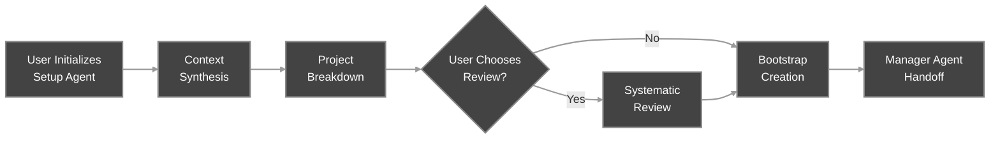
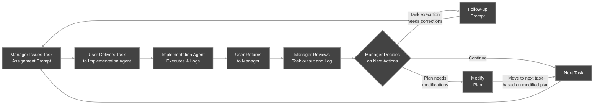
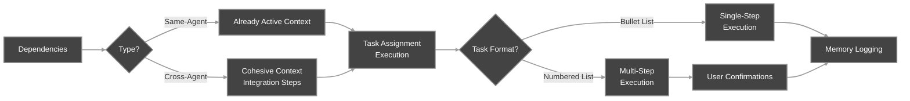
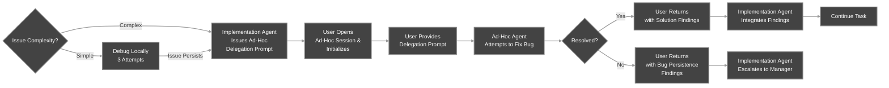
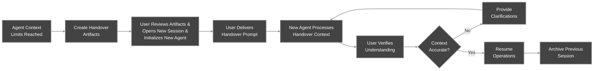

# Agentic Project Management - Complete Documentation
> Generated: 2026-01-03T00:03:53.379Z
---


## File: README.md

---

---
id: index
slug: /
sidebar_label: Documentation Hub
sidebar_position: 1
---

# APM v0.5 Documentation Hub

Welcome to the documentation suite for the Agentic Project Management (APM) framework.

## Overview

This documentation suite provides in-depth coverage of APM's architecture, workflows, and implementation strategies using the v0.5 CLI. Whether you're getting started or optimizing your experience, these resources will guide you through effective multi-agent project management.

### Getting Started
- **[Introduction](Introduction.md)** - Overview of the APM framework, core concepts, and the v0.5 CLI.
- **[Getting Started](Getting_Started.md)** - Step-by-step guide for installing APM via CLI and launching your first session.
 - **[CLI Guide](CLI.md)** - Detailed CLI usage, behaviors, policies, and update rules.

### Core Documentation
- **[Agent Types](Agent_Types.md)** - Detailed breakdown of all four Agent types and their roles
- **[Workflow Overview](Workflow_Overview.md)** - Complete workflow walkthrough with procedures
- **[Token Consumption Tips](Token_Consumption_Tips.md)** - Strategies for cost-effective model usage
- **[Modifying APM](Modifying_APM.md)** - Guide for customizing APM v0.5 locally after CLI installation.
- **[Troubleshooting Guide](Troubleshooting_Guide.md)** - Solutions for common issues encountered during Setup Phase, Task Loop Phase, and Handovers.

### Advanced Topics
- **[Context and Memory Management](Context_and_Memory_Management.md)** - Deep dive into APM's architecture and Dynamic-MD Memory System.
- **[Context and Prompt Engineering](Context_and_Prompt_Engineering.md)** - In-depth explanation of how APM's prompts and guides shape Agent context and behavior.

## Recommended Reading Order

1.  Begin with the **[Introduction](Introduction.md)** to understand the APM v0.5 framework and the CLI setup.
2.  Proceed to **[Getting Started](Getting_Started.md)** to install APM and launch your first session.
3.  As you work through your initial sessions, review **[Agent Types](Agent_Types.md)** and **[Workflow Overview](Workflow_Overview.md)** to understand Agent roles and the overall process.
4.  As you gain experience, consult **[Token Consumption Tips](Token_Consumption_Tips.md)** for cost optimization. Refer to the **[Troubleshooting Guide](Troubleshooting_Guide.md)** when you encounter issues.
5.  To tailor APM's prompts and guides to your specific needs, see **[Modifying APM](Modifying_APM.md)**.
6.  For a deep dive into APM's architecture and technical details, read **[Context and Memory Management](Context_and_Memory_Management.md)** and **[Context and Prompt Engineering](Context_and_Prompt_Engineering.md)**.

> **Note on visualizations:** All screenshots and GIFs in this documentation suite are taken from APM sessions using Cursor. However, the described workflow and procedures are nearly identical across all supported AI IDEs. If you're using a different assistant, you can readily adapt these steps to work with your platform's unique quirks or workflows. 
>
>For APM setup via CLI Assistants, users can intuitively adjust the walkthroughs to align with their own AI Assistant's interface and behavior. Visualizations for CLI Assistants is coming soon.


## File: Introduction.md

---

---
id: introduction
slug: /introduction
sidebar_label: Introduction
sidebar_position: 3
---

# APM v0.5 - Agentic Project Management Framework

**A Structured, Multi-Agent Workflow System for Complex Project Execution with AI Assistants**

Agentic Project Management (APM) is an open-source framework that structures AI-driven software development. It transforms a single, overloaded AI chat session into a coordinated team of specialized AI Agents, enabling complex project execution using AI Assistants like Cursor, Windsurf, Copilot and more.

Building on the emerging practice of Spec-Driven Development, which embodies the **first plan, then execute** philosophy with AI Assistants, APM adds structured workload distribution and management across a team of specialized Agents. This enhanced approach is called **Agentic Spec-Driven Development**.

## The Challenge: Context Decay

Managing large projects with AI assistants presents a fundamental systemic challenge: **Context Window Limits**.

As conversations extend, context degrades. The AI loses track of original requirements, produces contradictory code, and hallucinates details. In an AI Assistant, where context is often aggressively pruned to save costs, this leads to a disruption in project continuity.

## The Solution: Structured Multi-Agent Architecture

APM addresses context window limitations and context decay by treating the AI not as a single continuous assistant, but as distinct **Agent Instances** with specific roles and intelligently scoped contexts.

Instead of one long chat history, APM distributes the workload:
1.  **Specialization**: Agents focus on specific domains (Planning, Management, Implementation).
2.  **Persistence**: A file-based Memory System preserves project history outside of the Agent's context, keeping a large context archive.
3.  **Continuity**: Structured Handover Protocols transfer "working memory" between Agents when context limits are reached.

### Visual Workflow Overview

The following diagram illustrates the end-to-end workflow, from the Setup Phase to the Task Loop and Ad-Hoc delegations.

<div align="center">
  
</div>

---

## Core Components

APM coordinates four specialized Agent types using a "Manager-Worker" topology.

### 1. The Agents

| Agent Type | Role | Responsibility |
| :--- | :--- | :--- |
| **Setup Agent** | **Architect** | Operates once at the start. Conducts discovery, gathers requirements, and generates the detailed *Implementation Plan*. Tasks in the plan are grouped by field (eg. Frontend, Backend etc.). |
| **Manager Agent** | **Coordinator** | Maintains the "big picture." Assigns tasks, reviews work, manages context dependencies, and orchestrates the project. |
| **Implementation Agent** | **Developer** | Executes specific tasks (coding, writing, design). Receives only tasks from a specific group in the plan, to avoid context creep. Operates in a focused context scope and logs work to Memory. |
| **Ad-Hoc Agent** | **Specialist** | Temporary instances for isolated tasks (debugging, research etc.). They solve specific problems and close, preventing context pollution or overfill of the calling Agent. |

> For a detailed breakdown of Agent capabilities, see [Agent Types](Agent_Types.md).

### 2. Context Management

APM manages the context of multiple Agents with explicit protocols and artifacts:

* **Implementation Plan**: The source of truth for project structure and progress.
* **Dynamic Memory Bank**: A folder structure of Markdown logs where Implementation Agents document their work. Memory Logs are mapped to tasks of the Implementation Plan, keeping an organized context archive of the sesion. The Manager reads these logs to track progress without needing the implementation details, focusing on the big-picture.
* **Handover Protocol**: A distinct procedure to transfer context (user preferences, undocumented insights and working memory) to a fresh Agent instance before the context window fills up.

---

## The Workflow Phases

APM operates in two distinct phases:

### Phase 1: Setup
The **Setup Agent** interviews the user to build a comprehensive context foundation. It systematically breaks the project down into phases, tasks and subtasks, creating a detailed **Implementation Plan**. Tasks are grouped by field, and each field is assigned to an **Implementation Agent** for execution.

### Phase 2: Task Loop
The **Manager Agent** and **Implementation Agents** enter a coordination loop:
1.  **Assign**: Manager creates specific *Task Assignment Prompts* that the User sends to the Implementation Agents
2.  **Execute**: Implementation Agent performs the task and *logs to Memory*.
3.  **Review**: Manager *reviews the Memory Log* and decides the next action.

---

## Installation & Usage

APM is installed via the [`agentic-pm`](https://www.npmjs.com/package/agentic-pm) CLI, which scaffolds the necessary guides and prompt templates into your project workspace. To get started with installation and your first session, see [Getting Started](Getting_Started.md).

---

## Contributing

APM is an Open Source project, and contributions to both the framework and its documentation are encouraged. You can contribute by posting an Issue for bugs, feature requests, or questions, or by submitting a Pull Request (PR) with improvements, fixes, or documentation enhancements/refinements. For details on contributions and guidelines, please see the [CONTRIBUTING.md](https://github.com/sdi2200262/agentic-project-management/blob/main/CONTRIBUTING.md) file.


## File: Getting_Started.md

---

---
id: getting-started
slug: /getting-started
sidebar_label: Getting Started
sidebar_position: 2
---

# Getting Started - APM v0.5

This guide walks you through launching your first APM session, from initial setup through completing your first few tasks. **The more time spent during setup and planning, the better your project execution will be.**

 - For a clearer understanding of each Agent's roles and responsibilities, refer to the [Agent Types document](Agent_Types.md).

 - For a detailed walkthrough of APM workflows and protocols, refer to the [Workflow Overview document](Workflow_Overview.md).

---

## Prerequisites

Before starting your first APM session, ensure you have the following in place:

### Required Resources
* **Node.js**: APM v0.5 CLI requires Node.js (v18 or higher recommended).
* **AI IDE Platform**: Access to one of the supported AI Assistants.
* **Project Workspace**: A dedicated directory for your project files.

### Recommended Model Tiers

APM Agents function best with models that excel at systematic reasoning and context management. Model selection can be optimized by role, but **Claude Sonnet 4** stands out for its consistent performance across all Agent instances.

| Agent Type | Recommended Models (Best Results) | Cost-Effective Alternatives | Key Model Selection Note |
| :--- | :--- | :--- | :--- |
| **Setup Agent** | Claude Sonnet 4, Claude Sonnet 4.5 | - | **Crucial:** Avoid switching models mid-conversation during the Setup Phase to prevent context gaps. Use one model throughout. |
| **Manager Agent** | Claude Sonnet 4, Claude Sonnet 4.5, Gemini 2.5 Pro | Claude 3.7 Sonnet, Cursor Auto, Cursor's Composer 1 | Switching models mid-session is not encouraged, though testing showed fewer issues here than with the Setup Agent. **Cursor Auto delivered outstanding performance in testing.** |
| **Implementation Agent** | Sonnet 4.5, GPT-5, GPT-5-Codex, Gemini 2.5 Pro | GPT-4.1 in Copilot, Cursor Auto, Cursor's Comopser 1, Grok Code | **Flexible:** Context is tightly scoped, making model switching viable for matching task complexity (e.g., switching to premium for design-heavy tasks). |

> **Note:** For guidance on choosing models in an economical way, be sure to read the [Token_Consumption_Tips.md](Token_Consumption_Tips.md).

---

## Notes for specific AI IDEs

Notes for specific IDEs will be added here as new releases occur and user feedback is collected.

> **As of November 2025, GitHub Copilot does not provide a context window consumption visualization.** Instead, it uses an internal "summarizing conversation history" mechanism that is known to be buggy and can break cached context, disrupting APM workflows.
>
> * **If summarization triggers (in any phase)**: The Agent may lose track of crucial context (guides, prompts, task details), resulting in degraded responses. **Stop the response immediately**, then re-provide the necessary prompts, guides, or task context before continuing. If issues persist, consider starting a new Agent session and manually rebuilding context to resume work where you left off.
>
> **Tip:** Consider disabling the summarization mechanism by setting `github.copilot.chat.summarizeAgentConversationHistory.enabled` to `false` in your Copilot settings.

---

## Step 1: Install and Initialize APM

APM v0.5 introduces a CLI tool that automates the installation and setup process.

### 1.1 Install the CLI

Install the APM CLI globally using npm:

```bash
npm install -g agentic-pm
````

**Alternatively:** for local installation in your project's workspace:

```bash
npm install agentic-pm
```

### 1.2 Initialize Your Project

Navigate to your project directory and run:

```bash
apm init
```

<div align="center">
  <video 
    controls 
    autoplay 
    loop 
    muted 
    style={{ maxWidth: '100%', borderRadius: '14px', width: '1200px' }}
  >
    <source src={require('@site/static/docs-video/cursor-apm-install-and-init.mp4').default} type="video/mp4" />
    Your browser does not support the video tag.
  </video>
</div>


The `init` command will:

  * **Prompt for AI Assistant Selection**: Select your AI assistant from a list of supported platforms.
  * **Download APM Assets**: Automatically fetch the latest prompts and guides.
  * **Create Directory Structure**: Set up the `.apm/` directory with:
      * `.apm/guides/` - All template guides for APM workflows
      * `.apm/Memory/Memory_Root.md` - Root memory file with header template (to be filled by Manager Agent)
      * `.apm/Implementation_Plan.md` - Implementation plan file with header template (to be filled by Setup Agent)
      * `.apm/metadata.json` - Installation metadata
  * **Install Commands**: Create assistant-specific slash commands in the appropriate directory (e.g., `.cursor/`, `.github/copilot/`, etc.)

After initialization completes, you're ready to begin using APM.

---

## Step 2: Initialize Setup Agent

The Setup Agent conducts comprehensive project planning and creates all necessary APM assets.

### 2.1 Create Setup Agent Session

1.  **Open New Chat Session**: Start a dedicated chat session for the Setup Agent (e.g., "AI Agent" mode).
2.  **Name It Clearly**: Use a clear name like "Setup Agent" or "APM Setup."
3.  **Model Choice**: Select a top-tier model as recommended in the [Prerequisites](#prerequisites).

### 2.2 Run Setup Agent Initialization Command

To initialize the Setup Agent, simply enter the command:

```
/apm-1-initiate-setup
```

<div align="center">
  <video 
    controls 
    autoplay 
    loop 
    muted 
    style={{ maxWidth: '100%', borderRadius: '14px', width: '1200px' }}
  >
    <source src={require('@site/static/docs-video/cursor-apm-setup-agent.mp4').default} type="video/mp4" />
    Your browser does not support the video tag.
  </video>
</div>

---

## Step 3: Work Through Setup Phase
The Setup Agent will greet you and outline its 4-step workflow:

1.  Context Synthesis
2.  Project Breakdown & Plan Creation
3.  Implementation Plan Review & Refinement (Optional)
4.  Manager Bootstrap Prompt Creation

The Setup Agent will guide you through each step systematically, always asking for your confirmation before moving on so you can review, clarify, or request changes. **Be thorough during this phase** - time invested here prevents roadblocks later.

### 3.1 Context Synthesis (Project Discovery)

**This is the most important stage.** The Setup Agent will conduct structured discovery through four mandatory **Question Rounds:**

  * **Existing Materials & Vision**: Share PRDs, requirements, existing code, or project documentation.
  * **Technical Requirements**: Discuss technologies, constraints, dependencies, and technical scope.
  * **Process Requirements**: Explain workflow preferences, quality standards, and coordination needs.
  * **Final Validation**: The Agent presents a comprehensive summary for your review and approval before proceeding to Project Breakdown.

> **Tips for Context Synthesis:** Share all relevant project details, constraints, and uncertainties with the Setup Agent. **Try to provide requested context in the order that you are prompted** — early delivery of artifacts like PRDs or documentation improves the Agent's discovery process.

### 3.2 Project Breakdown & Plan Creation

The Setup Agent will systematically break down your project through key stages:

  * **Domain Analysis**: Identify work areas and create Implementation Agent assignments.
  * **Phase Definition**: Establish project progression and logical groupings.
  * **Phase Cycles**: Create detailed task breakdown with dependency analysis.
  * **Final Review**: Agent workload balancing and cross-Agent coordination planning.

> **Tips for Project Breakdown:** Review the Agent's reasoning in the chat and thoroughly check the full Implementation Plan at the end. Request any changes or clarifications now. **Fixing issues early is much easier and cheaper than later adjustments.**

### 3.3 Implementation Plan AI Review & Refinement (Optional)

The Setup Agent will offer systematic review of the Implementation Plan:

  * **Recommended**: For complex projects or first-time APM users.
  * **Optional**: If you're satisfied with the plan quality, you can skip this step and proceed directly to Bootstrap Creation.

> **Tip for Implementation Plan AI-driven Review:** This AI-driven review focuses on AI-specific planning issues (task packing, classification errors). **You must still conduct your own manual review** for requirement gaps or constraints.

### 3.4 Manager Bootstrap Creation

The Setup Agent will create a **Bootstrap Prompt** summarizing project context, key requirements, and next steps for the Manager Agent. 

**Save or copy this prompt** — you'll need it to initialize the Manager Agent session.

---

## Step 4: Initialize Manager Agent

### 4.1 Create Manager Agent Session

1.  **Open New Chat**: Create another dedicated chat session in "Agent" mode.
2.  **Name It Clearly**: Use a clear name, such as "Manager Agent" or "APM Manager 1."
3.  **Model Choice**: Select a premium or budget model as recommended in the [Prerequisites](#prerequisites).

### 4.2 Run Manager Agent Initialization Command

Enter the Manager Agent initialization command:

```
/apm-2-initiate-manager
```

### 4.3 Deliver Bootstrap Prompt

The Manager Agent requires the Bootstrap Prompt to receive initial project context.

**Paste the Bootstrap Prompt** created by your Setup Agent.

The Manager Agent will review project materials and the required guides and then summarize understanding before requesting authorization to begin tasks. **Authorize the Manager Agent** once you confirm their understanding is accurate. For example:

`"Your understanding of your responsibilities is complete. Please proceed to phase 1 execution."`

The Manager Agent will **initialize the Memory System** and create a **Task Assignment Prompt** for the first task in your Implementation Plan. The prompt will be presented **in a markdown code block** for easy copy-paste.

<div align="center">
  <video 
    controls 
    autoplay 
    loop 
    muted 
    style={{ maxWidth: '100%', borderRadius: '14px', width: '1200px' }}
  >
    <source src={require('@site/static/docs-video/cursor-apm-manager-agent-budget-model.mp4').default} type="video/mp4" />
    Your browser does not support the video tag.
  </video>
</div>

---

## Step 5: First Task Assignment

### 5.1 Initialize Implementation Agent

1.  **Open New Chat**: Create another dedicated chat session for the assigned Implementation Agent.
2.  **Name Appropriately**: Use the Agent name from the Implementation Plan (e.g., "Agent_Frontend").
3.  **Model Choice**: Select a premium or budget model as recommended in the [Prerequisites](#prerequisites).
4.  **Enter the Implementation Agent Initialization Command**:
```
/apm-3-initiate-implementation
```
The Implementation Agent will confirm its role, read the Memory Log Guide, and wait for the Task Assignment.

### 5.2 Deliver Task Assignment

**Copy the Task Assignment Prompt** from the Manager Agent and **paste it to the Implementation Agent**.

The Implementation Agent will confirm task requirements, carry out the work, and report completion with a Memory Log entry.

### 5.3 Task Execution & Memory Logging
The Implementation Agent will execute the task in one of two ways:
  * **Single-Step Tasks**: Agent completes all subtasks and proceeds directly to Memory Logging.
  * **Multi-Step Tasks**: Agent executes step-by-step with your confirmation at each stage. You can provide feedback and request modifications between steps.

> * **Efficiency tip**: Request step combination for related work: `"Step 2 looks alright. Combine steps 3-4 and log in your next response."`
> * **Explanation Tip:** Ask the Manager Agent to include explanation instructions in Task Assignment Prompts, or request detailed explanations directly from the Implementation Agent during task execution.

Once task is complete, or faced serious blockers, the Agent will create a concise Memory Log entry summarizing task completion, outputs, any delegations or any issues encountered, and next steps or recommendations.

After Memory Logging, the Implementation Agent will output a **Final Task Report** code block written from your perspective. This report includes task completion status, execution notes, and key flags. **Copy this code block** and paste it back to the Manager Agent.

### 5.4 Report to Manager for Review & Next Steps

**Return to your Manager Agent session** and paste the Final Task Report code block from the Implementation Agent. If necessary, you can add additional context to this prompt. The Manager Agent will review the Memory Log and task outputs, then decide to either continue with the next task, request corrections, or update the Implementation Plan as needed.

<div align="center">
  <video 
    controls 
    autoplay 
    loop 
    muted 
    style={{ maxWidth: '100%', borderRadius: '14px', width: '1200px' }}
  >
    <source src={require('@site/static/docs-video/cursor-apm-first-task-assignment.mp4').default} type="video/mp4" />
    Your browser does not support the video tag.
  </video>
</div>

---

## Establish Your Workflow

### Task Loop Pattern

You'll repeat this cycle:

1.  **Manager**: Creates Task Assignment Prompt.
2.  **User**: Delivers prompt to the appropriate Implementation Agent.
3.  **Implementation Agent**: Executes task, logs work, and outputs Final Task Report.
4.  **User**: Copies Final Task Report and pastes it to the Manager.
5.  **Manager**: Reviews Memory Log and determines the next action.

### Agent Management

  * **Multiple Implementation Agents**: Create separate sessions for different domains (Frontend, Backend, Research).
  * **Agent Naming**: Use clear, consistent naming (e.g., "Agent_Frontend_1", "Manager_Agent_1").
  * **Session Organization**: Keep Manager and Implementation Agent sessions easily accessible.

### Handover Procedure: Managing Context Window Limits

When Agents approach the context window limit, perform a **Handover Procedure** for smooth continuation.


1.  **Detect the Limit:** Watch for context window usage (if your IDE provides a visualization) or signs like repeated questions or generic responses.
2.  **Request a Handover:** Ask the Agent to begin a Handover Procedure using the appropriate command.
      * The Agent will produce a **Handover File** (active, undocumented context) and a **Handover Prompt** (onboarding instructions).
3.  **Open a New Agent Session:** Start a new chat for the same Agent role (e.g., "Agent_Backend_2") and initialize it.
4.  **Initialize the New Agent:** Paste the **Handover Prompt** (and provide the Handover File as context if needed) as the first message.
5.  **Verify and Resume:** **Verify the new Agent's understanding** of the project state. Once verified, authorize the Agent to continue work.

<div align="center">
  <video 
    controls 
    autoplay 
    loop 
    muted 
    style={{ maxWidth: '100%', borderRadius: '14px', width: '1200px' }}
  >
    <source src={require('@site/static/docs-video/cursor-apm-handover.mp4').default} type="video/mp4" />
    Your browser does not support the video tag.
  </video>
</div>

> **Note:** In the video above, the Handover is performed before the Implementation Agent's context window fills, purely for demonstration. In actual APM workflows, you should perform handovers proactively, ideally when your Agent is nearing 80–90% of their context window limit.

---

## Common First Session Issues & Tips

### Common First Session Issues

| Agent | Problem | Solution |
| :--- | :--- | :--- |
| **Setup Agent** | Splits responses or doesn't follow chat-to-file procedure. | Prompt for a complete systematic sequence in a single response, or adjust exchanges to complete the procedure. |
| **Setup Agent** | Implementation Plan tasks are too broad or packed. | Request task splitting and a more granular breakdown. |
| **Manager Agent** | Creates plain text instead of a markdown code block for Task Assignment. | Clarify format requirement: `"Please provide the Task Assignment Prompt in a markdown code block for copy-paste."` |
| **Implementation Agent** | Doesn't follow single-step vs multi-step patterns correctly. | Reference the task format and clarify execution expectations. |
| **Implementation Agent** | Memory Logging is incomplete or non-standard. | Reference the Memory Log Guide for the proper format *before* providing the next Task Assignment. |

> For more detailed troubleshooting guidance and solutions to common issues, refer to the [`docs/Troubleshooting_Guide.md`](https://www.google.com/search?q=Troubleshooting_Guide.md)

---

**Congratulations!** You've successfully launched your first APM session. The structured, Agentic spec-driven approach provides reliable project execution and prevents the chaos typical of AI collaboration.

**Additional Resources:**

  * [`Token_Consumption_Tips.md`](Token_Consumption_Tips.md) - Optimize model usage and costs
  * [`Context_and_Memory_Management.md`](Context_and_Memory_Management.md) - Deep dive into how APM manages context and memory
  * [`Modifying_APM.md`](Modifying_APM.md) - Customize APM for your specific needs


## File: Workflow_Overview.md

---

---
id: workflow-overview
slug: /workflow-overview
sidebar_label: Workflow Overview
sidebar_position: 6
---

# Workflow Overview - APM v0.5

APM establishes an **Agentic Spec-Driven Development** workflow that operates through two main phases:
1. **Setup Phase** with the *Setup Agent*
2. **Task Loop** with the *Manager, Implementation and Ad-Hoc Agents,* supported by **Handover Procedures** for context management.

> **Note on AI IDEs:** For specific behaviors and settings regarding IDEs like GitHub Copilot (e.g., context summarization issues), please refer to the [Getting Started](Getting_Started.md#notes-for-specific-ai-ides) guide.

---

## Setup Phase

The Setup Phase is a mandatory linear sequence. It functions as the project's architectural stage, ensuring a solid plan exists before any code is written.



### 1. Context Synthesis & Discovery

The Setup Agent initiates a structured, interactive interview process to build a complete "contextual foundation." This stage is critical for preventing downstream issues and ensuring the plan matches your specific constraints.

The Agent leads the User through three distinct discovery phases:
  1.  **Existing Materials & Vision:** Focuses on high-level scope, PRDs, existing codebases, and project documentation.
  2.  **Technical Requirements:** Drills down into specific stack choices, architectural constraints, dependencies, and other technical matters.
  3.  **Process Requirements:** Aligns on workflow preferences, coding standards, testing protocols, and review gates.
  4.  **Final Validation:** Presents a comprehensive summary for user review and approval before proceeding to Project Breakdown.

The Agent enforces **mandatory iterative follow-up cycles** for each Question Round (1-3) and requires explicit user approval in Question Round 4. It analyzes your responses and requests clarifications or missing details before advancing to the next Question Round, ensuring no critical requirements are overlooked. Early delivery of foundational documents (like PRDs) allows the Agent to tailor its technical questions in subsequent Question Rounds.

### 2. Project Breakdown & Plan Creation
Once context is established, the Setup Agent initiates the Project Breakdown. It uses a carefully designed "Chat-to-File" procedure designed to overcome common LLM limitations (like lazy planning or pattern matching) by forcing the model to articulate its reasoning in the chat before writing to the file. This process is often called "forced chain-of-thought" as it forces non-CoT models to use much higher quality reasoning while still utilizing their advanced agentic capabilities.

The Agent executes a systematic 4-step progression to transform requirements into a concrete plan:
  1.  **Domain Analysis:** Identifies distinct work areas (e.g., Frontend, Backend, DevOps) and assigns them to specialized Implementation Agents to ensure separation of concerns.
  2.  **Phase Definition:** Establishes the logical sequence of development (e.g., "Phase 1: Foundation" → "Phase 2: Core Features").
  3.  **Phase Cycles & Task Breakdown:** The Agent analyzes tasks phase-by-phase. It  assesses dependencies, applies **anti-packing guardrails** and other quality checks, *in the chat* before committing them to the plan.
  4.  **Final Review & Generation:** The Agent balances agent workloads, marks cross-agent dependencies, and finalizes the `Implementation_Plan.md` file.

The Agent will produce the plan incrementally, explaining its reasoning logic as it generates the file content. The User can review the finalized plan to request modifications and verify the Agent's rationale as presented in the chat.

### 3. Implementation Plan AI Review & Refinement (Optional)
Before finalizing the plan, you can opt for a systematic, agent-driven quality assurance pass. This step is designed to catch specific AI planning pitfalls—such as "task packing" (squeezing too much work into one task) or pattern matching, that might cause issues during execution.

This is not a generic re-read. The Setup Agent applies an analytical testing framework to specific sections of the plan you select. It challenges its own previous planning decisions to identify risks, ambiguity, or missing context. The Agent will present a critique of the selected sections. You must review these findings and approve or reject the proposed modifications.

> **Crucial:** This AI review focuses on structural and logical integrity. It does not replace your manual review for requirements or domain constraints.

### 4. Manager Bootstrap

Finaly, the Agent generates a **Bootstrap Prompt**. This prompt acts as the "seed" for the Manager Agent, containing the user intent, project context, and initialization instructions.

---

## Task Loop Phase

The Manager Agent coordinates the project, while Implementation Agents execute the work. This cycle repeats until the project is complete.



### 1. Manager Initialization
The Manager parses a specialized prompt (either a **Bootstrap Prompt** from the Setup Phase or a **Handover Prompt** from a previous session) to understand the current project state. It then reads the required guides and the `Implementation_Plan.md` to build its mental model.
  
After completing these steps, the Manager summarizes its understanding and requests user authorization to proceed. To continue, the User reviews the Agent's summary and explicitly **authorizes** the Manager to proceed before any tasks are assigned. This is to make clarifications or corrections if the Manager's understanding seems incorrect, before proceeding to project execution.

### 2. Task Assignment Prompt Creation
The Manager analyzes the next task in the `Implementation_Plan.md` to determine its requirements, and it constructs a detailed [**Meta-Prompt**](Context_and_Prompt_Engineering.md#apm-prompt-asset-architecture) designed to ensure the Implementation Agent has exactly the context needed to execute it successfully. This **Task Assignment Prompt** is presented in a Markdown code block in-chat, for the User to copy-paste to the corresponding Implementation Agent's chat session.

When fetching the next task, the Manager Agent scans for context dependencies. It distinguishes between **Same-Agent Dependencies** (which rely on the same agent's active context) and **Cross-Agent Dependencies** (which require explicit file reading and integration steps). If the task relies on a different agent's work, the Task Assignment includes a specific `## Context from Dependencies` section with instructions to read relevant output files.

### 3. Task Execution (Implementation Agents)

After receiving a Task Assignment Prompt, an Implementation Agent executes the work based on the task type:

  * **Single-Step:** For atomic tasks, the Agent completes the work and logs to Memory, in one response.
  * **Multi-Step:** For complex tasks, the Agent executes the work step-by-step, requiring User confirmation at each checkpoint. This allows for course correction between steps.

If Cross-Agent Dependencies exist, the Agent explicitly reads files/outputs from previous task executions by other Agents before starting their own.

Implementation Agents operate in a focused context scope, only being aware of what is in their task assignments, preventing "context pollution" from unrelated project work.

The User is the active "Human-in-the-Loop" overseeing and guiding task execution. Additionally,  you can combine steps to save tokens (e.g., `"Step 1 looks good. Combine steps 2 and 3 in your next response."`) or request strict explanations when needed.



### 4. Memory Logging & Review

Upon completion or if facing a serious blocker, the Implementation Agent creates a **Memory Log** summarizing the output, decisions, and file changes. The Memory Log serves as a *"context abstraction layer"* between the Manager's big-picture and the Implementation Agent's execution details.

After completing task execution and Memory Logging, Implementation Agents output a Final Task Report code block written from the User's perspective. This report includes task completion status, execution notes, and key flags. The User copies this report and pastes it back to the Manager Agent for review.

The Manager reviews the log and decides to **Continue** to the next task, **Request Corrections** by issuing a follow-up pronpt, or **Update the Plan** if the task revealed a need to do so.

### 5. Error Handling (Ad-Hoc Delegation)

APM tries to prevent Implementation Agents from spiraling into long debugging loops that waste tokens and corrupt context. If an Implementation Agent cannot solve an issue after **3 attempts**, it triggers the **Ad-Hoc Delegation Protocol**.

The issue is handed to a temporary **Ad-Hoc Agent**. The blocked Implementation Agent creates a **Delegation Prompt** describing the bug and how to reproduce it.

The User copies and pastes the delegation prompt into an Ad-Hoc Agent chat session, collaborates with the temporary Agent to resolve the bug, and after a solution is found, returns to the original Implementation Agent with the fix. If the problem remains unresolved, it may be escalated back to the Manager for further guidance.



---

## Handover Procedures

When an Agent's context window approaches its limits, a Handover is required to maintain performance and project continuity. This is a standard procedure, not a failure state.



### The Handover Process
A Handover Procedure transfers the outgoing Agent's working memory, insights, user preferences, and not-logged context, to a fresh instance to ensure seamless continuity.

#### 1. Trigger & Eligibility
Handovers must be proactive. Waiting until the context window is full may cause hallucinated or corrupted handovers. The procedure must be performed *between* tasks (after a Memory Log is completed), never during active execution.

Watch for context usage (~80-90% capacity) or signs of context degradation (repetitive questions, forgetting constraints) and when needed command the "full" Agent to begin the handover protocol once the current task cycle is fully resolved.

#### 2. Artifact Creation (The Two-Artifact System)
The Agent distills its "mental state" into two distinct components:
  * **Handover File:** A Markdown file capturing undocumented insights, effective workflow patterns, and specific user preferences that are not recorded in formal Memory Logs.
  * **Handover Prompt:** A structured meta-prompt containing onboarding instructions and reading protocols for the new Agent. It is presented in a Markdown code block for copy-paste to the new Agent instance.

#### 3. Initialization & Verification
The new Agent is initialized and given the Handover Prompt, which instructs it to read the Handover File and the relevant Memory Logs to reconstruct the required context.

The new Agent will summarize its understanding. The User **must** carefully review the summary to make sure no hallucinations or broken context has been transferred to the new Agent instance. Once verified, the User authorizes the new Agent to continue from where the previous left off.

> **Note:** For recovery from failed handovers, see the relevant section in the [Troubleshooting Guide](Troubleshooting_Guide.md#troubleshooting-guide---apm-v05)


## File: Agent_Types.md

---

---
id: agent-types
slug: /agent-types
sidebar_label: Agent Types
sidebar_position: 4
---

# Agent Types - APM v0.5

APM employs four distinct Agent types, each with clear responsibilities and carefully scoped context. These are functional specializations that leverage LLM expert capabilities through targeted task assignments and scoped context rather than artificial personas.

## Agent Specialization Architecture

APM achieves specialization through **Context Scoping**. Instead of relying on prompt engineering to create "characters," APM provides each Agent with only the files and instructions relevant to their specific role.

* **Setup Agent:** Sees the entire project vision, requirements and constraints.
* **Manager Agent:** Sees the plan and progress logs but does not get into implementation details.
* **Implementation Agent:** Sees assigned tasks and dependency context in great detail but no broad project history.
* **Ad-Hoc Agent:** Sees whatever the calling Agent and/or the User wants them to see.

### Quick Agent Comparison

| Agent Type | Role | Context Scope | Active Phase |
| :--- | :--- | :--- | :--- |
| **Setup Agent** | **Architect** | Project requirements, PRDs - **full project vision** | Project Start Only |
| **Manager Agent** | **Coordinator** | Implementation Plan, Task Assingments, Memory Logs - **big picture** | Entire Project |
| **Implementation Agent** | **Builder** | Specific Task Assignment, Context Dependency Outputs - **tight scope** | As Assigned |
| **Ad-Hoc Agent** | **Specialist** | Isolated context-heavy tasks - **only what the calling Agent provides** | Temporary / As Needed |

---

## 1. Setup Agent

**Role:** The Session Architect.

**Operational Context:** Fresh session. No prior project history.

The Setup Agent is a temporary instance that exists solely to translate user requirements into a structured Implementation Plan. It operates through mandatory progression gates to ensure no step is skipped and no detail is overlooked.

### Core Responsibilities
1.  **Context Synthesis:** systematically interviews the user to gather technical, functional, and process requirements.
2.  **Project Breakdown:** Analyzes the requirements to create a domain-driven task list (Frontend, Backend, DevOps).
3.  **Plan Generation:** Transforms the raw task list into the detailed **APM Implementation Plan artifact**.
4.  **Bootstrap Creation:** Generates the **Bootstrap Prompt** to pass project context to the Manager Agent.

---

## 2. Manager Agent

**Role:** The Project Orchestrator.

**Operational Context:** Maintains the "Big Picture" via the Implementation Plan and Memory System.

The Manager Agent is the central authority. It generally does not write code itself, except when specifically instructed; its main function is to orchestrate the workflow. It is responsible for decision-making, quality assurance, and maintaining the project state.

### Core Responsibilities
1.  **Orchestration:** Selects the next logical task from the Implementation Plan.
2.  **Task Assignment:** Generates precise **Task Assignment Prompts**, injecting necessary context from dependencies if needed (e.g., "Read the API schema generated by the Backend Agent").
3.  **Review:** Analyzes **Memory Logs** from Implementation Agents to verify task completion against acceptance criteria. Issues follow-up prompts on partial completions.
4.  **Plan Maintenance:** Updates the Implementation Plan if new requirements or blockers emerge during execution.

---

## 3. Implementation Agents

**Role:** The Developer.

**Operational Context:** Highly focused. Receives only the context necessary for the current task. Accumulates context as tasks are assigned.

Implementation Agents are the workhorses. A project typically has multiple specialized instances (e.g., `Agent_Frontend`, `Agent_Backend`). They execute tasks like producing code, doing research, testing etc.

### Core Responsibilities
1.  **Execution:** Performs work based strictly on the **Task Assignment Prompt** and User instructions.
2.  **Context Dependency Integration:** Explicitly reads outputs from other Agents (as instructed by the Manager) to ensure compatibility.
3.  **Memory Logging:** Documents execution outputs, file changes, and technical decisions in a standardized **Memory Log**.
4.  **Final Task Report:** Outputs a Final Task Report code block after Memory Logging, written from the User's perspective for Manager Agent review.
5.  **Error Escalation:** If a task gets blocked, Implementation Agents generate a **Delegation Prompt** for an Ad-Hoc Agent instead of spiraling into debugging loops. This keeps their context intact and enables more efficient and focused task executions.

### Execution Patterns
* **Single-Step:** For atomic tasks (e.g., "Create a utility function"). executed and logged in one response.
* **Multi-Step:** For complex logic. Executed iteratively with User confirmation at each step to prevent context drift. Users may request multiple steps to be combined for greater token efficiency, but this can lead to reduced output quality.

---

## 4. Ad-Hoc Agents

**Role:** The Temporary Specialist - aka "The Intern".

**Operational Context:** Isolated. Created for a single specific purpose and discarded afterwards. Just like in real life.

Ad-Hoc Agents are "disposable" instances used to solve specific problems without polluting the context of long-running Agents. Implementation Agents typically offload context-heavy work to Ad-Hoc Agents, pausing their own progress, or shifting focus to something else while they wait until the Ad-Hoc Agent returns the necessary results.

### Core Responsibilities
* **Isolation:** Ensures that the extensive context required to solve a bug (e.g., reading 50 library files) does not clog the memory of the main builders. Current official Ad-Hoc delegation workflows include:
  * **Debugging**: analyzing complex error logs or stack traces that would overwhelm an Implementation Agent's context
  * **Research**: investigating documentation or libraries to answer a specific technical question

### Workflow
1.  **Delegate:** The Implementation Agent assigns a specific task to an Ad-Hoc Agent -either following instructions in the Task Assignment Prompt or upon encountering a blocker- by issuing a **Delegation Prompt**.
2.  **Initialize:** User opens a temporary chat, initializes an Ad-Hoc Agent instance and pastes the Delegation Prompt.
3.  **Solve:** Ad-Hoc Agent executes the delegated work in collaboration with the User.
4.  **Deliver:** Agent provides a clean summary of their findigns in a Markdown code block to be pasted back into the calling Agent's session.
5.  **Terminate:** User returns to the calling Agent with the findigns and the Ad-Hoc session is closed.

---

**Next Steps:**
* Learn how to select the right model for each Agent in [Token Consumption Tips](Token_Consumption_Tips.md).
* See how Context Scoping works in [Context and Prompt Engineering](Context_and_Prompt_Engineering.md).
* Customize Agent behaviors in [Modifying APM](Modifying_APM.md).


## File: CLI.md

---

---
id: cli
slug: /cli
sidebar_label: CLI Guide
sidebar_position: 5
---

# APM CLI Guide

The APM CLI (`agentic-pm`) is the setup tool of the APM framework. It manages the installation of prompt templates, keeps your commands and guides up to date, and ensures version compatibility across different AI assistants.

## Installation

The CLI is a Node.js application. Ensure you have Node.js (v18 or higher) installed.

```bash
npm install -g agentic-pm
```

---

## Core Commands

### 1. Initialize Project (`apm init`)

The `init` command is the entry point for APM. It scaffolds the environment and configures your AI assistant.

**Usage:**

```bash
apm init
```

<div align="center">
  
</div>

**The Initialization Process:**

1.  **Assistant Selection:** The CLI scans for installed extensions and prompts you to select your primary AI assistant (e.g., Cursor, GitHub Copilot, Windsurf). If you run `init` again to add a second assistant, APM tracks both in its metadata.

2.  **Compatibility Check:** It automatically fetches the latest prompt templates that are compatible with your specific CLI version.

3.  **Asset Installation:**
      * **Guides:** Installs the latest workflow documentation into `.apm/guides/`.
      * **Commands:** Installs slash commands into the assistant-specific directory (e.g., `.cursor/rules`, `.github/prompts`).

4.  **Safe Artifact Creation:**
      * Generates `.apm/Implementation_Plan.md` and `.apm/Memory/Memory_Root.md` with header templates **only if they do not exist**.
      * **Your project data is never overwritten by initialization.**

#### Installing Specific Versions

You can force the installation of a specific version using the `--tag` flag. This is useful for downgrading or ensuring team consistency.

```bash
apm init --tag v0.5.0+templates.42
```

> **Tag Policy:** The CLI will warn you if you attempt to install a template version that requires a different base CLI version (e.g., trying to install v0.5.2 templates with a v0.5.1 CLI).

### 2. Update Assets (`apm update`)

The `update` command keeps your APM framework current without disrupting your active project work.

**Usage:**

```bash
apm update
```

**Update Logic:**

  * **Smart Lookup:** The CLI checks GitHub Releases for the latest templates compatible with your installed CLI version.
  * **Multi-Assistant Sync:** If you use multiple assistants (e.g., Copilot + Cursor), `apm update` updates all of them simultaneously.
  * **Safety First (Backups):** Before touching any files, the CLI creates a complete backup of your current configuration.
      * **Backup Location:** `.apm/apm-backup-<version>.zip`
      * **Auto-Restore:** If the update process fails at any point, the CLI automatically restores your previous state.

**Update Scope:**
| Component | Status during Update |
| :--- | :--- |
| **Guides** (`.apm/guides/`) | **Overwritten** (Updated to latest) |
| **Prompt Commands** | **Overwritten** (Updated to latest) |
| **Implementation Plan** | **Preserved** (Never touched) |
| **Memory Logs** | **Preserved** (Never touched) |

-----

## Directory Structure

A fully initialized APM project follows this structure:

```text
MyProject/
├── .apm/
│   ├── guides/                 # Reference docs (Context, Workflow, etc.)
│   ├── Memory/                 # Active project memory logs
│   ├── Implementation_Plan.md  # Your project's master plan
│   └── metadata.json           # APM version & assistant tracking
├── .cursor/                    # (Example) Assistant-specific folder
│   └── commands/               # Installed APM prompt commands
└── .github/                    # (Example) If Copilot is also installed
    └── prompts/                # Installed APM prompt commands
```

-----

## Technical Reference

### Metadata Schema

The `.apm/metadata.json` file is the source of truth for your APM installation. It tracks which assistants are active to ensure updates are applied correctly.

```json
{
  "cliVersion": "0.5.0",
  "templateVersion": "v0.5.0+templates.12",
  "assistants": ["Cursor", "GitHub Copilot"],
  "installedAt": "2025-11-20T10:00:00.000Z",
  "lastUpdated": "2025-11-25T14:30:00.000Z"
}
```

### Troubleshooting Updates

**Scenario: CLI is Outdated**
If `apm update` detects that a new template requires a newer CLI version, it will abort the update to prevent incompatibility.

**Solution:**

1.  Update the global CLI tool:
    ```bash
    npm update -g agentic-pm
    ```
    
2.  Run the template update again:
    ```bash
    apm update
    ```


## File: Context_and_Memory_Management.md

---

---
id: context-and-memory-management
slug: /context-and-memory-management
sidebar_label: Context & Memory Management
sidebar_position: 7
---

# Context & Memory Management - APM v0.5

This document details how APM implements progressive context and memory management for cost-effective, scalable project execution.

## Memory System Architecture
APM uses a **Dynamic Markdown (MD) File System**, organized as a layered directory structure that mirrors the phases and tasks in the Implementation Plan. This progressive "Dynamic Memory Bank" is maintained by the Manager Agent, who creates the overall structure, while individual documents —called **Memory Logs**— are populated by Implementation Agents as they record execution details of specific tasks.

Example of a typical Dynamic Meory Bank:
```text
.apm/Memory/
├── Memory_Root.md                  # High-level Project State (Manager Scope)
├── Phase_01_Foundation/            # Phase Directory
│   ├── Task_1_1_Project_Setup.md   # Atomic Task Log (Implementation Scope)
│   ├── Task_1_2_Database.md
│   └── ...
└── Phase_02_Core_Features/
    └── ...
```

### Stateless Operations (Ad-Hoc Agents)

Unlike Manager and Implementation Agents, **Ad-Hoc Agents are stateless**. They do not create Memory Logs or have dedicated folders within the `.apm/Memory/` system. Their outputs are ephemeral—meant to be pasted back into the main Agent’s session as immediate solutions, without being stored in the project's persistent history. When an Ad-Hoc Agent is used for a task, the corresponding Memory Log for that task will note the delegation and summarize relevant details for the Manager’s awareness.

### Memory Artifact Hierarchy

* **The Memory Root (`Memory_Root.md`)**: It is intended for the Manager Agent, providing concise, high-level summaries of completed phases with references to the individual Memory Logs, global architectural decisions, and current project status, enabling a clear view of the project's overall trajectory without requiring review of individual task logs.

* **Phase Directories & Memory Logs**: Phase Directories contain task Memory Logs that are written by Implementation Agents and read by the Manager Agent. Each Memory Log provides a compact summary of the corresponding task's execution, and is named according to the convention `Task_<Phase>_<ID>_<Slug>.md` (e.g., `Task_1_2_Database_Schema.md`), as mapped from the Implementation Plan.

### Context Archive: Scaling & Onboarding

As the project progresses, the Memory System evolves into a comprehensive **context archive**. This archive maps the project's specifications (the Implementation Plan) directly to its execution history (the Memory Logs).

This structured mapping enables efficient scalability:

  * **Seamless Onboarding:** New Agents can get up to speed by reviewing only the Memory Logs relevant to their assinged tasks —such as previous decisions, outputs, and files— without needing to read the entire codebase or unrelated history.
  * **Efficient Expansion:** When introducing new features, Agents can target specific historical logs (e.g., "Read `Task_1_2_Database.md`"). This allows for precise information retrieval without loading the entire project history.
    
> The specific protocol for injecting dependencies into an Agent is detailed in [Context & Prompt Engineering > Cross-Agent Context Injection](Context_and_Prompt_Engineering.md#4-cross-agent-context-dependency-management).

---

## The Memory Log Artifact

The **Memory Log** is the atomic unit of project history. It acts as a concrete record, distilling the detailed execution information from an Implementation Agent into a standardized file format.

### Standardized Log Format

To ensure parsing accuracy by the Manager, every Memory Log follows a strict Markdown structure:

1.  **Status Metadata:** YAML frontmatter indicating `status: complete` or `important_findings:yes` etc.
2.  **Execution Summary:** A concise narrative of what was built.
3.  **File Manifest:** A list of all files created or modified (e.g., `src/components/Button.tsx`).
4.  **Key Decisions:** Technical trade-offs made during execution.
5.  **Next Steps:** Guidance or recommendations for the Manager.

> The Manager reads this log to verify the task without needing to parse the raw code files, effectively reducing the context load by orders of magnitude.

---

## Handover Protocol

When an Agent's context window fills, APM employs a **Two-Artifact Handover System** to transfer "working memory" to a new instance.

Handovers in APM are efficient because the new Agent **does not inherit the complete execution details of the previous session.** It inherits only the Memory Logs, task outputs and the Handover Artifacts. This ensures that the "noise" of debugging, trial-and-error, and intermediate reasoning is filtered out, allowing a project to sustain multiple consecutive handovers without context degradation.

### The Handover File
A Markdown file generated by the outgoing Agent following this naming convention: `<Agent>_Handover_File_<SessionID>.md`
  * **Purpose:** Captures the **uncommitted** or **tacit** knowledge that doesn't belong in a formal Memory Log.
  * **Content:**
      * **User Preferences:** "User prefers concise code comments."
      * **Workflow Insights:** "The linter is strict about unused vars; run fix before committing."
      * **Undocumented State:** "I created a temp file `debug.log` that needs deletion."

### The Handover Prompt
A Markdown code block generated by the outgoing Agent.
  * **Purpose:** Acts as the "bootloader" for the new Agent.
  * **Content:**
      * Instructions to read the specific `Handover_File`.
      * Instructions to read the previous Agent's `Memory_Logs` to regain recent history.
      * A directive to pause for User Verification before acting.

### Context Saturation & Limits

Even with this robust system, context limits impose a physical ceiling. A single Agent role (e.g., `Agent_Frontend`) can typically sustain 3-4 handovers before the volume of accumulated context becomes too large to load effectively.

If a specific Agent role reaches this saturation point, it indicates the need for a **Workload Split**: The Manager should update the Implementation Plan and split the saturated role (e.g., `Agent_Frontend`) into two focused roles (e.g., `Agent_Frontend_Components` and `Agent_Frontend_State`). This is usually a User-ordered decision.


## File: Context_and_Prompt_Engineering.md

---

---
id: context-and-prompt-engineering
slug: /context-and-prompt-engineering
sidebar_label: Context & Prompt Engineering
sidebar_position: 8
---

# Context and Prompt Engineering - APM v0.5

APM's design relies on advanced context and prompt engineering techniques that work together to create reliable, efficient AI workflows. This document explores how APM constructs operational environments for LLMs and engineers prompts for maximum parsing accuracy and token efficiency.

## Context Engineering: Establishing Operational Environments

Context engineering in APM focuses on establishing clear operational boundaries and responsibilities. Unlike approaches that rely on personality-based role definitions, APM establishes a framework where specialization emerges from focused context scopes and defined process gates.

### 1. Context Abstraction

A critical architectural component of APM is the concept of **Context Abstraction Layers**. This technique along with intelligent workload distribution addresses the challenge of context decay in large projects by separating detailed execution context from high-level coordination context.

**The Problem**: In software development, the volume of code reading, error debugging, and file manipulation required for assinged task can easily saturate an Agent's context window. If a Manager Agent were required to ingest all this execution data to review a task, its context window would overfill after just a few cycles.

**The Solution**: After task execution Implementation Agents compress their task execution context into compact documents to act as an abstraction layer between the raw codebase and the project management level:

1.  **Execution Level**: Implementation Agents operate with full access to the codebase, processing high volumes of tokens to read files, write code, and debug errors.
2.  **Abstraction Process**: Upon task completion, the Implementation Agent synthesizes their work into a standardized **Memory Log**. This process compresses thousands of tokens of execution data (file reads, trial-and-error) into a few hundred tokens of clear summary.
    * For the specific file structure of a Memory Log, see [Context & Memory Management > The Memory Log Artifact](Context_and_Memory_Management.md#the-memory-log-artifact).
3.  **Management Level**: The Manager Agent reviews the **Memory Log** (the abstraction) rather than parsing every line of code or raw chat history. If necessary, they can use references in the Memory Log to investigate further details as needed.

This architecture enables the Manager Agent to efficiently coordinate complex projects, operating primarily on the abstracted layer while retaining the option to drill down into execution details only when critical issues arise. 

For more details on how APM manages its Agents' context and memory see [Context_and_Memory_Management.md](Context_and_Memory_Management.md).

### 2. Operational Boundaries and Scopes

APM distributes the project context across multiple, isolated Agent instances to prevent scope creep and hallucinations.

| Agent | Focus Area | Operational Exclusions |
| :--- | :--- | :--- |
| **Setup Agent** | Gathers requirements, designs solution architecture, and creates the implementation plan. | Does not participate in ongoing management or task execution. |
| **Manager Agent** | Oversees coordination, task assignment, decision-making, and maintains project state via Implementation Plan and Memory System. | Does not engage in direct code writing or detailed implementation (unless specifically instructed). |
| **Implementation Agent** | Executes assigned development tasks, integrates required context, and handles domain-specific work. | No access to overall project history or authority to change project scope. |
| **Ad-Hoc Agent** | Handles focused, high-context tasks temporarily delegated (e.g., debugging, research) by other Agents. | Only operates within the context explicitly provided for the delegated task. |


### 3. Dynamic Domain Specialization and Workload Distribution

Rather than employing predetermined Agent roles, APM enables **dynamic domain identification** through the Setup Agent's Project Breakdown process. Specialization is shaped by the unique requirements of each project. Implementation Agents are generated dynamically for each domain, ensuring the workload is effectively distributed among specialized Agent instances. This approach allows each Agent to remain focused and efficient, avoiding context overload and optimizing performance.

* **Domain Analysis**: The Setup Agent analyzes the project context to identify distinct domains of work. All subsequently identified tasks are categorized under these specific domains.
* **Workload Balancing**: If a domain has excessive task assignments (typically 8+ tasks), the Setup Agent splits the domain (e.g., `Agent_Backend_API` and `Agent_Backend_Database`) to distribute the workload.
* **Dynamic Specialization**: Implementation Agents receive descriptive identifiers and responsibilities that match the actual work needed. This activates the relevant knowledge in the model without relying on token-heavy persona descriptions.

### 4. Cross-Agent Context Dependency Management

One of the primary challenges in multi-agent systems is context fragmentation, when the Backend Agent doesn't know what the Frontend Agent built or vice versa. APM addresses this by tracking context dependencies between tasks, and performing context injections when cross-agent dependencies arise.

The Manager Agent facilitates this connection using a specific protocol in the **Task Assignment Prompt**. When cross-Agent dependencies come up during task assinment, it instructs the Agent on *how* to acquire the necessary context from the Memory System.

1.  **Dependency Overview:** Explicitly states which previous tasks (and Memory Logs) contain the required information.
2.  **Producer Output Summary:** The Manager reads the "Producer's" Memory Log and summarizes key details (e.g., "The API endpoint accepts JSON payload X and returns Y").
3.  **Integration Steps:** Concrete instructions for the current Agent to **read the specific files** created by the previous Agent (e.g., "Read `src/models/User.ts` before writing the controller").

By enforcing this protocol, APM ensures that isolated Agents operate with perfect awareness of each other's work without performing costly context dumps or manual context repairs.

### 5. Ad-Hoc Context Isolation

APM introduces **Ad-Hoc Agents** specifically to solve the problem of "context pollution."

Certain tasks, such as debugging a complex stack trace or researching a new library, require ingesting massive amounts of tokens. If an Implementation Agent performs this work directly, its context window becomes filled with "noise," displacing the critical instructions and file structure needed for the actual task execution. To address this Implementation Agents offload this "noisy" work to temporary Ad-Hoc instances using **Delegation Prompts**.

1.  **Isolation:** The Ad-Hoc Agent is initialized and provided *only* the Delegation Prompt. It has zero knowledge of the broader project history, effectively creating a "clean room" environment.
2.  **Execution:** It consumes the necessary tokens (e.g., reading 10 library files) to solve the specific problem.
3.  **Distillation:** It returns a clean, summarized answer to the Implementation Agent.
4.  **Termination:** The Ad-Hoc session is closed. The "noise" is discarded, and only the solution enters the main project context.

---

## Prompt Engineering: Optimizing Instruction Accuracy

### Structured Markdown for Parsing

APM employs **structured Markdown formatting** as the default communication protocol. Its hierarchical organization helps LLMs parse relationships between pieces of information while also supporting longer token retention than plain text. Compared with other structured formats like JSON or YAML, Markdown offers an optimal tradeoff between token efficiency and informational structure, making it particularly effective for multi-agent workflows.

* **Token Retention**: Structural elements like headers and lists help LLMs organize and retain key information throughout long conversations.
* **Reduced Ambiguity**: Visual hierarchy minimizes misinterpretation of complex instructions.
* **Cross-Model Compatibility**: Universal formatting conventions ensure consistent behavior across different LLMs.

### YAML Frontmatter Integration

APM uses **lightweight YAML front matter** at the top of important documents (such as Task Assignments and Memory Logs) to deliver structured metadata.

**Dual-Layer Parsing**:
1.  **YAML Layer**: Provides structured metadata for immediate filtering and context scaffolding (e.g., `execution_type`, `dependencies`, `status`).
2.  **Markdown Layer**: Delivers detailed instructions and nuances via hierarchical text.

This combination allows Agents to instantly recognize an asset's key attributes without parsing the entire body text, improving processing efficiency. For example, if a Memory Log contains `important_findings: true`, the Manager Agent would know it should further investigate the task —such as by reviewing source files and related data— in addition to the Memory Log itself, to fully understand what happened during execution in it's review.

---

## APM Prompt Asset Architecture

APM employs a tiered system of prompt assets, ranging from static initialization to dynamic generation.

### 1. User-Provided Assets

These are the prompts provided by the User either to initialize an Agent, or to instruct it to perform an action (slash-commands from the `agentic-pm` CLI).

The initiation prompts for each Agent instance establish their **core responsibilities**, defining their boundaries and the protocols they must follow. They instruct each Agent to look for further instructions in the provided guides when needed. Think of these like System Prompts for your APM Agents.

Action prompts (such as Handovers and Delegations) are clear, direct instructions that guide Agents to perform specific workflow actions at designated stages during your APM session.

### 2. Autonomous Access Assets (Passive Guides)

These are the Markdown guides located in `.apm/guides/`. Agents are instructed to **read these files autonomously** via their file tools.
* **Efficiency**: Agents only load specific guides (e.g., `Project_Breakdown_Guide.md`) into context when that specific action is required. This prevents the initial context window from being cluttered with instructions for tasks that may not happen until much later in the workflow.
* **Practicality:** Centralizing guides (such as the `Memory_Log_Guide.md`) allows multiple Agent instances to access them at precisely the points needed in their workflows. This approach is far more efficient than embedding the full content in each Agent's initiation prompt, reducing redundant context loading and improving token usage.

### 3. Meta-Prompts (Dynamic Generation)

The most advanced component of APM is the use of **Meta-Prompts** - prompts generated *by* Agents *for* Agents.

* **Task Assignment Prompts**: The Manager Agent extracts the task requirements  and dependency context from the Implementation Plan to create a specific, self-contained prompt for an Implementation Agent.
* **Memory Logs**: The Implementation Agents compress all their task execution context into compact documents for the Manager Agent to review.
* **Handover Prompts & Files**: An expiring Agent synthesizes its current state, user preferences, and undocumented context into a prompt and a file for its successor. These artifacts onboard the new instance and help resume work immediately.

These prompts have standardized format and are populated to contain exact operational context between isolated Agent sessions.


## File: Token_Consumption_Tips.md

---

---
id: token-consumption-tips
slug: /token-consumption-tips
sidebar_label: Token Consumption Tips
sidebar_position: 10
---

# Token Consumption Tips - APM v0.5

APM is designed for better structure, but multi-agent coordination introduces overhead. This guide provides strategies for optimizing cost while maintaining effectiveness across different model tiers.

> **Note:** All percentages and statistics in this document are approximate estimates based on testing.

---

## Economic Strategies

Choose the model allocation strategy that matches your budget and project stakes.

### Performance-First Approach
*Recommended for projects and tasks where quality > cost.*

* **Philosophy:** Use top-tier frontier models throughout for maximum consistency and reasoning.
* **Model Map:**
    * **All Agents:** Claude Sonnet 4/4.5, Gemini 2.5 Pro, or equivalent.
* **Outcome:** Highest token costs, but delivers the best consistency, reasoning, and error prevention.

### Hybrid Approach
*Recommended for users who want to manage costs effectively*

* **Philosophy:** Strategic model deployment based on specific task complexity.
* **Model Map:**
    * **Setup:** Premium.
    * **Manager:** Premium or Mid-tier.
    * **Implementation:** Budget for routine tasks; Premium for architecture/design.
* **Outcome:** Balanced cost profile with low quality impact.

---

## Model Recommendations by Agent Type

### Setup Agent

The Setup Agent creates your project foundation. Poor planning cascades through the session, causing expensive fixes later. **Invest in quality here to save tokens downstream.**

* **Best Performers:** **Claude Sonnet 4/4.5**

> **Critical Warnings:**
> * **Do Not Switch Models:** Stick with one model throughout the Setup Phase. Context gaps from switching can compromise the project discovery and planning.
> * **Avoid "Thinking" Models:** These models disrupt the 'forced Chain-of-Thought' chat-to-file technique used during Project Breakdown in this phase.

### Manager Agent 

* **Best Performers:** **Claude Sonnet 4/4.5**, Gemini 2.5 Pro, GPT-5
* **Effective Budget Options:** **Cursor Auto**, Cursor's Composer 1, Windsurf's SWE-1, Claude Haiku 4.5

> **Note:** While switching is possible, sticking to a single model is safer. In testing, **Cursor Auto** proved highly effective for coordination despite being a budget option.

### Implementation Agents

Implementation context is tightly scoped, making it safe to switch models based on the specific task type.

| Task Type | Recommended Models |
| :--- | :--- |
| **Complex / Creative** | **Sonnet 4, GPT-5, Gemini 2.5** |
| **Routine / Granular** | **Grok Code, Gemini 3 Flash, GPT-5-mini** |

**Efficiency Tactics for Task Execution:**

* **Step Combination:** For multi-step tasks, request the Agent to combine related steps (e.g., `"Combine config setup and dependency installation"`). This reduces confirmation overhead.
* **Context Injection:** If a task requires a file, attach it manually to the prompt. This allows the Agent to skip calling file read tools, saving tokens.
* **Iterative Correction:** When a step fails on a multi-step tasks, or if the task drifts , ask for a revision immediately. Do not proceed to the next step on a shaky foundation.

### Ad-Hoc Agents 

Select the model based on the complexity of the delegated task. For complex tasks choose premium models, while sticking to budget-friendly options for typical/routine delegations.

---

## Optimization by Phase

### 1. The Setup Phase
This phase consumes the most tokens but offers the highest ROI.

* **Context Synthesis:** Prepare materials (PRDs, code excerpts) *before* starting. Comprehensive initial responses prevent expensive back-and-forth.
* **Project Breakdown:** This is inherently expensive due to the systematic chat-to-file process. **Do not cut corners here.**
* **AI Plan Review:**
    * **Skip** if budget-constrained and you are comfortable reviewing manually.
    * **Use** for complex projects or first-time users.

### 2. Handover Procedures
Handovers are expensive because the Agent must reconstruct context from logs and files.

* **Proactive Timing (Recommended):** Initiate a handover when you reach **70-80%** of the context window. This helps prevent carrying over "contaminated" or outdated context, avoiding costly rework and unnecessary token usage.
* **Strategic Triggering:** When nearing context window limits, initiate handovers *before* starting a complex multi-step task to ensure the new Agent has a clean window for the heavy lifting.


## File: Modifying_APM.md

---

---
id: modifying-apm
slug: /modifying-apm
sidebar_label: Modifying APM
sidebar_position: 9
---

# Modifying APM - APM v0.5

APM v0.5 is designed to offer a flexible foundation workflow. While the CLI standardizes the installation, the generated assets are yours to modify. You can tailor prompt behaviors, integrate new tools, or enforce specific coding standards by editing the local files directly.

## The Customization Workflow

In APM v0.5, customization is **local-first**. The `apm init` command installs files into your project directory. To customize APM, you edit these files in place.

### Important: Updates & Persistence

The `agentic-pm` CLI manages the `.apm/` directory. Running `apm update` generally overwrites all core guides and prompt templates to ensure compatibility with the latest CLI version. Running `apm init` to install assets for a new AI Assistant will also overwrite all your templates. However, the CLI automatically creates a `.zip` backup of your current configuration before any update.

> **Recommendation:** We strongly suggest committing your `.apm/` directory to a version control system (like Git). This allows you to easily diff changes after an update and restore your customizations. Alternatively, you can manually copy your modified assets to a safe location before running updates.

---

## Modification Targets

To change APM's behavior, you must know which file controls which part of the workflow.

Example of how to approach editing APM's assets:
```text
MyProject/
├── .apm/
│   └── guides/                     
│       ├── Context_Synthesis_Guide.md...    # Edit to change Setup questions
│       ├── Task_Assignment_Guide.md...      # Edit to change how Manager assigns tasks
│       └── ...
├── .cursor/commands/
│   ├── apm-1-initiate-setup.md                      # Edit to change Setup Agent behavior
│   ├── apm-2-initiate-manager.md                    # Edit to change Manager Agent behavior
│   └── ...
```

### 1. Customizing the Setup Phase

To make the Setup Agent ask specific questions about your tech stack, consider modifying `.apm/guides/Context_Synthesis_Guide.md`.

**Example:** Replacing generic questions with a specific **Web Development Stack**:

```markdown
// Replace the "Technical Constraints" section with:
**Web Stack Requirements**
- Frontend: (React, Vue, Svelte?)
- State Management: (Redux, Zustand, Context?)
- Styling: (Tailwind, CSS Modules, Styled Components?)
- API Strategy: (REST, GraphQL, tRPC?)
```

### 2. Customizing Execution Behavior

To make Implementation Agents more verbose or silent depending on your preference, consider modifying `.cursor/commands/apm-3-initiate-implementation.md` (or equivalent).

**Example: YOLO Mode**
Add this to the **Operational Rules** section to save tokens:

```markdown
### Minimal Interaction Mode
- **Consolidated Reporting**: Do not narrate every step. Execute the full task and report only the final result.
- **Assumption Authority**: Make reasonable standard assumptions (e.g., naming conventions) without asking, unless ambiguous.
- **Error Recovery**: Attempt to fix linter errors automatically before reporting a failure.
```

### 3. Customizing Manager Coordination

To enforce strict security or testing standards on every task, consider modifying `.apm/guides/Task_Assignment_Guide.md`.

**Example: Security-First Assignment**
Add this to the **Task Assignment Prompt Template**:

```markdown
## Mandatory Security Requirements
- **Input Validation**: All user inputs must be validated via Zod/Yup schemas.
- **Auth Checks**: Verify authentication middleware on all new endpoints.
- **Sanitization**: Ensure no raw SQL or HTML injection points.
```

---

## MCP Tool Integration

APM Agents can leverage MCP servers to access external data (Docs, GitHub, Databases). To use these, configure the MCP servers in your AI Assistant, and then instruct the Agents to use them directly.

### Recommended MCP Setup

Using MCP tools has proven to be very helpful both during planning and coordination or during task execution. For example:

| Tool | Purpose | Best Used By |
| :--- | :--- | :--- |
| **Context7** | Fetch live documentation for libraries. | Implementation / Ad-Hoc Agent |
| **GitHub MCP** | Read repo history, PRs, and issues. | Setup / Manager Agent |

### Enabling MCP in APM

To make Agents aware of these tools, add a capability block to their **Initiation Prompts**:

```markdown
### Tool Usage Protocol (MCP)
You have access to external tools. Use them proactively:
1.  **@context7**: BEFORE writing code, fetch the latest docs for [Library Name] to avoid deprecated methods.
2.  **@github**: Read the PR history if the user references a previous feature.
3.  **@postgres**: Check the live schema before writing SQL queries. Do not guess column names.
```

---

## Creating Custom Delegation Guides

You can create new delegation workflows for specialized tasks (e.g., "Security Review" or "QA Testing").

1.  **Create the Guide:** Create `.cursor/commands/Security_Review_Delegation_Guide.md` (or equivalent)
2.  **Define the Protocol:**
      * **Input:** What does the Implementation Agent provide? (Code paths, threat models).
      * **Process:** What does the Ad-Hoc Agent do? (Scan for vulnerabilities, check auth logic).
      * **Output:** What is the deliverable? (A Markdown Audit Report).
3.  **Register the Delegation:** Add a trigger instruction to the `/apm-3-initiate-implementation` prompt:
      * *"If code involves payments or auth, trigger a Security Delegation using [path_to_guide]."*

> **Contribution:** If you create a valuable guide, consider contributing it to the [APM Repository](https://github.com/sdi2200262/agentic-project-management) to improve the framework.


## File: Troubleshooting_Guide.md

---

---
id: troubleshooting-guide
slug: /troubleshooting-guide
sidebar_label: Troubleshooting Guide
sidebar_position: 11
---

# Troubleshooting Guide - APM v0.5

Effective troubleshooting prevents minor issues from becoming project blockers. This guide covers common scenarios encountered during APM sessions and provides recovery strategies.


## Setup Phase Issues

Issues in the Setup Phase can affect the entire project, so it's best to resolve them before moving to the Task Loop Phase. If major problems arise, consider restarting the Setup Agent session to ensure a solid foundation.

### 1. Omitted Requirements During Context Synthesis

**Scenario:** You realize you forgot to provide a requirement during the Context Synthesis phase after the Agent has already moved on.

**Impact:** Depends on the significance of the omitted information.

* **Minor Details:** If it's a small detail (e.g., a minor tech stack preference), you can usually provide this information later when relevant or during a review step. The Setup Agent can typically incorporate minor additions.
* **Major/Foundational Requirements:** If you omitted something critical (like a PRD, core architectural constraint, or key specification), it can severely compromise the Setup Agent's understanding and the resulting Implementation Plan.

**Recommended Action (Major Omissions):**
It's best to **roll back and restart Context Synthesis**. Restarting early is less costly (in tokens and time) than correcting major flaws after Project Breakdown. Ensure high-level documents and core requirements are provided early, ideally in the first discovery phase, as this shapes the Agent's entire discovery strategy.

### 2. Interrupted Project Breakdown

**Scenario:** The Setup Agent's Project Breakdown sequence (the systematic chat-to-file process) gets interrupted, resulting in incomplete or fragmented output. This can happen due to the chosen model's limitations or conflicting system prompts in your AI IDE.

**Recommended Action:**

* **Instruct Agent to Continue:** If the process is interrupted, clearly instruct the Agent to pick up where it left off and complete the remaining steps. Be specific about what was finished and what needs to be done. Repeat until the entire breakdown is finished.
* **Model Switching (Use with Caution):** If the model seems incapable, you can switch to a more capable one (like Claude 3 Sonnet). However, **switching models mid-breakdown risks context gaps**. To mitigate this, instruct the *new* Agent to **redo the entire Project Breakdown sequence from the beginning** to ensure full context.
* **IDE System Prompts:** If the IDE itself seems to be causing interruptions even with a good model, use the "Instruct Agent to Continue" method.
* **IDE Checkpoints:** If your IDE supports checkpoints or message editing, use them to cleanly restart the Project Breakdown step after Context Synthesis.

> **Important:** Carefully review the complete output after recovery. If the sequence became too disjointed, evaluate context window usage and decide if restarting the Setup Agent is necessary.


---

## Task Loop Issues

Troubleshooting during the Task Loop often requires context-aware solutions, as issues can stem from the Setup Phase quality.

### 1. Missing Context Integration Instructions

**Scenario:** The Manager Agent issues a Task Assignment Prompt for a task with a cross-agent dependency but forgets to include the necessary `## Context from Dependencies` section with integration steps.

**How to Identify:** Check the Implementation Plan. If a task has `"Depends on: Task X.Y Output by Agent Z"` and the corresponding Task Assignment Prompt lacks detailed integration instructions (file reading, output summary), this issue is present.

**Recommended Action:** Notify the Manager Agent of the omission and request a **revised Task Assignment Prompt** that includes the required context integration steps.

### 2. Implementation Plan Needs Revisions

**Scenario:** You discover the Implementation Plan needs updates due to new requirements, scope changes, or execution insights.

**How to Identify:** You notice missing steps, outdated information, or misalignment with current goals. Sometimes the Manager Agent might flag the need for updates during task review.

**Types of Revisions:**

* **Minor Revisions:** Adding a task, updating details, small adjustments. Usually manageable by the Manager Agent. This can include adding a new phase with a few tasks if it doesn't drastically alter dependencies.
* **Major Revisions:** Changing core tech, adding/removing entire phases, major requirement shifts. Usually requires returning to the Setup Agent.

**Recommended Action:**

* **Minor Revisions:** Ask the Manager Agent to update the `.apm/Implementation_Plan.md` file. Provide **clear, detailed instructions** for the changes, including structure, content, and any affected dependencies. *Crucially, the Manager Agent lacks the Setup Agent's systematic breakdown ability, so your instructions must be explicit*.
* **Major Revisions:** Return to the Setup Agent.
    * **If original Setup Agent session has context space:** Continue in that session.
    * **If original session is near full:** Start a **new Setup Agent session**. Repeat **Context Synthesis**, providing the original context, a summary of progress (including completed tasks from the Memory System), and the required changes.
    * **For both cases:** Instruct the Setup Agent to perform **Project Breakdown only on the sections needing revision**.
    * Copy the **new Bootstrap Prompt** and provide it to the Manager Agent, explaining the major revisions.

---

## Handover Problems

Handover issues often arise when an Agent's context window is exceeded *before* or *during* the handover, leading to corrupted context transfer.

### 1. Handling a Handover After the Context Window is Full

**Scenario:** You realize the outgoing Agent's context is likely corrupted (due to exceeding limits) *before* completing the handover. Performing a standard handover risks transferring bad information.

**How to Identify:** Check IDE context visualization (if available) showing full capacity. Observe degraded performance: inconsistent responses, forgotten details, hallucinations.

**Recommended Action:**

1.  **Request Handover Prompt ONLY:** Instruct the outgoing Agent to generate *only* the Handover Prompt using its guide, but explicitly tell it **not to create a Handover File** and to **exclude the cross-reference validation section** from the prompt template.
2.  **Manually Review Prompt:** Carefully review the generated Handover Prompt, especially dynamic sections like "Current Session State" or "Immediate Next Action". Correct any inaccuracies or hallucinations manually.
3.  **Initialize New Agent:** Start a new session for the replacement Agent.
4.  **Provide Modified Prompt & Explain:** Give the new Agent the **manually reviewed/corrected Handover Prompt**. Explain that the previous Agent exceeded context limits and the Handover File was omitted to prevent corruption. Instruct it to restore documented context (from Memory Logs/Plan) using the prompt and ask clarifying questions to recover undocumented details.
5.  **Restore Missing Context:** After the Agent processes the prompt, work with it to fill in any missing undocumented context (workflow preferences, recent decisions, etc.) that would normally be in the Handover File.

### 2. Recovering from a Late Handover

**Scenario:** You complete a handover, but during the verification step (when the new Agent summarizes its understanding), you realize the transferred context is corrupted or incomplete.

**How to Identify:** The new Agent's summary contains missing info, inconsistencies, hallucinations, or doesn't match the actual project state.

**Recommended Recovery Actions:**

* **If Context is Mostly Intact (Minor Gaps/Errors):**
    * Provide direct corrections, clarifications, and missing details to the new Agent in response to its summary. Re-explain recent decisions or preferences if needed.
    * Verify its updated understanding, then continue the session.
* **If Context is Heavily Corrupted (Major Errors/Hallucinations):**
    * The handover was effectively unsuccessful. Treat this the same as "Handling a Handover After the Context Window is Full".
    * You likely still have the Handover Prompt generated by the (corrupted) outgoing Agent. **Manually review and repair this prompt** for accuracy.
    * **Discard the Handover File** as it's unreliable.
    * Start **another new Agent session** (e.g., Agent\_Backend\_3 if \_2 failed).
    * Provide the **manually repaired Handover Prompt** and explain the situation (previous Agent corrupted, file omitted).
    * Work with this Agent to restore undocumented context.

